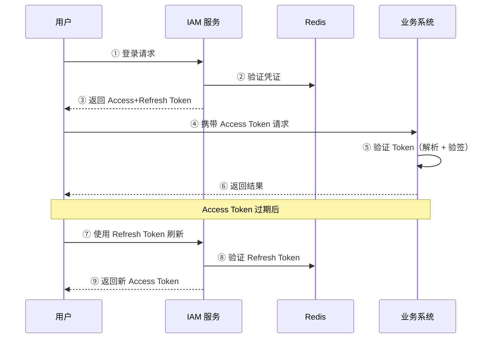
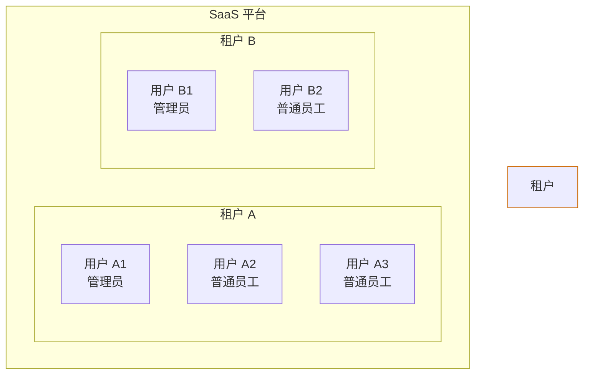
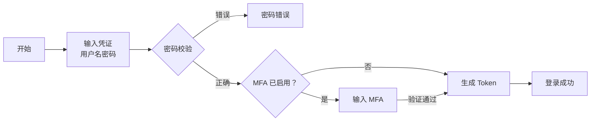

# IAM 产品需求文档 (PRD)

> 身份认证与访问管理系统 (Identity and Access Management)
> 版本：v0.1.0-draft

---

## 1. 文档概述

### 1.1 文档目的

本文档描述 IAM 系统的产品需求，包含产品背景、用户需求、功能需求、非功能需求等内容，作为产品设计、开发、测试的依据。

### 1.2 适用范围

- 产品经理：需求分析和优先级管理
- 研发团队：功能开发和自测
- 测试团队：测试用例设计
- 项目管理：进度追踪和版本规划

### 1.3 名词解释

- **IAM**：Identity and Access Management，身份认证与访问管理
- **租户 (Tenant)**：SaaS 平台中独立的企业客户，数据相互隔离。租户是数据隔离的基本单位，每个租户拥有独立的用户体系、角色权限配置
- **用户 (User)**：属于某个租户的具体个人，是系统的使用者。用户在租户内进行角色分配和权限管理
- **RBAC**：Role-Based Access Control，基于角色的访问控制
- **MFA**：Multi-Factor Authentication，多因素认证
- **JWT**：JSON Web Token，一种无状态的认证令牌，包含 Header、Payload、Signature 三部分，用于身份认证和信息传递
- **Access Token**：短期访问令牌（通常 15-30 分钟），用于 API 请求认证
- **Refresh Token**：长期刷新令牌（通常 7-30 天），用于获取新的 Access Token

### 1.4 修订历史

| 版本 | 日期 | 作者 | 变更说明 |
|------|------|------|----------|
| v0.1.0-draft | 2026-03-17 | - | 初始版本 |
| v0.1.1-draft | 2026-03-17 | - | 完善租户与用户关系说明，优化名词解释格式 |
| v0.1.2-draft | 2026-03-17 | - | 新增 Token 方案选型说明（JWT 结构、双 Token 方案、安全策略） |
| v0.1.3-draft | 2026-03-17 | - | 使用 mermaid 绘制 Token 流转图，修复 Markdown 格式问题 |
| v0.1.4-draft | 2026-03-17 | - | 将业务流程图和层级关系图转换为 mermaid 格式 |
| v0.1.5-draft | 2026-03-17 | - | 将 JWT Token 结构图转换为 mermaid 格式 |
| v0.1.6-draft | 2026-03-17 | - | 移除角色画像的代码块格式，改为纯文本 |
| v0.1.7-draft | 2026-03-17 | - | JWT Token 结构图恢复为 ASCII 格式 |

---

## 2. 产品概述

### 2.1 产品背景

随着 SaaS 业务的快速发展，多租户架构下的身份认证与访问管理成为核心基础设施需求：

**业务痛点：**

- 每个新 SaaS 产品都需要重复开发用户登录、权限管理等功能
- 缺乏统一的身份认证标准，各系统间用户数据孤立
- 权限模型不统一，难以实现细粒度的访问控制
- 安全审计能力薄弱，无法满足合规要求

**市场趋势：**

- 企业级 SaaS 对安全合规要求日益严格
- 零信任安全架构成为行业趋势
- 单点登录 (SSO) 和多因素认证 (MFA) 成为标配

### 2.2 产品定位

为 SaaS 多租户应用提供完整的身份认证与访问管理能力，支持多租户隔离、用户管理、认证授权、权限控制等核心功能。

### 2.3 产品目标

| 目标类型 | 具体目标 |
|----------|----------|
| 业务目标 | 为 SaaS 产品提供开箱即用的 IAM 能力，降低开发成本 70% |
| 技术目标 | 支持千万级用户、99.9% 可用性、API 响应 < 100ms |
| 安全目标 | 通过 SOC2 合规要求，支持 MFA、审计日志、数据加密 |
| 体验目标 | 开发者友好，API 文档完善，SDK 支持主流语言 |

### 2.4 竞品分析

| 产品 | 优势 | 劣势 | 我们的差异化 |
|------|------|------|--------------|
| Auth0 | 功能完善、生态丰富 | 价格高、国内访问慢 | 本地化部署、性价比 |
| Keycloak | 开源免费、功能强大 | 部署复杂、学习曲线陡 | 简化部署、中文支持 |
| Okta | 企业级功能、生态整合 | 价格昂贵、配置复杂 | 轻量级、易用性 |
| 阿里云 RAM | 与阿里云深度集成 | 仅限阿里生态 | 中立、多云支持 |

### 2.5 技术栈

- **后端**: Golang + go-zero 框架
- **数据库**: MySQL
- **缓存**: Redis
- **消息队列**: Kafka
- **容器化**: Docker + Docker Compose

### 2.6 Token 方案选型

#### 2.6.1 认证方案对比

| 方案 | 优势 | 劣势 | 适用场景 |
|------|------|------|----------|
| **Session-Cookie** | 服务端控制、易于撤销 | 需要服务端存储、跨域复杂 | 传统 Web 应用 |
| **JWT** | 无状态、高性能、跨域友好 | 撤销困难、Token 体积大 | 微服务、移动端、API 认证 |
| **Opaque Token** | 易于撤销、体积小 | 需要数据库查询 | 内部系统 |

#### 2.6.2 JWT Token 结构

```
┌─────────────────────────────────────────────────────────┐
│                      JWT Token                           │
├─────────────┬─────────────┬─────────────────────────────┤
│   Header    │   Payload   │   Signature                 │
│ (算法 + 类型) │  (用户信息)  │  (HS256/RS256 签名)         │
└─────────────┴─────────────┴─────────────────────────────┘
```

##### Header（头部）

- `alg`: 签名算法（RS256/HS256）
- `typ`: Token 类型（JWT）

##### Payload（载荷）

- `iss`: 签发者
- `sub`: 主题（用户 ID）
- `aud`: 受众
- `exp`: 过期时间
- `iat`: 签发时间
- `tenant_id`: 租户 ID（IAM 自定义）
- `roles`: 用户角色（IAM 自定义）

##### Signature（签名）

- 使用私钥对 Header + Payload 进行签名
- 防止 Token 被篡改

#### 2.6.3 双 Token 方案

IAM 系统采用 **Access Token + Refresh Token** 双令牌方案：

| 特性 | Access Token | Refresh Token |
|------|--------------|---------------|
| **用途** | API 请求认证 | 刷新 Access Token |
| **有效期** | 15-30 分钟 | 7-30 天 |
| **存储位置** | 内存/LocalStorage | HttpOnly Cookie |
| **撤销方式** | 加入黑名单 | 数据库删除 |
| **刷新机制** | 过期后使用 Refresh Token 刷新 | 可主动刷新或过期 |

#### 2.6.4 选型理由

**选择 JWT 作为 Access Token 的原因：**

1. **无状态认证**：Token 自包含用户信息，减少数据库查询
2. **高性能**：签名验证快，适合高并发场景
3. **跨域支持**：天然支持跨域，适合微服务架构
4. **多端兼容**：Web、移动端、第三方系统均可使用

**双 Token 方案的优势：**

1. **安全性**：Access Token 短期有效，泄露风险低
2. **用户体验**：Refresh Token 长期有效，用户无需频繁登录
3. **可控性**：可通过 Refresh Token 黑名单实现强制下线
4. **灵活性**：支持 Token 刷新、撤销、续期等操作

#### 2.6.5 Token 流转图



#### 2.6.6 安全策略

| 策略 | 说明 |
|------|------|
| **签名算法** | 优先使用 RS256（非对称加密），支持 HS256（对称加密） |
| **Token 加密** | 敏感信息使用 JWE 加密 |
| **黑名单机制** | 用户登出/密码修改时，将 Token 加入 Redis 黑名单 |
| **绑定设备** | Token 与设备指纹绑定，防止盗用 |
| **并发控制** | 支持单设备登录/多设备登录配置 |
| **自动续期** | Refresh Token 使用时自动续期（滑动过期） |

---

## 3. 用户分析

### 3.1 用户角色

#### 角色 1：平台运营管理员 (Platform Admin)

**画像：** 35 岁，男性，互联网公司运维负责人

**背景：** 负责公司 SaaS 平台的整体运营和技术管理

**技术能力：** 中等偏上，熟悉基本的 IT 概念

**核心诉求：**

- 快速开通新租户
- 监控平台整体使用情况
- 处理租户异常和问题
- 生成运营报表

#### 角色 2：租户管理员 (Tenant Admin)

**画像：** 30 岁，女性，企业 IT 部门主管

**背景：** 负责公司内部系统的用户管理和权限分配

**技术能力：** 中等，需要清晰的操作界面

**核心诉求：**

- 管理企业内的用户和部门
- 分配角色和权限
- 查看员工登录和操作日志
- 配置安全策略（密码策略、MFA）

#### 角色 3：普通用户 (End User)

**画像：** 28 岁，男女均有，企业普通员工

**背景：** 日常使用 SaaS 系统完成工作

**技术能力：** 基础，只需要会操作即可

**核心诉求：**

- 快速登录系统
- 修改个人信息和密码
- 绑定/解绑 MFA
- 查看自己的权限范围

#### 角色 4：开发者 (Developer)

**画像：** 26 岁，男性，后端开发工程师

**背景：** 负责将 IAM 集成到业务系统中

**技术能力：** 高，需要完善的 API 文档和 SDK

**核心诉求：**

- 清晰的 API 文档
- 多语言 SDK
- 快速接入指南
- 调试工具和支持

### 3.2 用户诉求总结

| 用户角色 | 核心诉求 | 优先级 |
|----------|----------|--------|
| 平台运营管理员 | 租户管理、监控报表 | P0 |
| 租户管理员 | 用户管理、权限分配、安全策略 | P0 |
| 普通用户 | 登录认证、个人信息管理 | P0 |
| 开发者 | API 文档、SDK、调试工具 | P1 |

### 3.3 典型使用场景

#### 场景 1：新租户开通

场景描述：一家新公司签约使用 SaaS 平台，需要开通独立的租户空间。

参与角色：平台运营管理员

流程步骤：

1. 运营管理员创建租户
2. 设置租户配额（用户数、存储空间等）
3. 创建租户管理员账号
4. 将租户管理员凭证发送给客户
5. 租户管理员登录并初始化配置

#### 场景 2：新员工入职

场景描述：某租户公司的新员工入职，需要开通系统访问权限。

参与角色：租户管理员、普通用户

流程步骤：

1. 租户管理员创建用户账号
2. 分配角色和权限
3. 系统发送激活邮件给新员工
4. 新员工激活账号并设置密码
5. 新员工绑定 MFA（如启用）
6. 新员工登录系统

#### 场景 3：用户登录

场景描述：用户访问 SaaS 应用，进行身份认证。

参与角色：普通用户

流程步骤：

1. 用户访问登录页面
2. 输入用户名和密码
3. 系统验证密码正确性
4. 如启用 MFA，输入动态验证码
5. 登录成功，跳转至首页
6. 系统记录登录日志

---

### 3.4 租户与用户关系

#### 3.4.1 概念对比

| 维度 | 租户 (Tenant) | 用户 (User) |
|------|--------------|------------|
| **定义** | SaaS 平台中独立的企业客户 | 属于某个租户的具体个人 |
| **层级** | 高层级容器 | 隶属于租户 |
| **作用** | 数据隔离的基本单位 | 系统的实际使用者 |
| **管理方式** | 平台运营统一管理 | 租户管理员在租户内管理 |
| **数据归属** | 拥有独立的数据空间 | 数据归属于所属租户 |
| **典型示例** | 某公司、某组织 | 公司的员工、组织的成员 |

#### 3.4.2 层级关系图



#### 3.4.3 核心要点

##### 1. 一对多关系

- 一个租户可以拥有多个用户（1:N）
- 一个用户只能属于一个租户
- 不同租户可以有相同邮箱的用户（数据隔离）

##### 2. 数据隔离

- 租户是数据隔离的基本边界
- 租户 A 的用户无法访问租户 B 的数据
- 所有用户数据都带有 `tenant_id` 标识

##### 3. 管理权限

- 平台运营管理员：管理租户（创建、编辑、冻结）
- 租户管理员：管理租户内的用户和权限
- 普通用户：仅管理个人信息

##### 4. 生命周期

- 租户创建在前，用户创建在后
- 租户冻结时，该租户下所有用户无法登录
- 租户删除时，该租户下所有用户数据级联删除

#### 3.4.4 相关需求

| 管理对象 | 需求 ID | 需求名称 |
|----------|---------|----------|
| 租户 | REQ-007 | 租户管理功能 |
| 用户 | REQ-004 | 用户管理功能 |
| 用户认证 | REQ-001, REQ-002, REQ-003 | 登录、注册、密码重置 |
| 用户权限 | REQ-005, REQ-006 | 角色管理、权限分配 |

---

## 4. 需求清单

### 4.1 需求总览

| ID | 需求名称 | 模块 | 优先级 | 估时 (人天) | 状态 | 关联用户故事 |
|----|----------|------|--------|-------------|------|--------------|
| REQ-001 | 用户登录功能 | 认证管理 | P0 | 3 | 待开发 | US-010 |
| REQ-002 | 用户注册功能 | 认证管理 | P0 | 2 | 待开发 | - |
| REQ-003 | 密码重置功能 | 认证管理 | P0 | 2 | 待开发 | US-011 |
| REQ-004 | 用户管理功能 | 用户管理 | P0 | 5 | 待开发 | US-001, US-002 |
| REQ-005 | 角色管理功能 | 权限管理 | P0 | 3 | 待开发 | US-020 |
| REQ-006 | 权限分配功能 | 权限管理 | P0 | 3 | 待开发 | US-021, US-022, US-023 |
| REQ-007 | 租户管理功能 | 租户管理 | P0 | 3 | 待开发 | US-030, US-031 |
| REQ-008 | MFA 多因素认证 | 认证管理 | P1 | 5 | 待开发 | US-012 |
| REQ-009 | 操作审计日志 | 审计日志 | P1 | 3 | 待开发 | - |
| REQ-010 | 登录日志记录 | 审计日志 | P1 | 2 | 待开发 | US-014 |

### 4.2 状态说明

| 状态 | 说明 |
|------|------|
| 待开发 | 需求已定义，尚未开始开发 |
| 开发中 | 需求正在开发中 |
| 测试中 | 开发完成，正在测试 |
| 已完成 | 需求已上线 |
| 已搁置 | 需求暂缓实施 |
| 已取消 | 需求取消 |

### 4.3 按模块分类

**认证管理模块：** REQ-001、REQ-002、REQ-003、REQ-008

**用户管理模块：** REQ-004

**权限管理模块：** REQ-005、REQ-006

**租户管理模块：** REQ-007

**审计日志模块：** REQ-009、REQ-010

### 4.4 按优先级分类

**P0 - 必须有（Must Have）** - 共 7 个需求，预计 21 人天

| ID | 需求名称 | 模块 | 估时 |
|----|----------|------|------|
| REQ-001 | 用户登录功能 | 认证管理 | 3 人天 |
| REQ-002 | 用户注册功能 | 认证管理 | 2 人天 |
| REQ-003 | 密码重置功能 | 认证管理 | 2 人天 |
| REQ-004 | 用户管理功能 | 用户管理 | 5 人天 |
| REQ-005 | 角色管理功能 | 权限管理 | 3 人天 |
| REQ-006 | 权限分配功能 | 权限管理 | 3 人天 |
| REQ-007 | 租户管理功能 | 租户管理 | 3 人天 |

**P1 - 应该有（Should Have）** - 共 3 个需求，预计 10 人天

| ID | 需求名称 | 模块 | 估时 |
|----|----------|------|------|
| REQ-008 | MFA 多因素认证 | 认证管理 | 5 人天 |
| REQ-009 | 操作审计日志 | 审计日志 | 3 人天 |
| REQ-010 | 登录日志记录 | 审计日志 | 2 人天 |

### 4.5 版本迭代计划

#### v0.1.0（Week 1-2）- 基础框架

| 需求 ID | 需求名称 | 负责人 | 计划开始 | 计划结束 | 实际结束 | 备注 |
|---------|----------|--------|----------|----------|----------|------|
| REQ-001 | 用户登录功能 | - | - | - | - | - |
| REQ-002 | 用户注册功能 | - | - | - | - | - |

#### v0.2.0（Week 3-4）- 核心功能

| 需求 ID | 需求名称 | 负责人 | 计划开始 | 计划结束 | 实际结束 | 备注 |
|---------|----------|--------|----------|----------|----------|------|
| REQ-004 | 用户管理功能 | - | - | - | - | - |
| REQ-005 | 角色管理功能 | - | - | - | - | - |
| REQ-006 | 权限分配功能 | - | - | - | - | - |
| REQ-007 | 租户管理功能 | - | - | - | - | - |

#### v0.3.0（Week 5-6）- 高级功能

| 需求 ID | 需求名称 | 负责人 | 计划开始 | 计划结束 | 实际结束 | 备注 |
|---------|----------|--------|----------|----------|----------|------|
| REQ-003 | 密码重置功能 | - | - | - | - | - |
| REQ-008 | MFA 多因素认证 | - | - | - | - | - |
| REQ-009 | 操作审计日志 | - | - | - | - | - |
| REQ-010 | 登录日志记录 | - | - | - | - | - |

---

## 5. 功能需求详情

### 5.1 认证管理

#### REQ-001 用户登录功能

| 项目 | 内容 |
|------|------|
| **优先级** | P0 |
| **估时** | 3 人天 |
| **关联用户故事** | US-010 |

**背景：** 用户需要安全的身份认证机制访问 SaaS 系统。当前缺少统一的登录功能，各业务系统登录方式不统一。

**目标：**

- 提供用户名密码登录方式
- 支持登录失败次数限制，防止暴力破解
- 登录成功后颁发 JWT Token
- 目标登录成功率 > 95%

**功能描述：**

1. 用户访问登录页面，输入用户名（邮箱/手机号）和密码
2. 系统校验用户名和密码正确性
3. 密码错误时，提示"用户名或密码错误"（不区分具体错误，防止枚举）
4. 登录成功后，返回 JWT Token（Access Token + Refresh Token）
5. 系统记录登录日志（时间、IP、设备、结果）
6. 连续失败 5 次后，账号锁定 15 分钟

**异常情况：**

| 异常场景 | 系统处理 |
|----------|----------|
| 用户名不存在 | 提示"用户名或密码错误" |
| 密码错误 | 提示"用户名或密码错误"，记录失败次数 |
| 账号被锁定 | 提示"账号已锁定，请 15 分钟后再试" |
| 账号被禁用 | 提示"账号已被禁用，请联系管理员" |
| 验证码错误（如触发） | 提示"验证码错误，剩余重试次数 N" |

**验收标准：**

- [ ] 正确用户名密码可登录成功
- [ ] 错误密码提示模糊化，不泄露用户是否存在
- [ ] 连续 5 次失败后账号锁定 15 分钟
- [ ] 登录成功后返回有效 JWT Token
- [ ] 登录日志完整记录

---

#### REQ-002 用户注册功能

| 项目 | 内容 |
|------|------|
| **优先级** | P0 |
| **估时** | 2 人天 |

**背景：** 新用户需要自助注册账号使用系统，支持开放注册和邀请注册两种模式。

**目标：**

- 支持邮箱注册，发送验证码校验
- 支持密码强度校验
- 支持租户管理员邀请注册
- 目标注册转化率 > 80%

**功能描述：**

1. 用户访问注册页面，输入邮箱、密码、验证码
2. 系统校验邮箱格式正确性
3. 系统校验密码强度（至少 8 位，包含大小写字母和数字）
4. 系统校验验证码正确性和有效性（5 分钟内有效）
5. 邮箱已注册时，提示"该邮箱已注册"
6. 注册成功后，自动登录并跳转到完善信息页面

**异常情况：**

| 异常场景 | 系统处理 |
|----------|----------|
| 邮箱格式错误 | 提示"请输入有效的邮箱地址" |
| 密码强度不足 | 提示"密码需至少 8 位，包含大小写字母和数字" |
| 验证码错误 | 提示"验证码错误，剩余重试次数 N" |
| 验证码过期 | 提示"验证码已过期，请重新获取" |
| 邮箱已注册 | 提示"该邮箱已注册，可直接登录或找回密码" |

**验收标准：**

- [ ] 有效邮箱 + 合规密码可注册成功
- [ ] 密码强度校验生效
- [ ] 验证码 5 分钟过期
- [ ] 邮箱重复注册被拦截
- [ ] 注册成功后自动登录

---

#### REQ-003 密码重置功能

| 项目 | 内容 |
|------|------|
| **优先级** | P0 |
| **估时** | 2 人天 |
| **关联用户故事** | US-011 |

**背景：** 用户忘记密码时需要自助重置，减少人工客服成本。

**目标：**

- 支持通过邮箱验证码重置密码
- 确保重置流程安全性
- 重置后使旧 Token 失效
- 目标密码重置成功率 > 90%

**功能描述：**

1. 用户访问"忘记密码"页面，输入邮箱
2. 系统校验邮箱是否存在
3. 邮箱存在时，发送重置验证码（6 位数字，5 分钟有效）
4. 用户输入验证码和新密码
5. 系统校验验证码正确性
6. 密码修改成功后，使该用户的所有旧 Token 失效
7. 发送密码重置成功通知邮件

**异常情况：**

| 异常场景 | 系统处理 |
|----------|----------|
| 邮箱不存在 | 提示"该邮箱未注册" |
| 验证码错误 | 提示"验证码错误，剩余重试次数 N" |
| 验证码过期 | 提示"验证码已过期，请重新获取" |
| 新密码强度不足 | 提示"密码需至少 8 位，包含大小写字母和数字" |
| 两次密码输入不一致 | 提示"两次输入的密码不一致" |

**验收标准：**

- [ ] 已注册邮箱可收到重置验证码
- [ ] 未注册邮箱明确提示
- [ ] 验证码 5 分钟过期
- [ ] 重置成功后旧 Token 失效
- [ ] 重置成功后发送通知邮件

---

#### REQ-008 MFA 多因素认证

| 项目 | 内容 |
|------|------|
| **优先级** | P1 |
| **估时** | 5 人天 |
| **关联用户故事** | US-012 |

**背景：** 高安全场景下需要多因素认证，防止账号被盗用。

**目标：**

- 支持 TOTP 动态验证码（Google Authenticator）
- 支持邮箱验证码
- 支持按角色配置 MFA 强制启用
- 目标 MFA 覆盖率 > 60%（管理员 100%）

**功能描述：**

1. 用户可绑定 TOTP（展示二维码，扫描后验证绑定）
2. 登录时，如启用 MFA，需输入动态验证码
3. 租户管理员可配置哪些角色必须启用 MFA
4. 支持 MFA 备用码（10 个，一次性使用）
5. 支持临时禁用 MFA（通过邮箱验证）

**异常情况：**

| 异常场景 | 系统处理 |
|----------|----------|
| TOTP 验证码错误 | 提示"验证码错误，剩余重试次数 N" |
| TOTP 验证码超时 | 提示"验证码已过期，请刷新后重试" |
| 备用码已使用 | 提示"备用码已失效" |
| 连续 5 次 MFA 失败 | 账号锁定 15 分钟 |

**验收标准：**

- [ ] 可成功绑定 TOTP
- [ ] 登录时 MFA 校验生效
- [ ] 强制 MFA 策略生效
- [ ] 备用码可正常使用
- [ ] MFA 失败锁定机制生效

---

### 5.2 用户管理

#### REQ-004 用户管理功能

| 项目 | 内容 |
|------|------|
| **优先级** | P0 |
| **估时** | 5 人天 |
| **关联用户故事** | US-001, US-002 |

**背景：** 租户管理员需要管理企业内的用户账号，包括创建、编辑、禁用等操作。

**目标：**

- 支持用户 CRUD 操作
- 支持用户状态管理（启用/禁用）
- 支持用户列表查询和筛选
- 支持批量操作

**功能描述：**

1. 租户管理员可创建新用户（邮箱、姓名、初始角色）
2. 可编辑用户信息（姓名、手机号、角色）
3. 可禁用/启用用户账号
4. 可删除用户（逻辑删除，保留历史记录）
5. 支持按姓名、邮箱、状态、角色筛选用户
6. 支持批量导入用户（CSV 格式）
7. 支持批量导出用户列表

**异常情况：**

| 异常场景 | 系统处理 |
|----------|----------|
| 创建用户时邮箱已存在 | 提示"该邮箱已被使用" |
| 删除用户时用户有进行中的任务 | 提示"用户有进行中的任务，无法删除" |
| 禁用用户时用户是唯一管理员 | 提示"至少保留一个管理员账号" |
| 批量导入格式错误 | 提示"文件格式错误，请检查后重试"，显示错误行号和原因 |

**验收标准：**

- [ ] 可创建、编辑、禁用、删除用户
- [ ] 禁用用户无法登录
- [ ] 删除为逻辑删除，数据保留
- [ ] 支持按条件筛选用户
- [ ] 批量导入/导出功能正常

---

### 5.3 权限管理

#### REQ-005 角色管理功能

| 项目 | 内容 |
|------|------|
| **优先级** | P0 |
| **估时** | 3 人天 |
| **关联用户故事** | US-020 |

**背景：** 租户需要根据企业组织架构自定义角色，实现灵活的权限管理。

**目标：**

- 支持角色 CRUD
- 支持自定义权限组合
- 支持预置角色（管理员、普通用户等）
- 角色与租户绑定

**功能描述：**

1. 租户管理员可创建新角色（角色名称、描述）
2. 可为角色分配权限（菜单权限、API 权限）
3. 可编辑已有角色（名称、权限）
4. 可删除角色（无用户关联时）
5. 系统预置角色：超级管理员、普通用户
6. 角色列表展示：角色名称、用户数、创建时间

**异常情况：**

| 异常场景 | 系统处理 |
|----------|----------|
| 角色名称重复 | 提示"角色名称已存在" |
| 删除有用户关联的角色 | 提示"角色下有 N 个用户，无法删除" |
| 修改预置角色 | 允许修改权限，不允许删除 |
| 角色权限为空 | 提示"请至少选择一个权限" |

**验收标准：**

- [ ] 可创建、编辑、删除角色
- [ ] 角色权限可灵活配置
- [ ] 预置角色不可删除
- [ ] 角色与用户关联关系正确
- [ ] 角色变更后，用户权限实时更新

---

#### REQ-006 权限分配功能

| 项目 | 内容 |
|------|------|
| **优先级** | P0 |
| **估时** | 3 人天 |
| **关联用户故事** | US-021, US-022, US-023 |

**背景：** 需要将角色权限分配给用户，实现访问控制。

**目标：**

- 支持用户 - 角色关联
- 支持批量分配角色
- 支持查看用户最终权限
- 权限变更实时生效

**功能描述：**

1. 租户管理员可为用户分配角色
2. 支持批量选择用户，批量分配角色
3. 支持移除用户角色
4. 用户可拥有多个角色，权限取并集
5. 可查看用户的最终权限列表
6. 权限变更记录审计日志

**异常情况：**

| 异常场景 | 系统处理 |
|----------|----------|
| 用户不存在 | 提示"用户不存在" |
| 角色不存在 | 提示"角色不存在" |
| 重复分配同一角色 | 提示"用户已拥有该角色" |
| 移除最后一个角色 | 提示"用户至少需要一个角色" |

**验收标准：**

- [ ] 可分配角色给用户
- [ ] 支持批量分配
- [ ] 用户可拥有多个角色
- [ ] 权限取并集生效
- [ ] 权限变更实时生效
- [ ] 审计日志完整记录

---

### 5.4 租户管理

#### REQ-007 租户管理功能

| 项目 | 内容 |
|------|------|
| **优先级** | P0 |
| **估时** | 3 人天 |
| **关联用户故事** | US-030, US-031 |

**背景：** SaaS 平台需要管理多个租户，每个租户数据相互隔离。

**目标：**

- 支持平台运营创建租户
- 支持租户配额管理（用户数、存储空间）
- 支持租户状态管理（激活/冻结）
- 租户数据完全隔离

**功能描述：**

1. 平台运营可创建租户（租户名称、管理员邮箱、配额）
2. 可编辑租户信息（名称、配额）
3. 可激活/冻结租户
4. 租户数据按 tenant_id 隔离
5. 租户配额超限告警（80% 阈值）
6. 租户列表展示：名称、用户数、状态、创建时间

**异常情况：**

| 异常场景 | 系统处理 |
|----------|----------|
| 租户名称重复 | 提示"租户名称已存在" |
| 租户配额超限 | 拒绝创建新用户，提示"配额不足，请联系平台运营" |
| 冻结租户 | 租户下所有用户无法登录 |
| 删除有数据租户 | 提示"租户下有数据，需先清空数据" |

**验收标准：**

- [ ] 可创建、编辑、冻结租户
- [ ] 租户配额限制生效
- [ ] 冻结租户无法登录
- [ ] 租户数据完全隔离
- [ ] 配额超限告警正常

---

### 5.5 审计日志

#### REQ-009 操作审计日志

| 项目 | 内容 |
|------|------|
| **优先级** | P1 |
| **估时** | 3 人天 |

**背景：** 需要记录用户的敏感操作，满足安全审计和合规要求。

**目标：**

- 记录所有敏感操作（用户管理、权限变更、配置修改）
- 记录操作人、操作时间、操作内容、IP 地址
- 支持按条件查询审计日志
- 日志保留 180 天

**功能描述：**

1. 自动记录敏感操作（无需业务代码侵入）
2. 日志内容：操作人、操作类型、操作对象、操作结果、IP、时间
3. 支持按操作人、操作类型、时间范围查询
4. 支持日志导出（CSV 格式）
5. 日志存储 180 天，过期自动清理

**异常情况：**

| 异常场景 | 系统处理 |
|----------|----------|
| 日志写入失败 | 记录到本地文件，后续补写 |
| 日志存储超限 | 自动清理最早 10% 日志 |
| 查询时间跨度过大 | 限制最大查询范围为 31 天 |

**验收标准：**

- [ ] 敏感操作完整记录
- [ ] 日志内容准确
- [ ] 查询功能正常
- [ ] 日志导出正常
- [ ] 过期日志自动清理

---

#### REQ-010 登录日志记录

| 项目 | 内容 |
|------|------|
| **优先级** | P1 |
| **估时** | 2 人天 |
| **关联用户故事** | US-014 |

**背景：** 需要记录用户登录行为，用于安全分析和异常检测。

**目标：**

- 记录所有登录尝试（成功/失败）
- 记录登录 IP、设备、地理位置
- 支持异常登录检测
- 支持租户管理员查看本企业登录日志

**功能描述：**

1. 自动记录所有登录尝试
2. 日志内容：用户、结果、IP、设备、User-Agent、时间
3. IP 解析地理位置（省份、城市）
4. 租户管理员可查看本企业登录日志
5. 异常登录告警（新设备、新地点、频繁失败）

**异常情况：**

| 异常场景 | 系统处理 |
|----------|----------|
| IP 解析失败 | 地理位置显示"未知" |
| 日志写入失败 | 记录到本地文件，后续补写 |
| User-Agent 解析失败 | 设备信息保存原始字符串 |

**验收标准：**

- [ ] 登录日志完整记录
- [ ] 地理位置解析正确
- [ ] 租户管理员只能查看本企业日志
- [ ] 异常登录检测告警正常

---

## 6. 非功能需求

### 6.1 性能需求

| 指标 | 目标值 | 说明 |
|------|--------|------|
| API 响应时间 | < 100ms (P95) | 95% 的请求响应时间在 100ms 内 |
| 系统吞吐量 | 1000+ QPS | 每秒处理请求数 |
| 用户规模 | 100 万 + | 支持注册用户数 |

### 6.2 安全需求

- 密码加密存储（bcrypt/argon2）
- 通信加密（HTTPS/TLS）
- SQL 注入防护
- XSS 防护
- CSRF 防护
- 敏感操作二次验证

### 6.3 可用性需求

- 99.9% 可用性
- 支持水平扩展
- 数据库主从复制
- Redis 集群
- 服务优雅关闭

### 6.4 多租户隔离

- 数据隔离（tenant_id）
- 资源隔离
- 配额隔离

---

## 7. 业务流程

### 7.1 用户登录流程



### 7.2 权限分配流程


### 7.3 租户开通流程


---

## 8. 风险与依赖

### 8.1 技术风险

| 风险 | 影响程度 | 缓解措施 |
|------|----------|----------|
| JWT Token 泄露 | 高 | 支持 Token 黑名单、短有效期 + 刷新 |
| 数据库单点故障 | 高 | 主从复制、读写分离 |
| 缓存穿透 | 中 | 布隆过滤器、空值缓存 |
| 分布式事务 | 中 | 最终一致性、消息队列 |

### 8.2 依赖项

| 依赖 | 用途 | 备选方案 |
|------|------|----------|
| MySQL | 主数据库 | PostgreSQL |
| Redis | 缓存、会话存储 | 无（强依赖） |
| Kafka | 异步日志、消息队列 | RabbitMQ |

---

## 9. 成功指标

### 9.1 业务指标

| 指标名称 | 目标值 | 计算方式 |
|----------|--------|----------|
| 租户数 | 100+ | 平台入驻租户数量 |
| 用户数 | 10 万 + | 总注册用户数 |
| API 调用量 | 1000 万+/天 | 日均 API 请求数 |

### 9.2 技术指标

| 指标名称 | 目标值 | 计算方式 |
|----------|--------|----------|
| API 可用性 | 99.9% | (总请求数 - 失败数) / 总请求数 |
| API 响应时间 | < 100ms | P95 延迟 |
| 认证成功率 | > 99.5% | 认证成功数 / 认证尝试数 |
| 系统吞吐量 | 1000+ QPS | 每秒处理请求数 |

### 9.3 用户体验指标

| 指标名称 | 目标值 | 计算方式 |
|----------|--------|----------|
| 登录转化率 | > 95% | 成功登录数 / 访问登录页数 |
| 用户满意度 | > 4.5/5 | 用户调研评分 |
| 开发者 NPS | > 50 | 开发者推荐度评分 |

---

## 附录

### 附录 A：用户故事清单

| ID | 用户故事 | 优先级 |
|----|----------|--------|
| US-001 | 作为租户管理员，我想要批量导入用户，以便快速完成团队初始化 | P0 |
| US-002 | 作为租户管理员，我想要禁用离职员工账号，以确保数据安全 | P0 |
| US-010 | 作为普通用户，我想要使用用户名密码登录，以便访问系统 | P0 |
| US-011 | 作为普通用户，我想要忘记密码后重置，以便恢复访问 | P0 |
| US-012 | 作为安全管理员，我想要强制启用 MFA，以提升安全性 | P1 |
| US-014 | 作为租户管理员，我想要查看登录历史，以便发现异常 | P1 |
| US-020 | 作为租户管理员，我想要创建自定义角色，以便匹配公司职级 | P0 |
| US-021 | 作为租户管理员，我想要给用户分配角色，以便授权 | P0 |
| US-022 | 作为开发者，我想要 API 权限校验中间件，以便快速集成 | P0 |
| US-023 | 作为租户管理员，我想要查看用户的最终权限，以便审计 | P1 |
| US-030 | 作为平台运营，我想要查看租户配额使用情况，以便评估扩容 | P1 |
| US-031 | 作为平台运营，我想要冻结欠费租户，以便催缴 | P1 |
