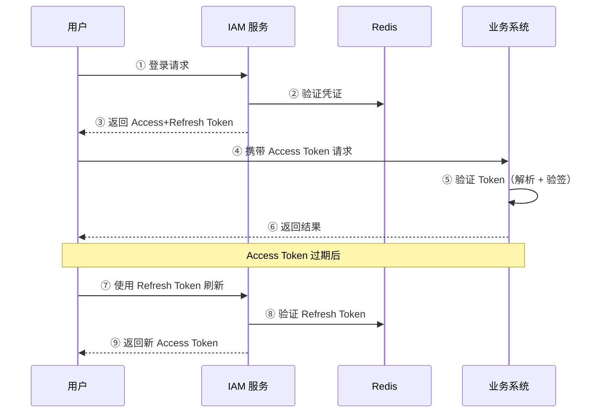
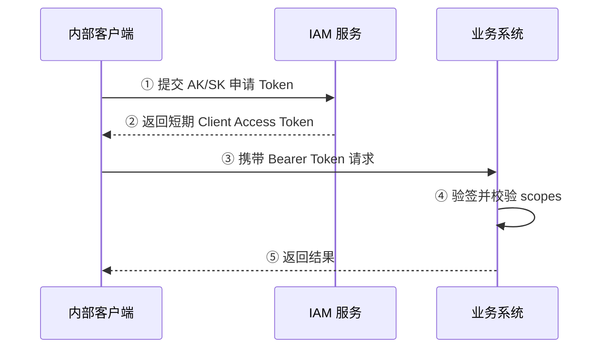

# 2. 产品概述

## 2.1 产品背景

随着 SaaS 业务的快速发展，多租户架构下的身份认证与访问管理成为核心基础设施需求：

**业务痛点：**

- 每个新 SaaS 产品都需要重复开发用户登录、权限管理等功能
- 缺乏统一的身份认证标准，各系统间用户数据孤立
- 权限模型不统一，难以实现细粒度的访问控制
- 安全审计能力薄弱，无法满足合规要求

**市场趋势：**

- 企业级 SaaS 对安全合规要求日益严格
- 零信任安全架构成为行业趋势
- 单点登录 (SSO) 和多因素认证 (MFA) 成为标配

## 2.2 产品定位

为 SaaS 多租户应用提供完整的统一认证与访问管理能力，支持用户认证、内部服务认证、多租户隔离、用户管理、认证授权、权限控制等核心功能。

## 2.3 产品目标

| 目标类型 | 具体目标 |
|----------|----------|
| 业务目标 | 为 SaaS 产品提供开箱即用的 IAM 能力，降低开发成本 70% |
| 技术目标 | 支持千万级用户、99.9% 可用性、API 响应 < 100ms |
| 安全目标 | 通过 SOC2 合规要求，支持 MFA、审计日志、数据加密 |
| 体验目标 | 开发者友好，API 文档完善，SDK 支持主流语言 |

## 2.4 竞品分析

| 产品 | 优势 | 劣势 | 我们的差异化 |
|------|------|------|--------------|
| Auth0 | 功能完善、生态丰富 | 价格高、国内访问慢 | 本地化部署、性价比 |
| Keycloak | 开源免费、功能强大 | 部署复杂、学习曲线陡 | 简化部署、中文支持 |
| Okta | 企业级功能、生态整合 | 价格昂贵、配置复杂 | 轻量级、易用性 |
| 阿里云 RAM | 与阿里云深度集成 | 仅限阿里生态 | 中立、多云支持 |

## 2.5 技术栈

- **后端**: Golang + Gin + grpc-go 框架组合
- **后端备选**: Kratos（保留为未来双协议微服务框架备选）
- **数据库**: MySQL
- **缓存**: Redis
- **消息队列**: Kafka
- **容器化**: Docker + Docker Compose

## 2.6 Token 方案选型

### 2.6.1 认证方案对比

| 方案 | 优势 | 劣势 | 适用场景 |
|------|------|------|----------|
| **Session-Cookie** | 服务端控制、易于撤销 | 需要服务端存储、跨域复杂 | 传统 Web 应用 |
| **JWT** | 无状态、高性能、跨域友好 | 撤销困难、Token 体积大 | 用户认证、内部服务短期 Token、API 认证 |
| **Opaque Token** | 易于撤销、体积小 | 需要数据库查询 | 高安全、强中心化校验场景 |

### 2.6.2 JWT Token 结构

```
┌─────────────────────────────────────────────────────────┐
│                      JWT Token                           │
├─────────────┬─────────────┬─────────────────────────────┤
│   Header    │   Payload   │   Signature                 │
│ (算法 + 类型) │  (用户信息)  │  (HS256/RS256 签名)         │
└─────────────┴─────────────┴─────────────────────────────┘
```

#### Header（头部）

- `alg`: 签名算法（RS256/HS256）
- `typ`: Token 类型（JWT）

#### Payload（载荷）

- `iss`: 签发者
- `sub`: 主题（用户 ID）
- `aud`: 受众
- `exp`: 过期时间
- `iat`: 签发时间
- `tenant_id`: 租户 ID（IAM 自定义）
- `roles`: 用户角色（IAM 自定义）

#### Signature（签名）

- 使用私钥对 Header + Payload 进行签名
- 防止 Token 被篡改

### 2.6.3 双 Token 方案

IAM 系统采用 **Access Token + Refresh Token** 双令牌方案：

| 特性 | Access Token | Refresh Token |
|------|--------------|---------------|
| **用途** | API 请求认证 | 刷新 Access Token |
| **有效期** | 15-30 分钟 | 7-30 天 |
| **存储位置** | 内存/LocalStorage | HttpOnly Cookie |
| **撤销方式** | 加入黑名单 | 数据库删除 |
| **刷新机制** | 过期后使用 Refresh Token 刷新 | 可主动刷新或过期 |

对于内部服务认证，IAM 采用 **AK/SK + 短期 JWT Access Token** 方案：

| 特性 | Client Access Token |
|------|---------------------|
| **用途** | 内部服务调用业务 API |
| **有效期** | 默认 10 分钟 |
| **存储位置** | 服务内存/密钥管理组件 |
| **刷新机制** | 到期后重新用 `AK/SK` 申请 |
| **撤销方式** | 禁用或轮换客户端凭证 |

### 2.6.4 选型理由

**选择 JWT 作为 Access Token 的原因：**

1. **无状态认证**：Token 自包含用户信息，减少数据库查询
2. **高性能**：签名验证快，适合高并发场景
3. **跨域支持**：天然支持跨域，适合微服务架构
4. **多端兼容**：Web、移动端、第三方系统均可使用

**双 Token 方案的优势：**

1. **安全性**：Access Token 短期有效，泄露风险低
2. **用户体验**：Refresh Token 长期有效，用户无需频繁登录
3. **可控性**：可通过 Refresh Token 黑名单实现强制下线
4. **灵活性**：支持 Token 刷新、撤销、续期等操作

**内部服务使用 JWT 的原因：**

1. **统一链路**：内部系统与用户请求共用网关验签机制
2. **高性能**：避免每次调用都回源校验
3. **可审计**：通过 `subject_type=client` 和 `scopes` 区分机器主体
4. **安全性**：长期凭证只用于换短期 Token，降低泄露面

### 2.6.5 Token 流转图





### 2.6.6 安全策略

| 策略 | 说明 |
|------|------|
| **签名算法** | 优先使用 RS256（非对称加密），支持 HS256（对称加密） |
| **Token 加密** | 敏感信息使用 JWE 加密 |
| **黑名单机制** | 用户登出/密码修改时，将 Token 加入 Redis 黑名单 |
| **客户端凭证轮换** | 内部客户端支持 AK/SK 创建、轮换和禁用 |
| **绑定设备** | Token 与设备指纹绑定，防止盗用 |
| **并发控制** | 支持单设备登录/多设备登录配置 |
| **自动续期** | Refresh Token 使用时自动续期（滑动过期） |
