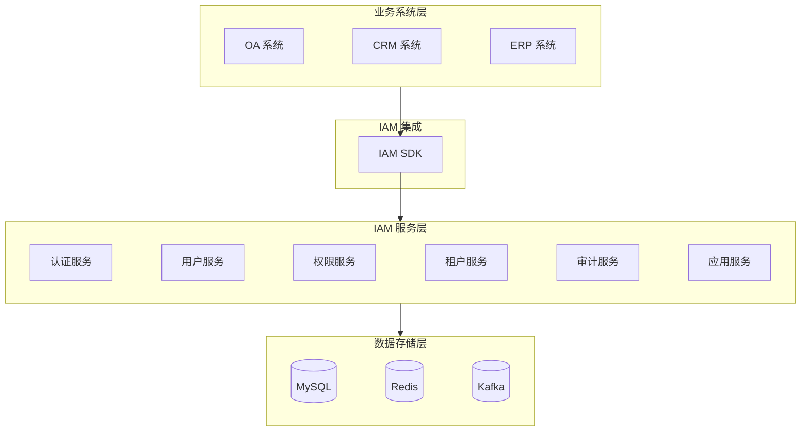
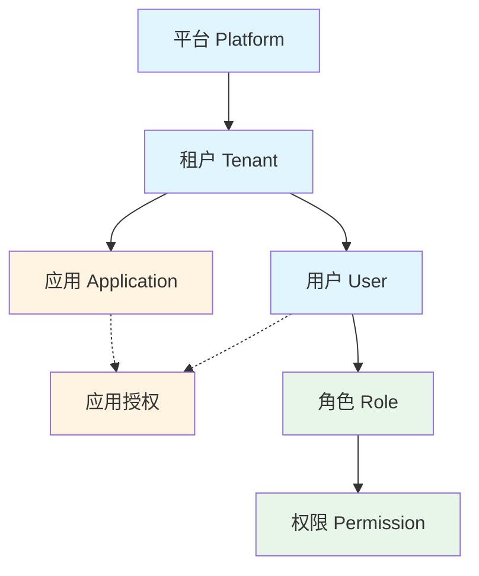
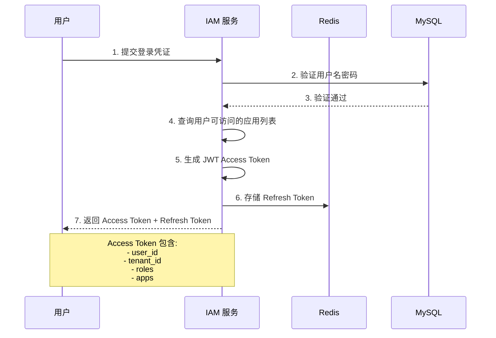
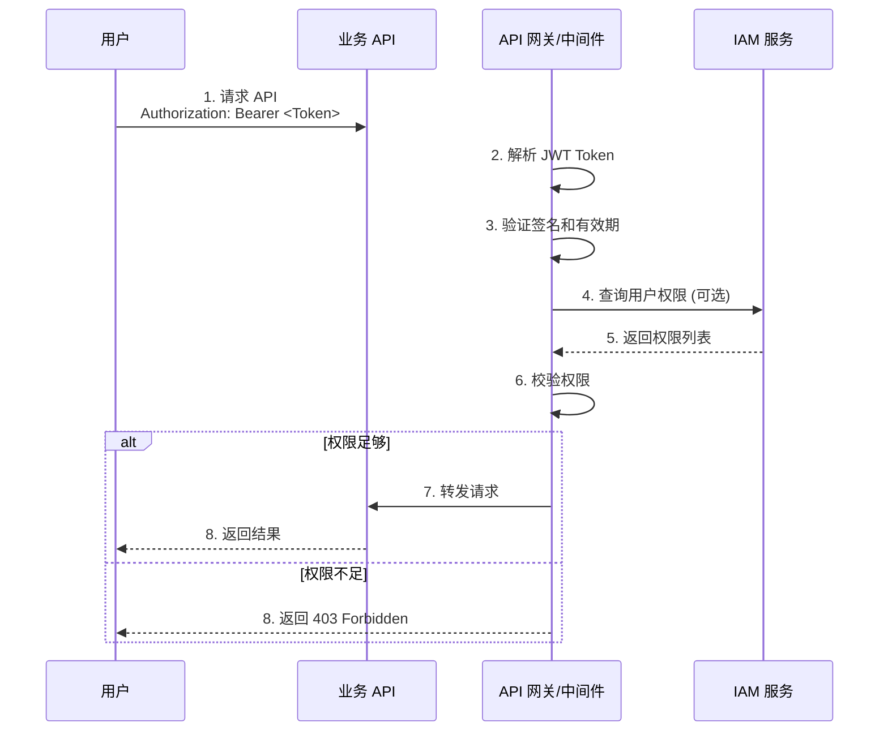
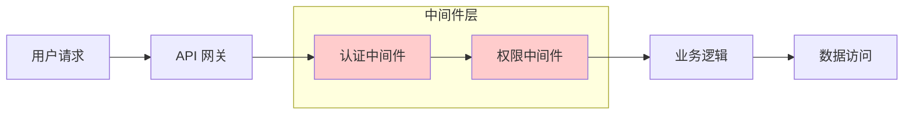
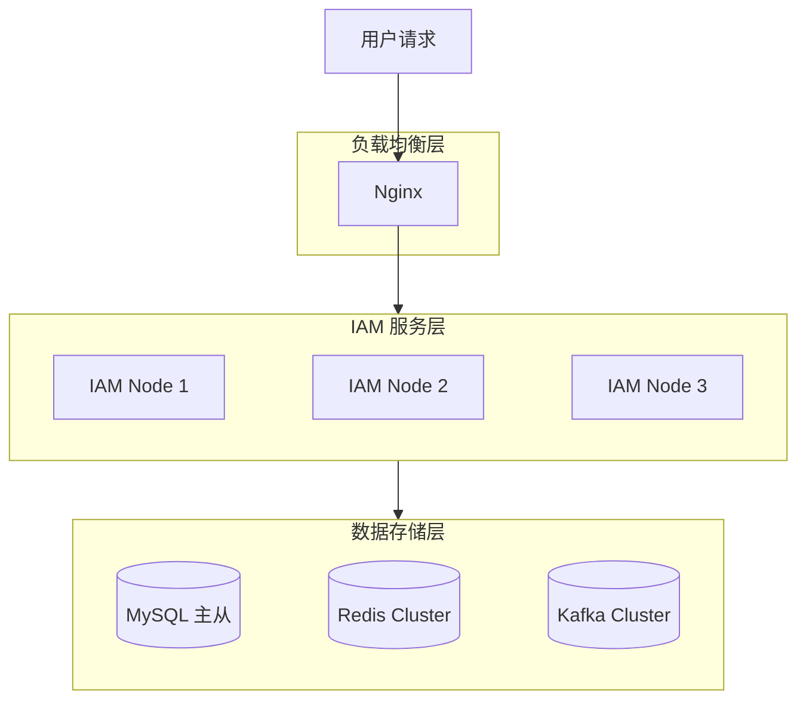

# 3. 系统架构

> 描述 IAM 系统的整体架构、核心模型、数据隔离机制和工作原理。
> 本文档是理解系统如何工作的全局视角，各功能模块的设计都应遵循本文档定义的原则。

---

## 3.1 系统定位

IAM（Identity and Access Management）是一个面向 SaaS 多租户场景的身份认证与访问管理系统，作为企业级基础设施为业务系统提供统一的身份认证和权限管理能力。



**各层说明：**

- **业务系统层**：接入 IAM 的各类业务系统
  - OA 系统：企业办公自动化系统
  - CRM 系统：客户关系管理系统
  - ERP 系统：企业资源计划系统

- **IAM 集成**：业务系统与 IAM 的集成方式
  - IAM SDK：封装认证、用户、权限等 API，支持多语言

- **IAM 服务层**：IAM 核心服务模块
  - 认证服务：用户登录、注册、Token 生成与验证
  - 用户服务：用户 CRUD、状态管理、批量导入导出
  - 权限服务：RBAC 模型、角色管理、权限分配
  - 租户服务：租户管理、配额管理、多租户隔离
  - 审计服务：操作审计日志、登录日志
  - 应用服务：应用管理、用户 - 应用授权

- **数据存储层**：数据持久化与缓存
  - MySQL：存储用户、角色、权限等核心数据
  - Redis：缓存热点数据、存储会话和 Token 黑名单
  - Kafka：异步写入审计日志和登录日志

---

## 3.2 核心数据模型

IAM 系统采用 **平台 - 租户 - 应用 - 用户** 四层模型，其中租户是数据隔离的基本边界，应用是授权和审计的基本单位。

### 3.2.1 模型总览



### 3.2.2 核心实体说明

| 实体 | 说明 | 关键属性 |
|------|------|----------|
| **平台 (Platform)** | IAM 系统运营方，管理所有租户 | 平台管理员、全局配置 |
| **租户 (Tenant)** | SaaS 平台中独立的企业客户，数据隔离的基本单位 | tenant_id、名称、状态、配额 |
| **应用 (Application)** | 租户下的业务系统，如 OA（办公自动化）、CRM（客户关系管理）、ERP（企业资源计划）等 | app_id、app_code、名称、状态 |
| **用户 (User)** | 属于某个租户的具体个人，可被授权访问一个或多个应用 | user_id、邮箱、角色列表 |
| **角色 (Role)** | 权限的集合，用于批量授权 | role_id、名称、权限列表 |
| **权限 (Permission)** | 对资源的操作许可，如 API 访问、菜单访问 | resource、action |

### 3.2.3 实体关系

| 关系 | 类型 | 说明 |
|------|------|------|
| 平台 → 租户 | 1:N | 一个平台管理多个租户 |
| 租户 → 应用 | 1:N | 一个租户下可以有多个应用 |
| 租户 → 用户 | 1:N | 一个租户下可以有多个用户 |
| 用户 → 应用 | M:N | 一个用户可以访问多个应用，一个应用可被多个用户访问 |
| 用户 → 角色 | M:N | 一个用户可以有多个角色，一个角色可以被多个用户拥有 |
| 角色 → 权限 | M:N | 一个角色可以有多个权限，一个权限可以属于多个角色 |

---

## 3.3 数据隔离机制

IAM 系统采用多层次数据隔离机制，确保不同租户、不同应用之间的数据完全隔离。

### 3.3.1 隔离层级

| 层级 | 隔离边界 | 实现方式 |
|------|----------|----------|
| **租户层** | 租户之间数据隔离 | 所有查询强制带 `tenant_id` 过滤条件 |
| **应用层** | 租户下不同应用数据隔离 | 业务数据带 `app_id` 字段，按应用授权过滤 |
| **权限层** | 用户只能访问被授权的资源 | RBAC 权限校验中间件 |

### 3.3.2 租户隔离实现

所有租户相关数据表必须包含 `tenant_id` 字段，示例如下：

**users 表数据示例**

| id | tenant_id | email | ... |
|----|-----------|-------|-----|
| 1001 | 100 | `a@x.com` | ... |
| 1002 | 100 | `b@x.com` | ... |
| 2001 | 200 | `c@y.com` | ... |

> 租户 A 的用户（tenant_id=100）与租户 B 的用户（tenant_id=200）数据完全隔离。

所有 API 查询必须通过中间件自动注入 `tenant_id` 过滤条件，确保租户数据隔离。

### 3.3.3 应用隔离实现

业务系统数据表需要增加 `app_id` 字段进行应用隔离，查询时同时带 `tenant_id` 和 `app_id` 过滤条件。

**业务数据表结构示例**

| 字段 | 类型 | 必填 | 说明 |
|------|------|------|------|
| id | BIGINT | 是 | 主键 |
| tenant_id | BIGINT | 是 | 租户 ID（租户隔离） |
| app_id | BIGINT | 是 | 应用 ID（应用隔离） |
| user_id | BIGINT | 否 | 用户 ID |
| data | JSON | 否 | 业务数据 |
| created_at | DATETIME | - | 创建时间 |

---

## 3.4 认证与授权流程

### 3.4.1 认证流程（用户登录）



### 3.4.2 授权流程（API 访问）



### 3.4.3 Token 结构与流转

**JWT Access Token 结构：**

```json
{
  "header": {
    "alg": "RS256",     // 签名算法
    "typ": "JWT"        // Token 类型
  },
  "payload": {
    "sub": "user-12345",        // 用户 ID（JWT 标准字段）
    "tenant_id": "tenant-67890",// 租户 ID（IAM 自定义）
    "roles": ["admin", "user"], // 角色列表（IAM 自定义）
    "apps": ["oa", "crm"],      // 可访问的应用列表（IAM 自定义）
    "iat": 1711350000,          // 签发时间（JWT 标准字段）
    "exp": 1711351800,          // 过期时间（JWT 标准字段）
    "iss": "iam-system",        // 签发者（JWT 标准字段）
    "aud": "api-gateway"        // 受众/目标服务（JWT 标准字段）
  }
}
```

**JWT Claim 说明：**

| Claim | 类型 | 说明 |
|-------|------|------|
| `sub` | 标准 | 主题，IAM 中为用户 ID |
| `iss` | 标准 | 签发者，IAM 服务标识 |
| `aud` | 标准 | 受众，Token 适用的目标服务 |
| `exp` | 标准 | 过期时间（Unix 时间戳） |
| `iat` | 标准 | 签发时间（Unix 时间戳） |
| `tenant_id` | 自定义 | 租户 ID，用于数据隔离 |
| `roles` | 自定义 | 用户角色列表 |
| `apps` | 自定义 | 用户可访问的应用列表 |

**Token 双令牌机制：**

| Token 类型 | 有效期 | 用途 | 存储位置 |
|-----------|--------|------|----------|
| Access Token | 30 分钟 | API 请求认证 | 客户端内存/LocalStorage |
| Refresh Token | 7 天 | 刷新 Access Token | 服务端 Redis + 客户端 HttpOnly Cookie |

---

## 3.5 系统工作原理

### 3.5.1 请求处理链路



**中间件职责说明**

| 中间件 | 职责 |
|--------|------|
| API 网关 | 限流降级、路由转发 |
| 认证中间件 | Token 验证、提取用户身份信息 |
| 权限中间件 | RBAC 权限校验 |

### 3.5.2 核心中间件

| 中间件 | 职责 | 位置 |
|--------|------|------|
| **认证中间件** | 解析和验证 JWT Token，提取用户身份信息 | API 网关层 |
| **租户隔离中间件** | 自动注入 `tenant_id` 过滤条件 | 数据访问层 |
| **权限校验中间件** | 基于 RBAC 模型校验用户权限 | 业务逻辑层 |
| **审计日志中间件** | 记录敏感操作日志 | AOP 切面 |

### 3.5.3 关键设计原则

| 原则 | 说明 |
|------|------|
| **租户数据隔离** | 所有数据查询强制带 `tenant_id` 过滤 |
| **最小权限原则** | 用户默认无任何权限，必须显式授权 |
| **权限并集生效** | 用户权限 = 所有角色权限的并集 |
| **实时权限校验** | 每次请求都校验权限，不依赖缓存 |
| **审计可追溯** | 所有敏感操作记录到审计日志 |

---

## 3.6 技术架构

### 3.6.1 技术栈

| 层级 | 技术选型 |
|------|----------|
| 后端框架 | Golang + go-zero |
| 数据库 | MySQL 8.0 |
| 缓存 | Redis 7.0 |
| 消息队列 | Kafka 3.0 |
| 容器化 | Docker + Docker Compose |

### 3.6.2 部署架构



### 3.6.3 关键性能指标

| 指标 | 目标值 |
|------|--------|
| API 响应时间 (P95) | < 100ms |
| 认证接口响应时间 | < 50ms |
| 系统可用性 | 99.9% |
| 支持并发用户数 | 1000+ QPS |
| 支持总用户数 | 100 万 + |

---

## 3.7 与安全相关的设计

### 3.7.1 密码安全

| 措施 | 说明 |
|------|------|
| 加密算法 | bcrypt / argon2 |
| 盐值 | 随机盐，每用户独立 |
| 传输 | 全程 HTTPS |
| 策略 | 强度校验、历史记录、过期策略 |

### 3.7.2 Token 安全

| 措施 | 说明 |
|------|------|
| 签名算法 | RS256（非对称加密） |
| 有效期 | Access Token 30 分钟，Refresh Token 7 天 |
| 撤销 | 黑名单机制（Redis） |
| 刷新 | Refresh Token 滚动更新 |

### 3.7.3 审计与追溯

| 日志类型 | 记录内容 | 保留期限 |
|----------|----------|----------|
| 操作审计日志 | 用户操作、管理员操作、配置变更 | 180 天 |
| 登录日志 | 登录尝试、IP、设备、地理位置 | 180 天 |
| Token 操作日志 | Token 生成、刷新、撤销 | 30 天 |

---

## 3.8 扩展性设计

### 3.8.1 水平扩展

- 服务无状态设计，支持水平扩容
- Redis Cluster 支持缓存容量扩展
- MySQL 主从复制，读写分离

### 3.8.2 功能扩展

| 扩展点 | 说明 |
|--------|------|
| 认证方式 | 支持插件化扩展新的认证方式（如生物识别） |
| 权限模型 | 支持从 RBAC 扩展到 ABAC、ReBAC |
| 第三方登录 | 支持 OAuth2 提供商插件化扩展 |

### 3.8.3 多租户扩展

- 支持单租户数据量增长（分库分表预留）
- 支持租户级配置差异化
- 支持租户级功能开关

---

## 3.9 与其他文档的关系

| 本文档章节 | 关联文档 |
|------------|----------|
| 3.2 核心数据模型 | [REQ-017 应用级数据隔离](./05-functional-requirements/REQ-017-application-isolation.md) |
| 3.3 数据隔离机制 | [REQ-007 租户管理](./05-functional-requirements/REQ-007-tenant-management.md) |
| 3.4 认证与授权流程 | [REQ-001 用户登录](./05-functional-requirements/REQ-001-user-login.md)、[REQ-012 Token 管理](./05-functional-requirements/REQ-012-token-management.md) |
| 3.5 系统工作原理 | [REQUIREMENTS.md](../REQUIREMENTS.md) 接口设计 |
| 3.7 安全设计 | [REQ-008 MFA](./05-functional-requirements/REQ-008-mfa.md)、[REQ-013 密码策略](./05-functional-requirements/REQ-013-password-policy.md) |
