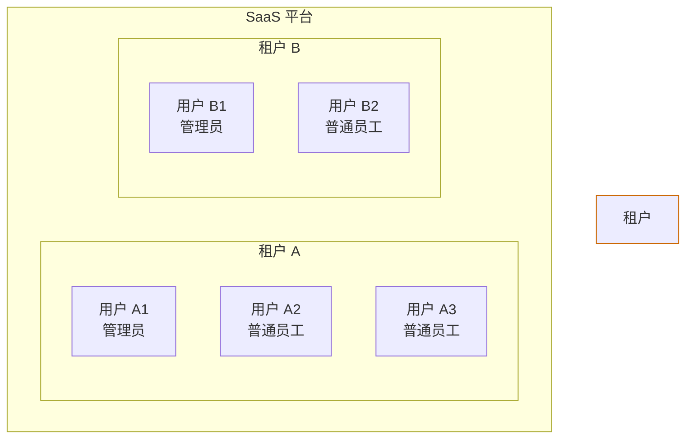

# 3. 用户分析

## 3.1 用户角色

### 角色 1：平台运营管理员 (Platform Admin)

**画像：** 35 岁，男性，互联网公司运维负责人

**背景：** 负责公司 SaaS 平台的整体运营和技术管理

**技术能力：** 中等偏上，熟悉基本的 IT 概念

**核心诉求：**

- 快速开通新租户
- 监控平台整体使用情况
- 处理租户异常和问题
- 生成运营报表

### 角色 2：租户管理员 (Tenant Admin)

**画像：** 30 岁，女性，企业 IT 部门主管

**背景：** 负责公司内部系统的用户管理和权限分配

**技术能力：** 中等，需要清晰的操作界面

**核心诉求：**

- 管理企业内的用户和部门
- 分配角色和权限
- 查看员工登录和操作日志
- 配置安全策略（密码策略、MFA）

### 角色 3：普通用户 (End User)

**画像：** 28 岁，男女均有，企业普通员工

**背景：** 日常使用 SaaS 系统完成工作

**技术能力：** 基础，只需要会操作即可

**核心诉求：**

- 快速登录系统
- 修改个人信息和密码
- 绑定/解绑 MFA
- 查看自己的权限范围

### 角色 4：开发者 (Developer)

**画像：** 26 岁，男性，后端开发工程师

**背景：** 负责将 IAM 集成到业务系统中

**技术能力：** 高，需要完善的 API 文档和 SDK

**核心诉求：**

- 清晰的 API 文档
- 多语言 SDK
- 快速接入指南
- 调试工具和支持

## 3.2 用户诉求总结

| 用户角色 | 核心诉求 | 优先级 |
|----------|----------|--------|
| 平台运营管理员 | 租户管理、监控报表 | P0 |
| 租户管理员 | 用户管理、权限分配、安全策略 | P0 |
| 普通用户 | 登录认证、个人信息管理 | P0 |
| 开发者 | API 文档、SDK、调试工具 | P1 |

## 3.3 典型使用场景

### 场景 1：新租户开通

场景描述：一家新公司签约使用 SaaS 平台，需要开通独立的租户空间。

参与角色：平台运营管理员

流程步骤：

1. 运营管理员创建租户
2. 设置租户配额（用户数、存储空间等）
3. 创建租户管理员账号
4. 将租户管理员激活邀请发送给客户
5. 租户管理员完成激活并初始化配置

### 场景 2：新员工入职

场景描述：某租户公司的新员工入职，需要开通系统访问权限。

参与角色：租户管理员、普通用户

流程步骤：

1. 租户管理员向新员工发送入租邀请
2. 新员工通过邀请链接设置密码并激活账号
3. 租户管理员分配角色和权限
4. 新员工绑定 MFA（如启用）
5. 新员工登录系统

### 场景 3：用户登录

场景描述：用户访问 SaaS 应用，进行身份认证。

参与角色：普通用户

流程步骤：

1. 用户访问登录页面
2. 输入用户名和密码
3. 系统验证密码正确性
4. 如启用 MFA，输入动态验证码
5. 登录成功，跳转至首页
6. 系统记录登录日志

## 3.4 租户与用户关系

### 3.4.1 概念对比

| 维度 | 租户 (Tenant) | 用户 (User) |
|------|--------------|------------|
| **定义** | SaaS 平台中独立的企业客户 | 属于某个租户的具体个人 |
| **层级** | 高层级容器 | 隶属于租户 |
| **作用** | 数据隔离的基本单位 | 系统的实际使用者 |
| **管理方式** | 平台运营统一管理 | 租户管理员在租户内管理 |
| **数据归属** | 拥有独立的数据空间 | 数据归属于所属租户 |
| **典型示例** | 某公司、某组织 | 公司的员工、组织的成员 |

### 3.4.2 层级关系图

### 3.4.3 核心要点

#### 1. 一对多关系

- 一个租户可以拥有多个用户（1:N）
- 一个用户只能属于一个租户
- 不同租户可以有相同邮箱的用户（数据隔离）

#### 2. 数据隔离

- 租户是数据隔离的基本边界
- 租户 A 的用户无法访问租户 B 的数据
- 所有用户数据都带有 `tenant_id` 标识

#### 3. 管理权限

- 平台运营管理员：管理租户（创建、编辑、冻结）
- 租户管理员：管理租户内的用户和权限
- 普通用户：仅管理个人信息

#### 4. 生命周期

- 租户创建在前，用户创建在后
- 租户冻结时，该租户下所有用户无法登录
- 租户删除时，该租户下所有用户数据级联删除

### 3.4.4 相关需求

| 管理对象 | 需求 ID | 需求名称 |
|----------|---------|----------|
| 租户 | REQ-007 | 租户管理功能 |
| 用户 | REQ-004 | 用户管理功能 |
| 用户认证 | REQ-001, REQ-002, REQ-003, REQ-015 | 登录、邀请注册/激活、密码重置、验证码登录 |
| 用户权限 | REQ-005, REQ-006 | 角色管理、权限分配 |
