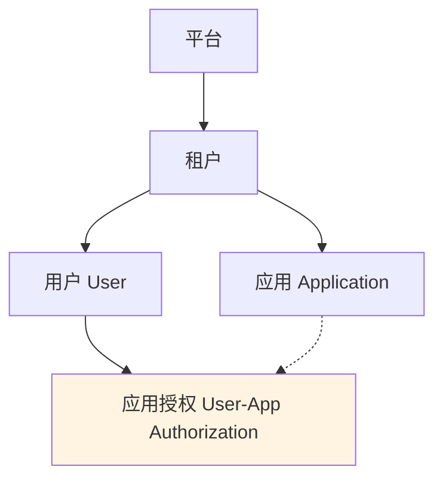

# REQ-017 应用管理与数据隔离功能

| 项目 | 内容 |
|------|------|
| **优先级** | P0 |
| **状态** | 待开发 |
| **关联用户故事** | US-032、US-033 |
| **关联需求** | REQ-007 租户管理、REQ-018 内部服务认证 |

## 1. 背景

首版本明确采用“**IAM 统一管理租户下应用及用户-应用授权关系**”的方案，将应用作为租户下的一等资源，以支持授权隔离、Token 下发和审计追溯。

`Application` 用于描述租户内业务应用，如 OA、CRM、ERP；它不同于平台级机器主体 `Client`，不参与内部服务 `scope` 认证模型。

## 2. 目标

- 支持租户内应用的创建、查询、更新、禁用和删除
- 支持用户与应用之间的显式授权关系
- 支持登录时将用户可访问应用列表写入 Token 的 `apps` claim
- 支持审计日志和登录日志按应用维度追溯
- 明确区分租户内 `Application` 与平台级 `Client`

## 3. 模型定义

### 3.1 模型关系



### 3.2 数据模型

**应用表（applications）**

| 字段 | 类型 | 必填 | 说明 | 示例 |
|------|------|------|------|------|
| id | BIGINT | 是 | 主键 | 1001 |
| tenant_id | BIGINT | 是 | 所属租户 ID | 100 |
| code | VARCHAR(32) | 是 | 应用编码，租户内唯一 | oa、crm、erp |
| name | VARCHAR(64) | 是 | 应用名称 | OA 系统、CRM 系统 |
| description | VARCHAR(255) | 否 | 应用描述 | 企业办公自动化系统 |
| status | TINYINT | 是 | 状态：1=激活，2=禁用 | 1 |
| created_at | TIMESTAMP | - | 创建时间 | 2026-03-28 10:00:00 |
| updated_at | TIMESTAMP | - | 更新时间 | 2026-03-28 10:00:00 |

**唯一索引**：`uk_tenant_code (tenant_id, code)` — 同一租户下应用编码唯一

---

**用户 - 应用授权表（user_app_authorizations）**

| 字段 | 类型 | 必填 | 说明 | 示例 |
|------|------|------|------|------|
| id | BIGINT | 是 | 主键 | 2001 |
| tenant_id | BIGINT | 是 | 所属租户 ID | 100 |
| user_id | BIGINT | 是 | 用户 ID | 5001 |
| app_id | BIGINT | 是 | 应用 ID | 1001 |
| created_at | TIMESTAMP | - | 授权时间 | 2026-03-28 10:00:00 |

**唯一索引**：`uk_tenant_user_app (tenant_id, user_id, app_id)` — 同一租户下同一用户对同一应用只能有一条授权记录

### 3.3 数据关系说明

| 关系 | 说明 |
|------|------|
| 租户 → 应用 | 一对多：一个租户下可以有多个应用 |
| 用户 → 应用 | 多对多：一个用户可以访问多个应用，一个应用可以被多个用户访问 |
| 授权记录 | 通过 `user_app_authorizations` 表建立用户与应用的多对多关系 |

> 说明：内部服务认证使用平台级 `Client` 主体，由 [REQ-018 内部服务认证](./REQ-018-internal-service-authentication.md) 定义；`Application` 仅表示租户内业务应用。

## 4. 核心规则

### 4.1 Token 设计

用户登录成功后，IAM 在 Access Token 中固化可访问应用列表，不增加单独的 `app_id` 字段，但增加 `apps` claim：

```json
{
  "sub": "user-123",
  "tenant_id": "tenant-456",
  "roles": ["admin"],
  "apps": ["oa", "crm"]
}
```

规则：

1. `apps` 表示当前用户可访问的应用编码列表
2. 应用授权变更对新签发 Token 立即生效
3. 已签发 Token 通过短 TTL 和显式撤销策略控制旧授权残留时间
4. 平台级 `Client` Token 不携带租户应用列表

### 4.2 隔离方式

| 层级 | 隔离方式 |
|------|----------|
| IAM 层 | 管理应用生命周期和用户 - 应用授权关系 |
| 业务层 | 业务数据表增加 `app_id` 字段，查询时带应用过滤条件 |

### 4.3 `Application` 与 `Client` 边界

| 维度 | Application | Client |
|------|-------------|--------|
| 层级 | 租户内资源 | 平台级机器主体 |
| 主要用途 | 用户访问某个业务应用 | 机器对机器调用 API |
| 是否携带 `tenant_id` | 是 | 否，默认平台级 |
| 是否进入用户 Token `apps` | 是 | 否 |
| 权限模型 | 用户-应用授权 + RBAC | `scope` |

## 5. API 接口

| API | 功能 |
|-----|------|
| `POST /api/v1/apps` | 创建应用 |
| `GET /api/v1/apps` | 应用列表 |
| `GET /api/v1/apps/:id` | 应用详情 |
| `PUT /api/v1/apps/:id` | 更新应用 |
| `DELETE /api/v1/apps/:id` | 删除应用 |
| `POST /api/v1/apps/:id/authorize` | 授权用户访问应用 |
| `DELETE /api/v1/apps/:id/authorize/:user_id` | 撤销应用授权 |
| `GET /api/v1/apps/:id/users` | 获取应用授权用户列表 |

## 6. 异常情况

| 异常场景 | 系统处理 |
|----------|----------|
| 应用编码重复 | 提示"应用编码已存在" |
| 应用已禁用 | 不再允许新增授权，现有访问需重新获取 Token |
| 授权不存在 | 提示"授权关系不存在" |
| 删除仍有授权的应用 | 提示需先撤销授权或禁用应用 |
| 用户不属于当前租户 | 拒绝授权 |

## 7. 验收标准

- [ ] 可创建、查询、更新、禁用和删除租户内应用
- [ ] 可为用户分配和撤销应用访问权限
- [ ] 登录成功后 Token 中正确下发 `apps` claim
- [ ] 应用授权变更对新签发 Token 立即生效
- [ ] 审计日志和登录日志可按应用维度追溯

## 8. 对现有需求的影响

| 需求 | 影响 |
|------|------|
| REQ-007 租户管理 | 需要展示应用配额与租户内应用上下文 |
| REQ-005 角色管理 | 角色仍保持租户级定义，但用户分配角色时支持应用范围 |
| REQ-009 操作审计日志 | 增加可选 `app_id` 字段 |
| REQ-010 登录日志 | 增加可选 `app_id` 字段 |
| REQ-012 Token 管理 | 用户 Token 固化 `apps` claim |
| REQ-018 内部服务认证 | 平台级 `Client` 与租户级 `Application` 需要明确边界 |
