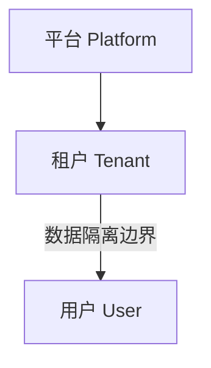
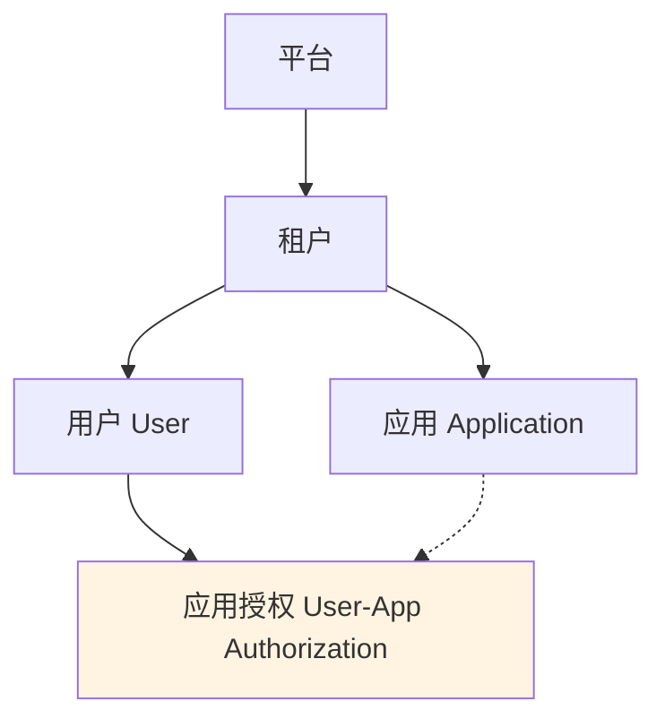
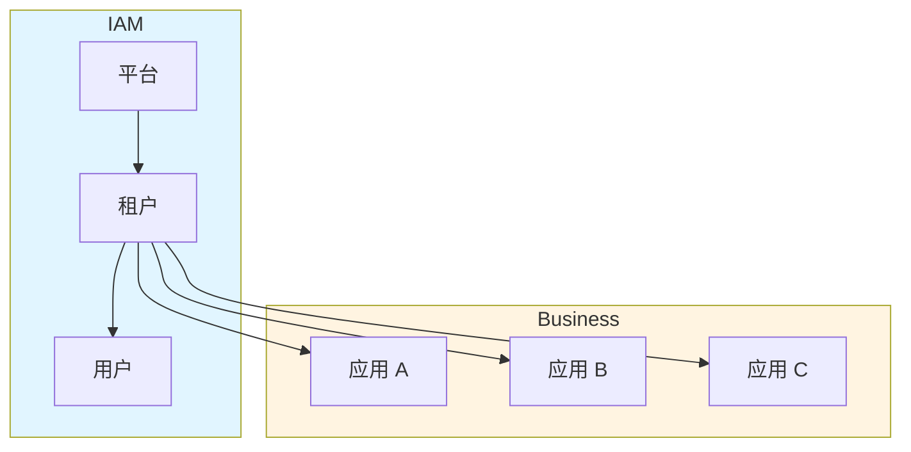

# REQ-017 应用级数据隔离方案选型

| 项目 | 内容 |
|------|------|
| **优先级** | P0（阻塞性需求） |
| **状态** | 待决策 |
| **创建日期** | 2026-03-28 |
| **关联需求** | REQ-007 租户管理、REQ-018 内部服务认证 |

---

## 1. 背景与问题

### 1.1 现状

当前 IAM 认证模型需要同时覆盖 **用户认证** 和 **内部服务认证** 两类主体。在应用隔离层面，核心业务数据模型仍以 **平台 - 租户 - 用户** 为基础：



- 租户是数据隔离的唯一边界
- 所有用户数据通过 `tenant_id` 进行隔离
- Token 中包含 `tenant_id` 标识租户身份
- 内部服务客户端属于平台级认证主体，不作为租户隔离实体

### 1.2 问题

一个租户可能拥有多个业务应用（例如：OA 系统、CRM 系统、ERP 系统），当前模型下：

- 这些应用的数据都共享同一个租户空间
- 无法在应用层面进行数据隔离
- 无法管理用户对不同应用的访问权限

### 1.3 目标

在现有租户模型基础上，支持应用级数据隔离，满足以下场景：

| 场景 | 描述 |
|------|------|
| 数据隔离 | 租户下不同应用的数据相互隔离 |
| 权限控制 | 用户可被授权访问租户下的部分或全部应用 |
| 审计追溯 | 操作日志可追溯到具体应用维度 |

---

## 2. 方案对比

### 2.1 方案 A：IAM 层扩展应用模型（推荐）

在 IAM 中增加 `Application` 实体，作为租户下的资源进行统一管理。该实体用于业务应用隔离，不等同于平台级内部客户端。

#### 2.1.1 模型设计



#### 2.1.2 数据模型

**应用表（applications）**

| 字段 | 类型 | 必填 | 说明 | 示例 |
|------|------|------|------|------|
| id | BIGINT | 是 | 主键 | 1001 |
| tenant_id | BIGINT | 是 | 所属租户 ID | 100 |
| name | VARCHAR(64) | 是 | 应用名称 | OA 系统、CRM 系统 |
| app_code | VARCHAR(32) | 是 | 应用编码，租户内唯一 | oa、crm、erp |
| description | VARCHAR(255) | 否 | 应用描述 | 企业办公自动化系统 |
| status | TINYINT | 是 | 状态：1=激活，0=禁用 | 1 |
| created_at | TIMESTAMP | - | 创建时间 | 2026-03-28 10:00:00 |

**唯一索引**：`uk_tenant_app_code (tenant_id, app_code)` — 同一租户下应用编码唯一

---

**用户 - 应用授权表（user_apps）**

| 字段 | 类型 | 必填 | 说明 | 示例 |
|------|------|------|------|------|
| id | BIGINT | 是 | 主键 | 2001 |
| tenant_id | BIGINT | 是 | 所属租户 ID | 100 |
| user_id | BIGINT | 是 | 用户 ID | 5001 |
| app_id | BIGINT | 是 | 应用 ID | 1001 |
| granted_at | TIMESTAMP | - | 授权时间 | 2026-03-28 10:00:00 |

**唯一索引**：`uk_user_app (user_id, app_id)` — 同一用户对同一应用只能有一条授权记录

---

**数据关系说明**

| 关系 | 说明 |
|------|------|
| 租户 → 应用 | 一对多：一个租户下可以有多个应用 |
| 用户 → 应用 | 多对多：一个用户可以访问多个应用，一个应用可以被多个用户访问 |
| 授权记录 | 通过 `user_apps` 表建立用户与应用的多对多关系 |

> 说明：内部服务认证使用平台级 `Client` 主体，由 [REQ-018 内部服务认证](./REQ-018-internal-service-authentication.md) 定义；`Application` 继续仅表示租户内业务应用。

#### 2.1.3 Token 设计

Token 保持现有结构，**不增加** `app_id`，但可扩展 claim：

```json
{
  "sub": "user-123",
  "tenant_id": "tenant-456",
  "roles": ["admin"],
  "apps": ["oa", "crm"]  // 可选：用户可访问的应用列表
}
```

#### 2.1.4 数据隔离方式

| 层级 | 隔离方式 |
|------|----------|
| IAM 层 | 管理应用生命周期和用户 - 应用授权关系 |
| 业务层 | 业务数据表增加 `app_id` 字段，查询时带应用过滤条件 |

#### 2.1.5 优势

- IAM 统一管理应用生命周期和授权
- 可集中查看用户对应用的访问权限
- 审计日志可追溯到应用维度
- 符合 IAM 作为身份基础设施的定位

#### 2.1.6 劣势

- 需要扩展 IAM 数据模型和 API
- 增加 REQ-007 的复杂度

---

### 2.2 方案 B：业务层自行处理

IAM 保持现有 **平台 - 租户 - 用户** 模型，应用概念完全由业务系统处理。

#### 2.2.1 模型设计



> 说明：IAM 层保持现有 **平台 - 租户 - 用户** 模型，应用概念完全由业务系统自行维护。

#### 2.2.2 数据隔离方式

- 业务系统在自己数据库中维护 `app_id`
- 用户登录成功后，由业务系统判断用户可访问哪些应用
- Token 中不带 `app_id`，业务层自行处理应用授权

#### 2.2.3 优势

- IAM 模型简单，无需改动
- 应用模型完全由业务系统自定义
- 不影响现有需求规划

#### 2.2.4 劣势

- 每个业务系统都要重复实现应用隔离逻辑
- 无法在 IAM 层统一管理应用授权
- 审计日志无法在 IAM 层追溯应用维度
- 长期来看，维护成本高，容易形成数据孤岛

---

## 3. 方案对比总结

| 对比维度 | 方案 A：IAM 扩展 | 方案 B：业务层处理 |
|----------|------------------|-------------------|
| **IAM 改动** | 需要扩展数据模型和 API | 无需改动 |
| **业务系统改动** | 增加 `app_id` 字段 | 增加 `app_id` 字段 + 授权逻辑 |
| **统一管理** | 支持 | 不支持 |
| **审计追溯** | 支持应用维度 | 各系统自行实现 |
| **开发成本** | 中（一次性投入） | 低（短期），高（长期重复） |
| **维护成本** | 低 | 高 |
| **扩展性** | 好 | 一般 |

---

## 4. 推荐方案

**推荐采用方案 A：IAM 层扩展应用模型**

### 4.1 理由

1. **符合 IAM 定位**：IAM 作为身份和访问管理基础设施，应当统一管理应用维度的授权
2. **避免重复建设**：各业务系统不需要重复实现应用隔离和授权逻辑
3. **审计合规**：支持应用维度的审计追溯，满足合规要求
4. **长期收益**：一次性投入，长期维护成本低

### 4.2 实施建议

#### 阶段一：数据模型扩展

- 新增 `applications` 表
- 新增 `user_apps` 授权表
- 在 REQ-007 租户管理中增加应用管理功能

#### 阶段二：API 扩展

| API | 功能 |
|-----|------|
| `POST /tenants/{id}/apps` | 创建应用 |
| `GET /tenants/{id}/apps` | 获取应用列表 |
| `POST /users/{id}/apps` | 授权用户访问应用 |
| `DELETE /users/{id}/apps/{appId}` | 撤销应用授权 |
| `GET /users/{id}/apps` | 获取用户可访问的应用列表 |

#### 阶段三：Token 扩展（可选）

- 在 Token 中增加 `apps` claim，列出用户可访问的应用
- 或在业务层通过 API 查询用户可访问的应用

---

## 5. 待决策项

| 决策点 | 选项 | 推荐 |
|--------|------|------|
| 是否在 IAM 层管理应用？ | 是 / 否 | 是 |
| Token 是否增加 `apps` claim？ | 是 / 否 | 可选 |
| 应用授权是在登录时计算还是实时查询？ | 登录时 / 实时查询 | 登录时（写入 Token） |

---

## 6. 对现有需求的影响

| 需求 | 影响 |
|------|------|
| REQ-007 租户管理 | 需要扩展，增加应用管理功能 |
| REQ-005 角色管理 | 可选：角色可关联到应用维度 |
| REQ-009 审计日志 | 需要扩展，增加 `app_id` 字段 |
| REQ-012 Token 管理 | 可选：用户 Token 增加 `apps` claim，并与客户端 Token 并存 |
| REQ-018 内部服务认证 | 平台级 `Client` 与租户级 `Application` 需要明确边界 |

---

## 7. 附录：术语表

| 术语 | 定义 |
|------|------|
| 租户 (Tenant) | SaaS 平台中独立的企业客户，数据隔离的基本单位 |
| 应用 (Application) | 租户下的业务系统，如 OA、CRM、ERP 等 |
| 用户 (User) | 属于某个租户的具体个人，可被授权访问一个或多个应用 |
