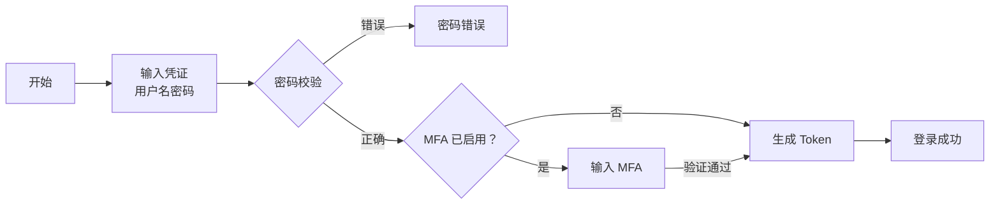
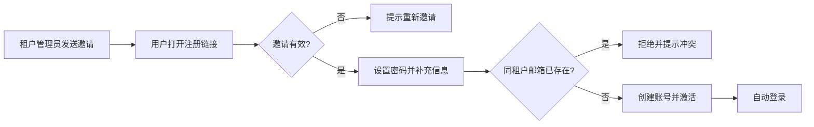
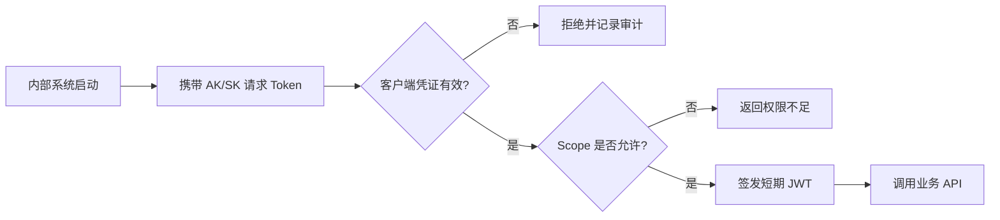

# 7. 业务流程

## 7.1 用户登录流程

```mermaid
flowchart LR
    A[开始] --> B[输入凭证<br/>用户名密码]
    B --> C{密码校验}
    C -->|错误 | D[密码错误]
    C -->|正确 | E{MFA 已启用？}
    E -->|是 | F[输入 MFA]
    E -->|否 | G[生成 Token]
    F -->|验证通过 | G
    G --> H[登录成功]
```

## 7.2 用户注册与激活流程

```mermaid
flowchart LR
    A[租户管理员发送邀请] --> B[用户打开注册链接]
    B --> C{邀请有效?}
    C -->|否| D[提示重新邀请]
    C -->|是| E[设置密码并补充信息]
    E --> F{同租户邮箱已存在?}
    F -->|是| G[拒绝并提示冲突]
    F -->|否| H[创建账号并激活]
    H --> I[自动登录]
```

## 7.3 权限分配流程

```mermaid
flowchart LR
    A[创建角色] --> B[配置权限点]
    B --> C[保存角色]
    C --> D[选择用户]
    D --> E[分配角色]
    E --> F[权限生效]
```

## 7.4 内部服务认证流程

```mermaid
flowchart LR
    A[内部系统启动] --> B[携带 AK/SK 请求 Token]
    B --> C{客户端凭证有效?}
    C -->|否| D[拒绝并记录审计]
    C -->|是| E{Scope 是否允许?}
    E -->|否| F[返回权限不足]
    E -->|是| G[签发短期 JWT]
    G --> H[调用业务 API]
```

## 7.5 租户开通流程

```mermaid
flowchart LR
    A[创建租户] --> B[配置配额]
    B --> C[创建管理员]
    C --> D[发送凭证]
    D --> E[租户初始化]
    E --> F[租户可用]
```
