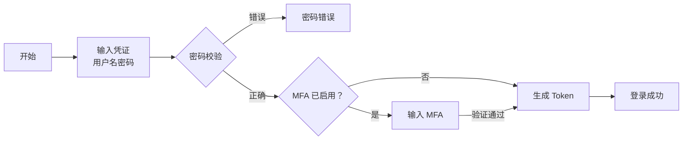

# 7. 业务流程

## 7.1 用户登录流程

```mermaid
flowchart LR
    A[开始] --> B[输入凭证<br/>用户名密码]
    B --> C{密码校验}
    C -->|错误 | D[密码错误]
    C -->|正确 | E{MFA 已启用？}
    E -->|是 | F[输入 MFA]
    E -->|否 | G[生成 Token]
    F -->|验证通过 | G
    G --> H[登录成功]
```

## 7.2 权限分配流程

```mermaid
flowchart LR
    A[创建角色] --> B[配置权限点]
    B --> C[保存角色]
    C --> D[选择用户]
    D --> E[分配角色]
    E --> F[权限生效]
```

## 7.3 租户开通流程

```mermaid
flowchart LR
    A[创建租户] --> B[配置配额]
    B --> C[创建管理员]
    C --> D[发送凭证]
    D --> E[租户初始化]
    E --> F[租户可用]
```
