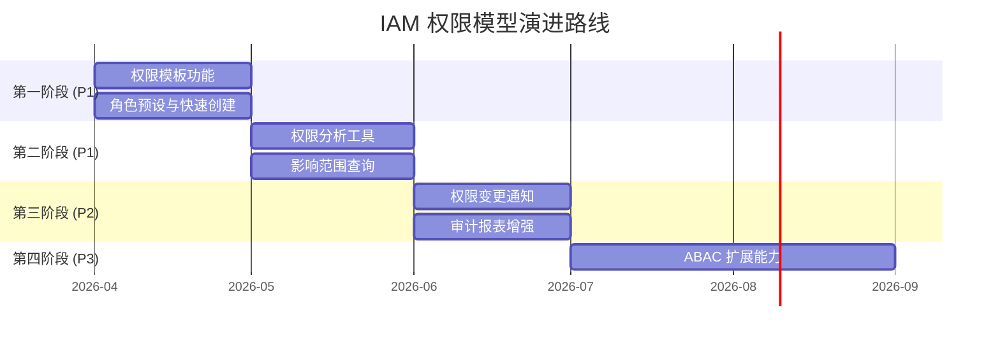
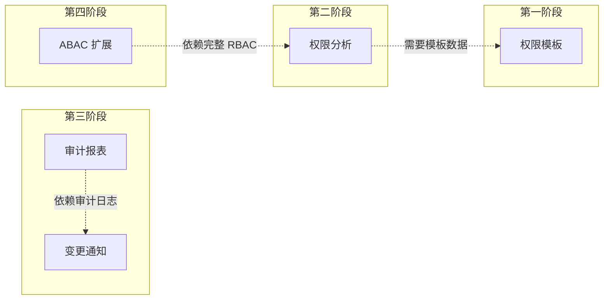

# IAM 权限模型演进路线

> 最后更新：2026-04-03
> 本文档定义 IAM 权限模型在核心 RBAC 基础上的未来增强方向，按优先级和依赖关系排序。

---

## 1. 概述

当前 IAM 权限模型已覆盖核心 RBAC、约束 RBAC、数据权限和多租户隔离能力。本文档定义的演进路线旨在进一步提升系统的**易用性**、**可运维性**和**灵活性**。

### 1.1 演进原则

| 原则 | 说明 |
|------|------|
| **核心优先** | 优先实现高价值、低复杂度的功能 |
| **向后兼容** | 所有增强不破坏现有 API 和数据模型 |
| **渐进式采用** | 新功能可选开启，不影响现有用户 |
| **文档先行** | 每个功能实现前先完善设计和 API 文档 |

---

## 2. 演进路线总览



---

## 3. 第一阶段：权限模板功能（P1）

### 3.1 背景

**当前状态：** 系统支持创建自定义角色，但每次创建都需要手动选择权限。对于常见岗位（如"销售经理"、"HR 专员"），缺少快速创建方式。

**用户痛点：**
- 管理员需要反复配置相似角色
- 新租户开通时角色配置效率低
- 缺少行业最佳实践参考

### 3.2 功能设计

#### 3.2.1 角色模板定义

**role_templates 表 - 角色模板**

| 字段 | 类型 | 必填 | 说明 | 示例 |
|------|------|------|------|------|
| id | BIGINT | 是 | 主键 | 1001 |
| template_code | VARCHAR(50) | 是 | 模板编码（全局唯一） | "sales_manager" |
| name | VARCHAR(100) | 是 | 模板名称 | "销售经理" |
| description | TEXT | 否 | 模板描述 | "负责销售团队管理和本部门客户查看" |
| category | VARCHAR(50) | 是 | 分类 | "销售"、"HR"、"财务"、"技术" |
| default_permissions | JSON | 是 | 默认权限列表 | `["customer:read", "customer:write"]` |
| recommended_scopes | JSON | 否 | 推荐数据范围 | `{"customer": "dept_and_sub"}` |
| is_official | TINYINT | 是 | 是否官方模板 | 1 |
| created_at | DATETIME | 是 | 创建时间 | 2026-04-01 10:00:00 |

#### 3.2.2 官方模板示例

| 模板编码 | 模板名称 | 分类 | 典型权限 |
|----------|----------|------|----------|
| `system_admin` | 系统管理员 | 技术 | 全部权限（除敏感操作） |
| `hr_specialist` | HR 专员 | HR | 员工 CRUD、考勤查看 |
| `sales_manager` | 销售经理 | 销售 | 本部门客户管理、订单查看 |
| `sales_rep` | 销售代表 | 销售 | 个人客户管理、订单创建 |
| `finance_view` | 财务查看员 | 财务 | 账单查看、报表导出 |
| `finance_edit` | 财务专员 | 财务 | 账单管理、支付处理 |

#### 3.2.3 API 设计

| API | 方法 | 功能 |
|-----|------|------|
| `/role-templates` | GET | 获取角色模板列表（支持分类过滤） |
| `/role-templates/:code` | GET | 获取模板详情（包含权限列表） |
| `/roles/from-template` | POST | 基于模板创建角色 |

**基于模板创建角色请求示例：**

```json
POST /roles/from-template
{
  "tenant_id": 100,
  "template_code": "sales_manager",
  "role_name": "华东区销售经理",  // 可选，默认使用模板名称
  "role_description": "负责华东区销售业务",  // 可选
  "permission_adjustments": {
    "add": ["report:export"],     // 可选：增加权限
    "remove": ["customer:delete"] // 可选：移除权限
  },
  "data_scopes": {
    "customer": "dept_and_sub"    // 可选：自定义数据范围
  }
}
```

### 3.3 验收标准

- [ ] 系统预置至少 6 个官方角色模板
- [ ] 支持基于模板一键创建角色
- [ ] 支持在模板基础上微调权限
- [ ] 支持租户自定义模板（可选）

---

## 4. 第二阶段：权限分析工具（P1）

### 4.1 背景

**当前状态：** 系统支持查询用户权限和角色权限，但缺少反向查询和影响分析能力。

**用户痛点：**
- 无法快速定位"哪些角色拥有某权限"
- 无法评估"修改角色会影响多少用户"
- 难以发现"过度授权的用户"

### 4.2 功能设计

#### 4.2.1 权限影响分析

**API：权限反向查询**

```
GET /permissions/:id/roles
GET /permissions/:id/users  // 直接拥有该权限的所有用户
```

**响应示例：**

```json
{
  "permission_id": 2001,
  "permission_name": "customer:read",
  "roles_with_permission": [
    {
      "role_id": 101,
      "role_name": "销售经理",
      "user_count": 15
    },
    {
      "role_id": 102,
      "role_name": "销售代表",
      "user_count": 50
    }
  ],
  "total_affected_users": 65
}
```

#### 4.2.2 角色影响分析

**API：角色变更前影响评估**

```
GET /roles/:id/impact-analysis
```

**响应示例：**

```json
{
  "role_id": 101,
  "role_name": "销售经理",
  "direct_users": 15,
  "inherited_users": 5,  // 通过角色继承获得该角色的用户
  "total_affected_users": 20,
  "user_breakdown": {
    "by_department": [
      {"dept_id": 1, "dept_name": "华东销售部", "user_count": 10},
      {"dept_id": 2, "dept_name": "华北销售部", "user_count": 10}
    ]
  }
}
```

#### 4.2.3 过度授权检测

**API：用户权限分析报告**

```
GET /users/:id/permission-analysis
```

**响应示例：**

```json
{
  "user_id": 5001,
  "user_name": "张三",
  "total_permissions": 45,
  "roles": ["销售经理", "项目管理员"],
  "risk_indicators": [
    {
      "type": "high_privilege_count",
      "message": "用户权限数超过同角色平均水平（45 vs 平均 30）"
    },
    {
      "type": "conflicting_roles",
      "message": "用户同时拥有潜在冲突的角色：'申请人' 和 '审批人'"
    }
  ],
  "unused_permissions": [
    {"permission": "system:config", "last_used": null},
    {"permission": "user:delete", "last_used": "2026-01-15"}
  ]
}
```

### 4.3 验收标准

- [ ] 支持权限反向查询（哪些角色/用户拥有某权限）
- [ ] 支持角色影响分析（修改角色会影响多少用户）
- [ ] 支持过度授权检测和建议
- [ ] 提供可视化报告（可选：前端图表展示）

---

## 5. 第三阶段：通知与报表增强（P2）

### 5.1 权限变更通知（P2）

#### 5.1.1 背景

**当前状态：** 权限变更后缓存会失效，但用户和前端无感知。

**使用场景：**
- 管理员收回用户权限后，用户希望及时知道
- 安全团队需要监控高权限变更

#### 5.1.2 功能设计

**通知渠道：**

| 渠道 | 触发场景 | 接收方 |
|------|----------|--------|
| WebSocket | 权限实时变更 | 在线用户 |
| 站内消息 | 权限变更确认 | 被变更用户 |
| 邮件/Slack | 高权限变更告警 | 安全团队 |

**变更类型：**

- 用户角色被添加/移除
- 角色权限被修改
- 数据范围被调整

#### 5.1.3 API 设计

```json
// 权限变更通知消息
{
  "type": "permission_changed",
  "user_id": 5001,
  "changes": [
    {
      "action": "role_removed",
      "role_name": "销售经理",
      "changed_by": 1,
      "changed_at": "2026-04-01T10:00:00Z",
      "reason": "岗位调动"  // 可选
    }
  ]
}
```

### 5.2 审计报表增强（P2）

#### 5.2.1 背景

**当前状态：** 审计日志记录完整，但缺少定期汇总和可视化报表。

#### 5.2.2 报表类型

| 报表 | 周期 | 内容 |
|------|------|------|
| 权限变更汇总 | 周报 | 本周角色/权限变更统计、影响用户数 |
| 闲置权限报告 | 月报 | 90 天未使用的权限列表、建议回收 |
| 过度授权报告 | 月报 | 权限数超标的用户列表 |
| 合规审计报告 | 季度 | 满足 SOC2 要求的审计报告 |

#### 5.2.3 API 设计

```
GET /reports/permission-changes?start=2026-04-01&end=2026-04-07
GET /reports/unused-permissions?threshold_days=90
GET /reports/overprivileged-users
```

### 5.3 验收标准

- [ ] 权限变更支持 WebSocket 实时通知
- [ ] 支持配置高权限变更告警规则
- [ ] 支持生成权限变更汇总报告
- [ ] 支持闲置权限识别和建议回收

---

## 6. 第四阶段：ABAC 扩展能力（P3）

### 6.1 背景

**当前状态：** 系统采用 RBAC 模型，支持静态角色授权。

**使用场景（需要 ABAC）：**
- "只能在工作时间（9:00-18:00）访问敏感数据"
- "只能在办公网 IP 范围内访问管理后台"
- "只能访问入职时间早于自己的员工档案"

### 6.2 功能设计

#### 6.2.1 策略模型

**ABAC 四要素：**

| 要素 | 说明 | 示例属性 |
|------|------|----------|
| **主体（Subject）** | 请求方 | user.role, user.department, user.level |
| **资源（Resource）** | 被访问对象 | resource.type, resource.owner, resource.sensitivity |
| **操作（Action）** | 动作 | read, write, delete, export |
| **环境（Environment）** | 上下文 | env.time, env.ip, env.device |

#### 6.2.2 策略语言（简化版）

```json
{
  "policy_id": "pol_001",
  "name": "工作时间限制",
  "effect": "deny",
  "condition": {
    "and": [
      { "attr": "resource.sensitivity", "op": "gte", "value": "L3" },
      {
        "or": [
          { "attr": "env.hour", "op": "lt", "value": 9 },
          { "attr": "env.hour", "op": "gte", "value": 18 },
          { "attr": "env.weekday", "op": "gte", "value": 5 }
        ]
      }
    ]
  }
}
```

#### 6.2.3 混合授权模式

```
用户最终权限 = RBAC 授权 ∩ ABAC 策略

即：
1. 先通过 RBAC 获取基础权限
2. 再通过 ABAC 策略进行动态过滤
```

#### 6.2.4 集成方式

**方案 A：内部策略引擎（推荐初期）**

- 实现简化的策略解析器
- 支持常见条件运算符（=, !=, >, <, in, contains）
- 策略存储于数据库

**方案 B：OPA 集成（推荐长期）**

- 集成 Open Policy Agent
- 使用 Rego 策略语言
- 支持更复杂的策略逻辑

### 6.3 验收标准

- [ ] 支持定义 ABAC 策略
- [ ] 支持 RBAC + ABAC 混合授权
- [ ] 支持策略测试和模拟
- [ ] 策略评估性能 < 10ms（P95）

---

## 7. 依赖关系与优先级

### 7.1 依赖关系图



### 7.2 优先级评估矩阵

| 功能 | 用户价值 | 技术复杂度 | 开发成本 | 优先级 |
|------|----------|------------|----------|--------|
| 权限模板 | 高 | 低 | 低 | P1 |
| 权限分析 | 高 | 中 | 中 | P1 |
| 变更通知 | 中 | 中 | 中 | P2 |
| 审计报表 | 中 | 低 | 低 | P2 |
| ABAC 扩展 | 中（特定场景） | 高 | 高 | P3 |

---

## 8. 成功指标

### 8.1 采用率指标

| 指标 | 目标值 |
|------|--------|
| 角色模板使用率 | > 60% 新角色通过模板创建 |
| 权限分析 API 调用量 | > 100 次/天 |
| 变更通知订阅用户 | > 30% 管理员开启 |

### 8.2 运维效率指标

| 指标 | 目标值 |
|------|--------|
| 角色创建平均耗时 | 从 5 分钟降至 1 分钟 |
| 权限问题定位时间 | 从 30 分钟降至 5 分钟 |
| 闲置权限回收率 | > 80% 被识别的闲置权限 |

---

## 9. 参考文档

| 文档 | 说明 |
|------|------|
| [RBAC 设计文档](./references/rbac-design.md) | 核心 RBAC 模型 |
| [数据权限设计](./references/data-permission.md) | 行级/列级权限 |
| [系统架构](./PRD/03-system-architecture.md) | 整体架构设计 |

---

## 10. 修订历史

| 版本 | 日期 | 作者 | 变更说明 |
|------|------|------|----------|
| v0.1 | 2026-04-03 | IAM Team | 初始版本，定义四阶段演进路线 |
