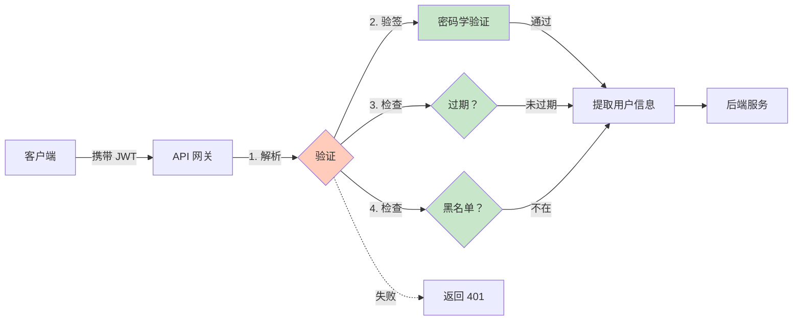
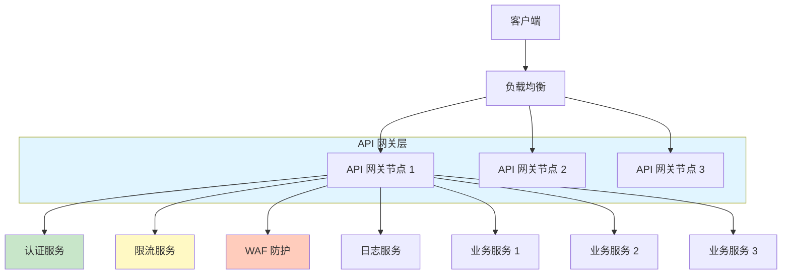

# API 网关安全

> 最后更新：2026-03-29
> 适用场景：API 网关设计、接口防护、流量管理

---

## 1. 概述

API 网关是系统的统一入口，负责请求路由、认证授权、限流降级等安全功能。

```
客户端 → API 网关 → 后端服务
         ↑
    安全防护层
```

**核心功能：**

| 功能 | 说明 |
|------|------|
| **认证授权** | 验证 Token，检查权限 |
| **限流** | 防止滥用和 DDoS 攻击 |
| **请求校验** | 过滤恶意请求 |
| **日志审计** | 记录所有请求 |
| **WAF** | Web 应用防火墙 |

---

## 2. API 认证

### 2.1 认证方式对比

| 方式 | 说明 | 适用场景 |
|------|------|----------|
| **JWT** | Token 自包含用户信息 | 微服务、移动端 |
| **Opaque Token** | 随机字符串，需查库验证 | 单应用、高安全场景 |
| **API Key** | 静态密钥，标识调用方 | 服务端对服务端 |
| **OAuth 2.0** | 第三方授权 | 开放平台 |

### 2.2 JWT 认证流程



### 2.3 Go 代码示例

```go
// JWT 认证中间件
func JWTAuthMiddleware() gin.HandlerFunc {
    return func(c *gin.Context) {
        // 1. 从 Header 获取 Token
        authHeader := c.GetHeader("Authorization")
        if authHeader == "" {
            c.AbortWithStatusJSON(401, gin.H{"error": "缺少认证信息"})
            return
        }

        // 2. 解析 Bearer Token
        parts := strings.SplitN(authHeader, " ", 2)
        if len(parts) != 2 || parts[0] != "Bearer" {
            c.AbortWithStatusJSON(401, gin.H{"error": "认证格式错误"})
            return
        }
        tokenString := parts[1]

        // 3. 解析和验证 Token
        token, err := jwt.Parse(tokenString, func(token *jwt.Token) (interface{}, error) {
            // 验证签名算法
            if _, ok := token.Method.(*jwt.SigningMethodRSA); !ok {
                return nil, fmt.Errorf("unexpected signing method: %v", token.Header["alg"])
            }
            return publicKey, nil
        })

        if err != nil {
            c.AbortWithStatusJSON(401, gin.H{"error": "Token 无效"})
            return
        }

        // 4. 检查黑名单
        jti := token.Claims.(jwt.MapClaims)["jti"].(string)
        if isBlacklisted(jti) {
            c.AbortWithStatusJSON(401, gin.H{"error": "Token 已撤销"})
            return
        }

        // 5. 提取用户信息到 Context
        claims := token.Claims.(jwt.MapClaims)
        c.Set("user_id", claims["sub"])
        c.Set("tenant_id", claims["tenant_id"])
        c.Set("roles", claims["roles"])

        c.Next()
    }
}
```

---

## 3. 限流（Rate Limiting）

### 3.1 限流算法

| 算法 | 说明 | 优点 | 缺点 |
|------|------|------|------|
| **固定窗口** | 固定时间窗口内计数 | 实现简单 | 临界问题 |
| **滑动窗口** | 滑动时间窗口内计数 | 更平滑 | 实现复杂 |
| **令牌桶** | 固定速率产生令牌 | 支持突发 | 需要状态 |
| **漏桶** | 固定速率流出 | 强制恒定速率 | 不灵活 |

### 3.2 令牌桶算法实现

```
令牌桶容量：100 个
令牌产生速率：10 个/秒

请求到来时：
- 桶中有令牌 → 消耗一个，允许通过
- 桶中无令牌 → 拒绝请求

特点：
- 支持突发（最多 100 个请求）
- 长期平均速率：10 个/秒
```

### 3.3 Go 代码示例（Redis 实现）

```go
// 基于 Redis 的限流器
type RateLimiter struct {
    redis *redis.Client
}

// 滑动窗口限流
func (rl *RateLimiter) Allow(key string, limit int, window time.Duration) bool {
    ctx := context.Background()
    now := time.Now().UnixNano()
    windowStart := now - window.Nanoseconds()

    pipe := rl.redis.Pipeline()

    // 1. 移除窗口外的请求
    pipe.ZRemRangeByScore(ctx, key, "0", fmt.Sprintf("%d", windowStart))

    // 2. 添加当前请求
    pipe.ZAdd(ctx, key, redis.Z{
        Score:  float64(now),
        Member: fmt.Sprintf("%d-%s", now, uuid.New().String()),
    })

    // 3. 设置过期时间
    pipe.Expire(ctx, key, window)

    // 4. 统计窗口内请求数
    countPipe := rl.redis.Pipeline()
    count := countPipe.ZCard(ctx, key)

    _, err := pipe.Exec(ctx)
    if err != nil {
        return true // 错误时放行（或根据策略拒绝）
    }

    result, err := countPipe.Exec(ctx)
    if err != nil {
        return true
    }

    return result.(*redis.IntCmd).Val() <= limit
}

// 使用示例
limiter := &RateLimiter{redis: redisClient}

func RateLimitMiddleware() gin.HandlerFunc {
    return func(c *gin.Context) {
        key := "ratelimit:" + c.ClientIP() // 按 IP 限流

        if !limiter.Allow(key, 100, time.Minute) { // 100 次/分钟
            c.AbortWithStatusJSON(429, gin.H{
                "error": "请求过于频繁，请稍后再试",
            })
            return
        }

        c.Next()
    }
}
```

### 3.4 限流策略

| 维度 | 说明 | 示例 |
|------|------|------|
| **全局限流** | 整个系统的总请求数 | 10000 次/秒 |
| **单用户限流** | 每个用户的请求数 | 100 次/分钟 |
| **单 IP 限流** | 每个 IP 的请求数 | 1000 次/分钟 |
| **API 维度限流** | 每个接口的请求数 | 敏感接口更严格 |

---

## 4. 请求校验

### 4.1 输入验证

```go
// 请求参数验证
type LoginRequest struct {
    Email    string `json:"email" binding:"required,email"`
    Password string `json:"password" binding:"required,min=8,max=32"`
}

func Login(c *gin.Context) {
    var req LoginRequest

    // 自动验证
    if err := c.ShouldBindJSON(&req); err != nil {
        c.AbortWithStatusJSON(400, gin.H{"error": err.Error()})
        return
    }

    // 业务逻辑...
}
```

### 4.2 SQL 注入防护

```go
// 使用参数化查询
func GetUserByEmail(email string) (*User, error) {
    var user User
    // ❌ 错误：SQL 拼接
    // sql := fmt.Sprintf("SELECT * FROM users WHERE email = '%s'", email)

    // ✅ 正确：参数化
    db.Where("email = ?", email).First(&user)
    return &user, nil
}
```

### 4.3 XSS 防护

```go
// HTML 转义
import "html"

func SanitizeInput(input string) string {
    return html.EscapeString(input)
}

// 输出到 HTML 时自动转义
// 输入：<script>alert('xss')</script>
// 输出：&lt;script&gt;alert(&#39;xss&#39;)&lt;/script&gt;
```

---

## 5. WAF（Web 应用防火墙）

### 5.1 防护规则

| 规则类型 | 说明 | 示例 |
|----------|------|------|
| **SQL 注入** | 检测 SQL 注入特征 | `' OR 1=1 --` |
| **XSS** | 检测脚本注入 | `<script>...` |
| **路径遍历** | 检测目录穿越 | `../../../etc/passwd` |
| **命令注入** | 检测系统命令 | `; rm -rf /` |
| **敏感文件** | 阻止访问敏感文件 | `.git/config` |

### 5.2 简单 WAF 实现

```go
// WAF 中间件
func WAFMiddleware() gin.HandlerFunc {
    // 编译正则表达式（预编译，提高性能）
    sqlInjectionPattern := regexp.MustCompile(`(?i)(union|select|insert|update|delete|drop|'|--)`)
    xssPattern := regexp.MustCompile(`(?i)(<script|javascript:|on\w+=)`)
    pathTraversalPattern := regexp.MustCompile(`(\.\.\/|\.\.\\)`)

    return func(c *gin.Context) {
        // 1. 检查 Query 参数
        for _, values := range c.Request.URL.Query() {
            for _, value := range values {
                if sqlInjectionPattern.MatchString(value) {
                    c.AbortWithStatusJSON(400, gin.H{"error": "非法请求"})
                    return
                }
                if xssPattern.MatchString(value) {
                    c.AbortWithStatusJSON(400, gin.H{"error": "非法请求"})
                    return
                }
            }
        }

        // 2. 检查路径
        if pathTraversalPattern.MatchString(c.Request.URL.Path) {
            c.AbortWithStatusJSON(400, gin.H{"error": "非法请求"})
            return
        }

        // 3. 检查请求体（Body）
        // 注意：需要重新读取 Body，因为 gin 只能读取一次
        body, err := io.ReadAll(c.Request.Body)
        if err == nil {
            if sqlInjectionPattern.MatchString(string(body)) {
                c.AbortWithStatusJSON(400, gin.H{"error": "非法请求"})
                return
            }
        }

        // 重新设置 Body，供后续 handler 使用
        c.Request.Body = io.NopCloser(bytes.NewBuffer(body))

        c.Next()
    }
}
```

---

## 6. API 网关架构

### 6.1 架构图



### 6.2 中间件链

```go
// 中间件执行顺序
r := gin.Default()

// 1. 全局恢复（panic 恢复）
r.Use(gin.Recovery())

// 2. 全局 CORS
r.Use(CORSMiddleware())

// 3. WAF 防护（最外层防护）
r.Use(WAFMiddleware())

// 4. 限流（防止滥用）
r.Use(RateLimitMiddleware())

// 5. 认证（需要认证的 API）
authGroup := r.Group("")
authGroup.Use(JWTAuthMiddleware())
{
    // 需要认证的路由
    authGroup.GET("/users", GetUsers)
    authGroup.POST("/orders", CreateOrder)
}

// 6. 公开 API（无需认证）
publicGroup := r.Group("/public")
{
    publicGroup.POST("/login", Login)
    publicGroup.GET("/health", HealthCheck)
}
```

---

## 7. 日志与审计

### 7.1 请求日志

```go
// 请求日志中间件
func RequestLogger() gin.HandlerFunc {
    return func(c *gin.Context) {
        start := time.Now()
        path := c.Request.URL.Path

        // 处理请求
        c.Next()

        // 记录日志
        latency := time.Since(start)
        c.JSON(200, gin.H{
            "status":  c.Writer.Status(),
            "method":  c.Request.Method,
            "path":    path,
            "latency": latency.String(),
            "ip":      c.ClientIP(),
            "user_id": c.GetString("user_id"),
        })
    }
}
```

### 7.2 日志字段

| 字段 | 说明 | 示例 |
|------|------|------|
| `request_id` | 请求唯一标识 | uuid |
| `timestamp` | 请求时间 | 2026-03-29 10:00:00 |
| `method` | HTTP 方法 | GET/POST |
| `path` | 请求路径 | /api/users |
| `status` | 响应状态码 | 200/401/403/500 |
| `latency` | 响应时间 | 50ms |
| `client_ip` | 客户端 IP | 192.168.1.1 |
| `user_id` | 用户 ID（如有） | 12345 |
| `user_agent` | 用户代理 | Mozilla/5.0... |

---

## 8. 安全最佳实践

### 8.1 检查清单

- [ ] 所有 API 强制 HTTPS
- [ ] 实现 JWT 认证中间件
- [ ] 实现限流（按用户/IP/API）
- [ ] 实现 WAF 基础防护
- [ ] 记录所有请求日志
- [ ] 敏感操作记录审计日志
- [ ] 错误信息不泄露敏感数据
- [ ] 定期更新依赖和证书

### 8.2 错误处理

```go
// 统一错误处理
func ErrorHandler(c *gin.Context, err error) {
    // 记录详细错误到日志（内部）
    log.Printf("Error: %+v", err)

    // 返回通用错误给用户（不泄露细节）
    c.JSON(500, gin.H{
        "error": "服务器内部错误",
        "code":  "INTERNAL_ERROR",
    })
}
```

---

## 9. 参考链接

- API 网关模式：https://microservices.io/patterns/api-gateway.html
- Gin 框架：https://github.com/gin-gonic/gin
- Redis 限流：https://redis.io/commands/incr/
- OWASP API 安全：https://owasp.org/www-project-api-security/
