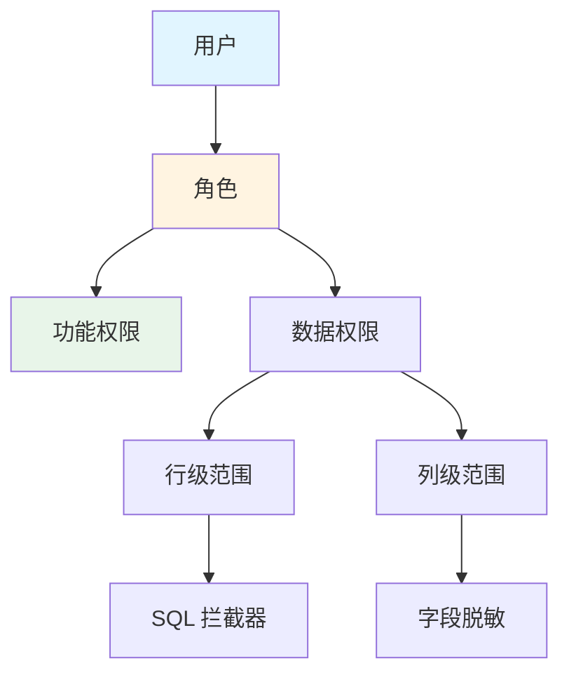
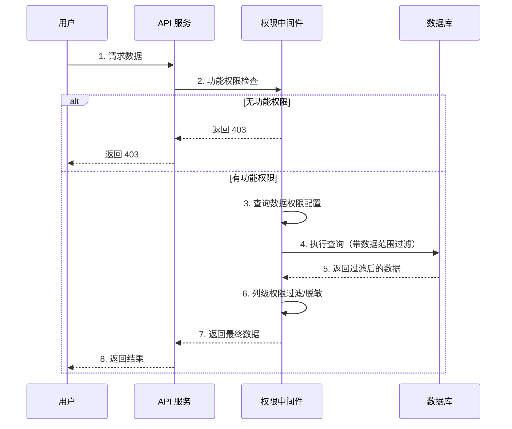

# 数据权限设计

> 最后更新：2026-03-28
> 适用场景：行级/列级数据访问控制、数据隔离、细粒度权限管理

---

## 1. 概述

数据权限控制用户对**数据范围**的访问能力，解决"用户可以访问哪些数据"的问题。

```
功能权限：用户是否可以访问"用户管理"菜单
数据权限：用户可以查看/编辑哪些用户的数据
```

**两个维度：**

| 维度 | 说明 | 示例 |
|------|------|------|
| **行级权限** | 控制用户可以访问哪些行（记录） | 销售经理可看全部，销售只能看自己的客户 |
| **列级权限** | 控制用户可以访问哪些列（字段） | 普通 HR 看不到薪资字段 |

---

## 2. 行级权限

### 2.1 数据范围类型

| 范围 | 说明 | SQL 过滤条件 |
|------|------|-------------|
| **全部数据** | 可访问所有数据 | 无过滤 |
| **本部门及下级** | 可访问本部门及下级部门数据 | `dept_id IN (本部门，下级部门)` |
| **本部门** | 可访问本部门数据 | `dept_id = 本部门` |
| **个人** | 只可访问自己的数据 | `user_id = 当前用户` |
| **自定义** | 手动指定数据范围 | `id IN (自定义列表)` |

### 2.2 数据模型设计

**data_scope 表 - 数据权限范围**

| 字段 | 类型 | 必填 | 说明 | 示例 |
|------|------|------|------|------|
| id | BIGINT | 是 | 主键 | 1001 |
| tenant_id | BIGINT | 是 | 租户 ID | 67890 |
| role_id | BIGINT | 是 | 角色 ID | 101 |
| resource_type | VARCHAR(50) | 是 | 资源类型 | "customer", "order" |
| scope_type | VARCHAR(20) | 是 | 范围类型 | all/dept_and_sub/dept/self/custom |
| custom_scope | JSON | 否 | 自定义范围 | {"dept_ids": [1,2,3]} |
| created_at | DATETIME | 是 | 创建时间 | 2026-03-28 10:00:00 |

**示例数据：**

| id | role_id | resource_type | scope_type | custom_scope |
|----|---------|---------------|------------|--------------|
| 1 | 101（销售经理） | customer | dept_and_sub | NULL |
| 2 | 102（销售专员） | customer | self | NULL |
| 3 | 101（销售经理） | order | all | NULL |

### 2.3 SQL 拦截器实现

```go
// 数据权限拦截器
type DataScopeInterceptor struct {
    userID    int64
    tenantID  int64
    userDept  int64 // 用户所属部门
    userRoles []int64
}

// 拦截查询，自动注入数据范围过滤
func (ds *DataScopeInterceptor) InterceptQuery(query string, args []interface{}) (string, []interface{}, error) {
    // 1. 解析 SQL，判断是否是 SELECT 语句
    if !isSelectQuery(query) {
        return query, args, nil
    }

    // 2. 查询该资源的数据权限配置
    scopes := getDataScopes(ds.userID, ds.tenantID, getTableName(query))

    // 3. 如果没有配置，返回原 SQL（默认无权限？还是默认全部？根据策略）
    if len(scopes) == 0 {
        // 策略 1：默认无权限（白名单模式）
        // return "SELECT * FROM (...) WHERE 1=0", args, nil

        // 策略 2：默认全部权限（黑名单模式，推荐）
        return query, args, nil
    }

    // 4. 构建数据范围过滤条件
    scopeConditions := buildScopeConditions(scopes, ds)

    // 5. 注入 WHERE 条件
    newQuery := injectWhereCondition(query, scopeConditions)

    return newQuery, args, nil
}

// 构建范围条件
func buildScopeConditions(scopes []DataScope, ds *DataScopeInterceptor) string {
    var conditions []string

    for _, scope := range scopes {
        switch scope.ScopeType {
        case "all":
            // 全部数据，无需过滤
            return "1=1"

        case "self":
            // 只查自己的
            conditions = append(conditions, fmt.Sprintf("user_id = %d", ds.userID))

        case "dept":
            // 本部门
            conditions = append(conditions, fmt.Sprintf("dept_id = %d", ds.userDept))

        case "dept_and_sub":
            // 本部门及下级部门
            deptIDs := getChildDepts(ds.userDept)
            conditions = append(conditions, fmt.Sprintf("dept_id IN (%v)", deptIDs))

        case "custom":
            // 自定义范围
            if scope.CustomScope.DeptIDs != nil {
                conditions = append(conditions, fmt.Sprintf("dept_id IN (%v)", scope.CustomScope.DeptIDs))
            }
        }
    }

    // 多个角色的数据范围取并集（OR）
    return "(" + strings.Join(conditions, " OR ") + ")"
}
```

### 2.4 使用示例

```go
// 业务代码（无需关心数据权限）
func ListCustomers(ctx context.Context, req *ListCustomersRequest) ([]Customer, error) {
    // 直接使用 ORM 查询
    var customers []Customer
    err := db.Model(&Customer{}).Find(&customers).Error
    return customers, err
}

// 实际执行的 SQL 会被拦截器自动注入数据范围过滤
// 销售经理看到：SELECT * FROM customers WHERE (dept_id IN (1,2,3))
// 销售专员看到：SELECT * FROM customers WHERE (user_id = 123)
```

---

## 3. 列级权限

### 3.1 敏感字段定义

**sensitive_fields 表 - 敏感字段配置**

| 字段 | 类型 | 必填 | 说明 | 示例 |
|------|------|------|------|------|
| id | BIGINT | 是 | 主键 | 1001 |
| tenant_id | BIGINT | 是 | 租户 ID | 67890 |
| resource_type | VARCHAR(50) | 是 | 资源类型 | "user", "employee" |
| field_name | VARCHAR(50) | 是 | 字段名 | "salary", "id_card" |
| sensitivity_level | VARCHAR(20) | 是 | 敏感级别 | L1/L2/L3 |
| description | TEXT | 否 | 说明 | "员工薪资，仅 HR 可见" |

**敏感级别：**

| 级别 | 说明 | 可见角色 |
|------|------|----------|
| **L1（公开）** | 所有用户可见 | 所有角色 |
| **L2（内部）** | 本部门可见 | 本部门角色 |
| **L3（机密）** | 仅授权角色可见 | 特定角色（如 HR、财务） |

### 3.2 列过滤实现

```go
// 列级权限检查
type ColumnPermission struct {
    userID    int64
    tenantID  int64
    userRoles []int64
}

// 检查用户是否可以访问某字段
func (cp *ColumnPermission) CanAccessField(resourceType, fieldName string) bool {
    // 查询字段敏感级别
    field := GetSensitiveField(cp.tenantID, resourceType, fieldName)

    // 不是敏感字段，允许访问
    if field == nil {
        return true
    }

    switch field.SensitivityLevel {
    case "L1":
        return true

    case "L2":
        // 检查是否是本部门角色
        return HasDeptRole(cp.userID, cp.tenantID)

    case "L3":
        // 检查是否有授权角色
        authorizedRoles := GetFieldAuthorizedRoles(cp.tenantID, resourceType, fieldName)
        return HasAnyRole(cp.userID, authorizedRoles, cp.tenantID)

    default:
        return false
    }
}

// 过滤查询结果中的敏感字段
func FilterSensitiveFields(data interface{}, cp *ColumnPermission) interface{} {
    // 使用反射遍历结构体字段
    val := reflect.ValueOf(data)
    typ := reflect.TypeOf(data)

    result := reflect.New(typ).Elem()

    for i := 0; i < val.NumField(); i++ {
        fieldName := typ.Field(i).Name
        jsonTag := typ.Field(i).Tag.Get("json")

        // 检查是否可以访问该字段
        if cp.CanAccessField(getResourceType(data), fieldName) {
            result.Field(i).Set(val.Field(i))
        } else {
            // 设置为零值或脱敏值
            result.Field(i).Set(reflect.Zero(val.Field(i).Type()))
        }
    }

    return result.Interface()
}
```

### 3.3 字段脱敏

```go
// 字段脱敏策略
type MaskStrategy func(string) string

var maskStrategies = map[string]MaskStrategy{
    "phone":   maskPhone,
    "id_card": maskIDCard,
    "email":   maskEmail,
    "salary":  maskSalary,
}

// 手机号脱敏：13812345678 → 138****5678
func maskPhone(s string) string {
    if len(s) < 11 {
        return s
    }
    return s[:3] + "****" + s[7:]
}

// 身份证号脱敏：110101199001011234 → 110101********1234
func maskIDCard(s string) string {
    if len(s) < 18 {
        return s
    }
    return s[:6] + "********" + s[10:]
}

// 邮箱脱敏：zhangsan@example.com → zh****n@example.com
func maskEmail(s string) string {
    parts := strings.Split(s, "@")
    if len(parts) != 2 {
        return s
    }
    name := parts[0]
    if len(name) < 3 {
        return "****@" + parts[1]
    }
    return name[:1] + "****" + name[len(name)-1:] + "@" + parts[1]
}

// 薪资脱敏：直接隐藏
func maskSalary(s string) string {
    return "***"
}
```

---

## 4. 数据权限与 RBAC 集成

### 4.1 权限模型总览



### 4.2 权限检查流程



---

## 5. 多租户数据隔离

### 5.1 租户隔离策略

| 策略 | 说明 | 实现方式 |
|------|------|----------|
| **独立数据库** | 每租户一个数据库 | 连接池路由 |
| **独立 Schema** | 每租户一个 Schema | Schema 前缀 |
| **共享数据库 + tenant_id** | 所有租户共享，通过 tenant_id 隔离 | 查询拦截器自动注入 tenant_id |

### 5.2 共享数据库实现

```go
// 租户隔离中间件
type TenantIsolationMiddleware struct {
    tenantID int64
}

// 自动注入 tenant_id 过滤条件
func (tm *TenantIsolationMiddleware) InterceptQuery(query string, args []interface{}) (string, []interface{}, error) {
    // 检查是否已有 tenant_id 条件
    if hasTenantCondition(query) {
        return query, args, nil
    }

    // 注入 tenant_id 条件
    newQuery := injectTenantCondition(query, tm.tenantID)
    return newQuery, args, nil
}

// 示例：
// 原始 SQL: SELECT * FROM users WHERE id = 1
// 注入后：SELECT * FROM users WHERE id = 1 AND tenant_id = 67890
```

### 5.3 租户隔离与数据权限的关系

```
租户隔离（第一层）：所有查询强制 tenant_id = X
数据权限（第二层）：在租户内进一步限制数据范围

SQL 示例：
SELECT * FROM customers
WHERE tenant_id = 67890          -- 租户隔离（强制）
  AND dept_id IN (1, 2, 3)       -- 数据权限（角色相关）
```

---

## 6. 审计与合规

### 6.1 数据访问审计

| 字段 | 类型 | 必填 | 说明 | 示例 |
|------|------|------|------|------|
| id | BIGINT | 是 | 主键 | 10001 |
| tenant_id | BIGINT | 是 | 租户 ID | 67890 |
| user_id | BIGINT | 是 | 用户 ID | 12345 |
| resource_type | VARCHAR(50) | 是 | 资源类型 | "customer" |
| action | VARCHAR(20) | 是 | 操作类型 | read/write/delete |
| query_condition | TEXT | 否 | 查询条件 | "dept_id IN (1,2,3)" |
| result_count | INT | 否 | 返回记录数 | 100 |
| accessed_at | DATETIME | 是 | 访问时间 | 2026-03-28 10:00:00 |

### 6.2 敏感数据访问告警

| 规则 | 说明 | 告警级别 |
|------|------|----------|
| 非授权角色访问 L3 字段 | 尝试越权访问敏感数据 | 高 |
| 批量导出敏感数据 | 单次导出超过阈值 | 高 |
| 非工作时间访问敏感数据 | 夜间/周末访问 | 中 |
| 频繁访问敏感数据 | 短时间内多次访问 | 中 |

---

## 7. 最佳实践

### 7.1 数据权限设计原则

| 原则 | 说明 |
|------|------|
| **默认最小权限** | 用户默认无数据权限，需显式授权 |
| **权限并集生效** | 用户有多个角色时，数据范围取并集 |
| **透明拦截** | 业务代码无需关心数据权限，由中间件处理 |
| **审计可追溯** | 所有敏感数据访问记录审计日志 |

### 7.2 性能优化

| 优化 | 说明 |
|------|------|
| **缓存数据权限配置** | Redis 缓存角色数据范围，5 分钟过期 |
| **预计算部门层级** | 部门树预先计算，避免递归查询 |
| **索引优化** | tenant_id、dept_id、user_id 建立复合索引 |
| **分页限制** | 大数据量查询强制分页，避免全表扫描 |

---

## 8. 常见问题

### Q1: 数据权限和功能权限有什么区别？

| 维度 | 功能权限 | 数据权限 |
|------|----------|----------|
| **控制对象** | 菜单、按钮、API | 数据记录、字段 |
| **问题** | "能不能做某事" | "能看到哪些数据" |
| **实现** | 角色 - 权限关联 | 数据范围配置 |
| **示例** | 是否可以访问"用户管理" | 可以查看哪些用户的数据 |

### Q2: 如何处理跨部门协作场景？

方案 1：自定义数据范围
```
给用户配置 custom 范围，手动指定可访问的部门列表
```

方案 2：临时授权
```
创建临时数据权限记录，设置 expires_at 过期时间
```

### Q3: 数据权限会影响查询性能吗？

会，但可以通过以下方式优化：
1. 缓存数据权限配置
2. 预计算部门层级
3. 建立合适的索引
4. 避免过度细粒度的权限配置

---

## 9. 参考链接

- 数据权限设计模式：https://en.wikipedia.org/wiki/Data_security
- SQL 拦截器实现：https://mybatis.org/mybatis-3/zh/configuration.html#plugins
- 敏感数据脱敏指南：https://owasp.org/www-project-data-protection/
