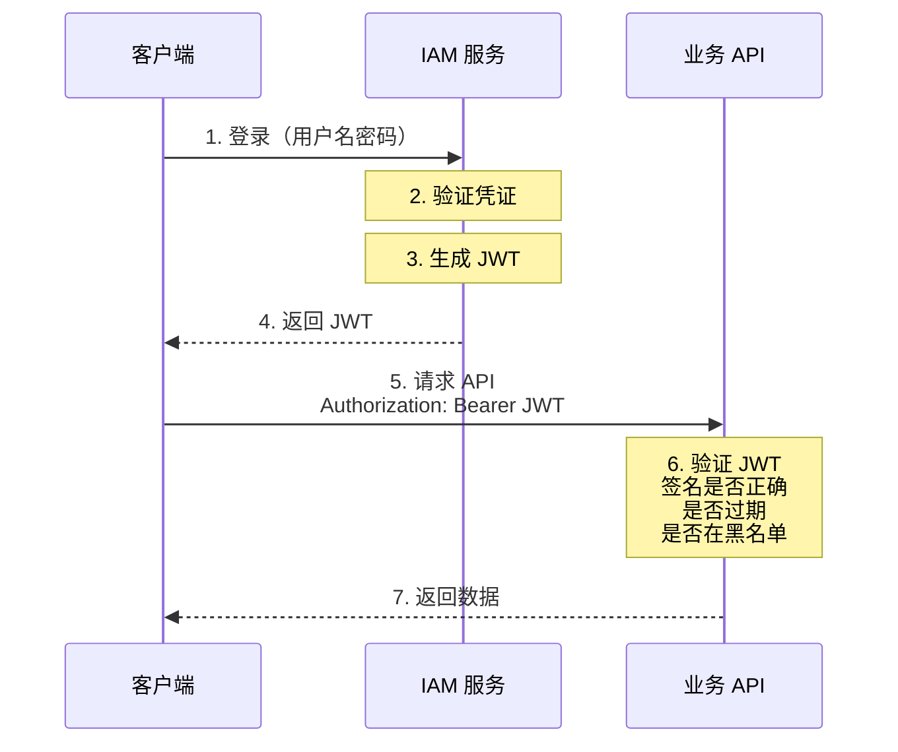
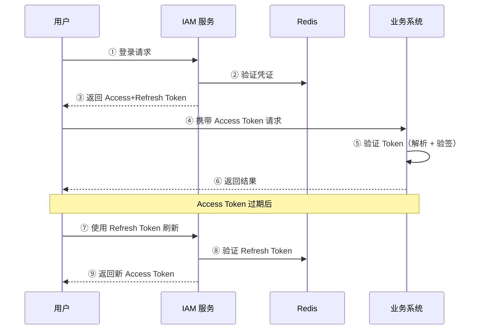

# JWT 基础

> 最后更新：2026-03-25
> 适用场景：IAM Token 认证机制

## 1. JWT 是什么

**JWT (JSON Web Token)** 是一种开放的、紧凑的、自包含的标准（RFC 7519），用于在各方之间安全地传输信息作为 JSON 对象。

### 1.1 JWT 的结构

```
Header.Payload.Signature
```

示例：
```
eyJhbGciOiJIUzI1NiIsInR5cCI6IkpXVCJ9.
eyJzdWIiOiIxMjM0NTY3ODkwIiwibmFtZSI6IkpvaG4gRG9lIiwiaWF0IjoxNTE2MjM5MDIyfQ.
SflKxwRJSMeKKF2QT4fwpMeJf36POk6yJV_adQssw5c
```

### 1.2 三个部分详解

#### Header（头部）

```json
{
  "alg": "HS256",  // 签名算法
  "typ": "JWT"     // 类型
}
```

常用算法：
- `HS256`: HMAC + SHA-256（对称加密，速度快）
- `RS256`: RSA + SHA-256（非对称加密，可分离签发和验证）

#### Payload（负载）

```json
{
  "sub": "1234567890",        // 主题（通常是用户 ID）
  "name": "John Doe",         // 用户名称
  "iat": 1516239022,          // 签发时间
  "exp": 1516242622,          // 过期时间
  "iss": "iam-system",        // 签发者
  "aud": "api-server",        // 受众
  "jti": "unique-token-id",   // Token 唯一标识
  "tid": "tenant-001"         // 租户 ID（自定义）
}
```

标准 Claims（注册声明）：

| Claim | 名称 | 说明 |
|-------|------|------|
| `iss` | Issuer | 签发者 |
| `sub` | Subject | 主题 |
| `aud` | Audience | 受众 |
| `exp` | Expiration Time | 过期时间 |
| `nbf` | Not Before | 生效时间 |
| `iat` | Issued At | 签发时间 |
| `jti` | JWT ID | Token 唯一标识 |

#### Signature（签名）

```
HMACSHA256(
  base64UrlEncode(header) + "." + base64UrlEncode(payload),
  secret
)
```

签名的作用：
- 验证 Token 未被篡改
- 验证 Token 是由可信方签发的

---

## 2. JWT 工作流程



---

## 3. JWT 在 IAM 中的应用

### 3.1 Access Token 格式

```json
{
  "sub": "user-12345",
  "tid": "tenant-67890",
  "roles": ["admin", "user"],
  "iat": 1711350000,
  "exp": 1711351800,
  "jti": "at_xxxxxxxxxxxxx",
  "iss": "iam-system",
  "aud": "api-gateway"
}
```

## 4. 双 Token 方案

IAM 系统采用 **Access Token + Refresh Token** 双令牌方案。

### 4.1 方案对比

| 特性 | Access Token | Refresh Token |
|------|--------------|---------------|
| **用途** | API 请求认证 | 刷新 Access Token |
| **格式** | JWT | 随机字符串（Opaque Token） |
| **有效期** | 15-30 分钟 | 7-30 天 |
| **存储位置** | 客户端（内存/LocalStorage） | 服务端（Redis）+ HttpOnly Cookie |
| **撤销方式** | 加入黑名单 | 数据库删除 |
| **刷新机制** | 过期后使用 Refresh Token 刷新 | 可主动刷新或过期 |

### 4.2 为什么用双 Token

**单 Token 方案的问题：**

| 问题 | 说明 |
|------|------|
| 短期 Token | 用户体验差，需要频繁重新登录 |
| 长期 Token | 泄露风险高，被窃取后可长期使用 |

**双 Token 方案的优势：**

1. **安全性**：Access Token 短期有效，泄露后影响范围有限
2. **用户体验**：Refresh Token 长期有效，用户无感知续期
3. **可控性**：可通过删除 Refresh Token 实现强制下线
4. **灵活性**：支持 Token 刷新、撤销、续期等操作

### 4.3 Token 流转图



### 4.4 安全策略

| 策略 | 说明 |
|------|------|
| **签名算法** | 优先使用 RS256（非对称加密），支持 HS256（对称加密） |
| **Token 加密** | 敏感信息使用 JWE 加密 |
| **黑名单机制** | 用户登出/密码修改时，将 Token 加入 Redis 黑名单 |
| **绑定设备** | Token 与设备指纹绑定，防止盗用 |
| **并发控制** | 支持单设备登录/多设备登录配置 |
| **自动续期** | Refresh Token 使用时自动续期（滑动过期） |

### 4.5 代码示例

#### Refresh Token 生成（Go）

```go
func GenerateRefreshToken() (string, error) {
    // 生成 32 字节随机字符串
    bytes := make([]byte, 32)
    if _, err := rand.Read(bytes); err != nil {
        return "", err
    }
    return base64.URLEncoding.EncodeToString(bytes), nil
}
```

#### Token 刷新流程（Go）

```go
func RefreshAccessToken(refreshToken string) (*TokenPair, error) {
    // 1. 验证 Refresh Token 是否在 Redis 中存在
    userID, err := redis.Get(refreshToken).Result()
    if err != nil {
        return nil, fmt.Errorf("refresh token invalid")
    }

    // 2. 获取用户信息
    user, err := getUserByID(userID)
    if err != nil {
        return nil, err
    }

    // 3. 生成新的 Access Token
    accessToken, err := GenerateToken(user.ID, user.TenantID, user.Roles)
    if err != nil {
        return nil, err
    }

    // 4. 可选：刷新 Refresh Token（滑动过期）
    newRefreshToken, _ := GenerateRefreshToken()
    redis.Set(newRefreshToken, userID, 7*24*time.Hour)
    redis.Del(refreshToken)

    return &TokenPair{
        AccessToken:  accessToken,
        RefreshToken: newRefreshToken,
    }, nil
}
```

---

## 6. JWT 在 IAM 中的应用

### 3.3 Token 生成代码示例（Go）

```go
import (
    "github.com/golang-jwt/jwt/v5"
    "time"
)

type Claims struct {
    UserID   string `json:"sub"`
    TenantID string `json:"tid"`
    Roles    []string `json:"roles"`
    jwt.RegisteredClaims
}

func GenerateToken(userID, tenantID string, roles []string) (string, error) {
    claims := Claims{
        UserID:   userID,
        TenantID: tenantID,
        Roles:    roles,
        RegisteredClaims: jwt.RegisteredClaims{
            ExpiresAt: jwt.NewNumericDate(time.Now().Add(30 * time.Minute)),
            IssuedAt:  jwt.NewNumericDate(time.Now()),
            Issuer:    "iam-system",
            Subject:   userID,
            ID:        generateTokenID(),
        },
    }

    token := jwt.NewWithClaims(jwt.SigningMethodHS256, claims)
    return token.SignedString([]byte(jwtSecret))
}
```

### 3.4 Token 验证代码示例（Go）

```go
func ValidateToken(tokenString string) (*Claims, error) {
    token, err := jwt.ParseWithClaims(tokenString, &Claims{}, func(token *jwt.Token) (interface{}, error) {
        return []byte(jwtSecret), nil
    })

    if err != nil {
        return nil, err
    }

    claims, ok := token.Claims.(*Claims)
    if !ok || !token.Valid {
        return nil, fmt.Errorf("invalid token")
    }

    // 检查是否在黑名单
    if isBlacklisted(claims.ID) {
        return nil, fmt.Errorf("token revoked")
    }

    return claims, nil
}
```

---

## 7. JWT 安全最佳实践

### 4.1 必须做的

| 措施 | 原因 |
|------|------|
| 使用 HTTPS | 防止 Token 被窃听 |
| 设置合理的过期时间 | 减少泄露后的影响 |
| 验证签名 | 防止伪造 Token |
| 验证过期时间 | 防止过期 Token 被使用 |
| 使用 `jti` 实现撤销 | 支持主动使 Token 失效 |

### 4.2 建议做的

| 措施 | 原因 |
|------|------|
| 不在 Payload 存敏感数据 | Payload 可被解码（只是签名保护） |
| 使用短 Access Token + 长 Refresh Token | 平衡安全与体验 |
| Token 加入租户 ID | 防止跨租户访问 |
| 记录 Token 使用情况 | 审计追溯 |

### 4.3 不要做的

| 错误做法 | 正确做法 |
|----------|----------|
| 在 JWT 中存储密码 | 永远不要在 JWT 中存储敏感信息 |
| 使用 `none` 算法 | 始终使用签名算法 |
| Access Token 有效期过长 | 使用 Refresh Token 机制 |
| 不验证 `iss` 和 `aud` | 验证签发者和受众 |

---

## 8. JWT vs 不透明 Token

| 维度 | JWT | 不透明 Token |
|------|-----|--------------|
| 格式 | 自包含 JSON | 随机字符串 |
| 验证方式 | 本地验证签名 | 查数据库/Redis |
| 性能 | 高（无需查库） | 低（需要查库） |
| 撤销支持 | 需要黑名单 | 天然支持 |
| 信息暴露 | Payload 可见 | 完全 opaque |
| 适用场景 | Access Token | Refresh Token |

IAM 选择：**JWT Access Token + 不透明 Refresh Token**

---

## 9. 常见问题

### Q1: JWT 如何撤销？

JWT 本身无法撤销，需要通过以下方式：

1. **黑名单机制**：将 `jti` 加入黑名单
2. **短有效期**：等待自然过期
3. **密钥轮换**：更换签名密钥，使旧 Token 失效

### Q2: HS256 和 RS256 如何选择？

| 场景 | 推荐算法 |
|------|----------|
| 单服务 | HS256（简单、快速） |
| 微服务（多服务验证） | RS256（可分离签发和验证） |
| 需要第三方验证 | RS256（公钥可公开） |

### Q3: JWT 被泄露了怎么办？

1. 将该 Token 的 `jti` 加入黑名单
2. 将该用户的所有 Token 撤销（删除 Refresh Token）
3. 强制用户重新登录
4. 可选：通知用户异常登录

### Q4: JWT 可以存储什么信息？

**推荐存储：**
- 用户 ID
- 租户 ID
- 角色列表
- Token 元数据（过期时间等）

**不要存储：**
- 密码
- 手机号、邮箱等敏感个人信息
- 权限详情（权限太多会导致 Token 过大）

---

## 10. 参考链接

- RFC 7519: https://tools.ietf.org/html/rfc7519
- jwt.io: https://jwt.io/ （在线调试工具）
- OWASP JWT Cheat Sheet: https://cheatsheetseries.owasp.org/cheatsheets/JSON_Web_Token_for_Java_Cheat_Sheet.html

---

## 11. 相关需求文档

- [REQ-012 Token 管理](../05-functional-requirements/REQ-012-token-management.md)
