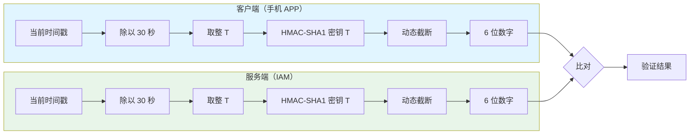
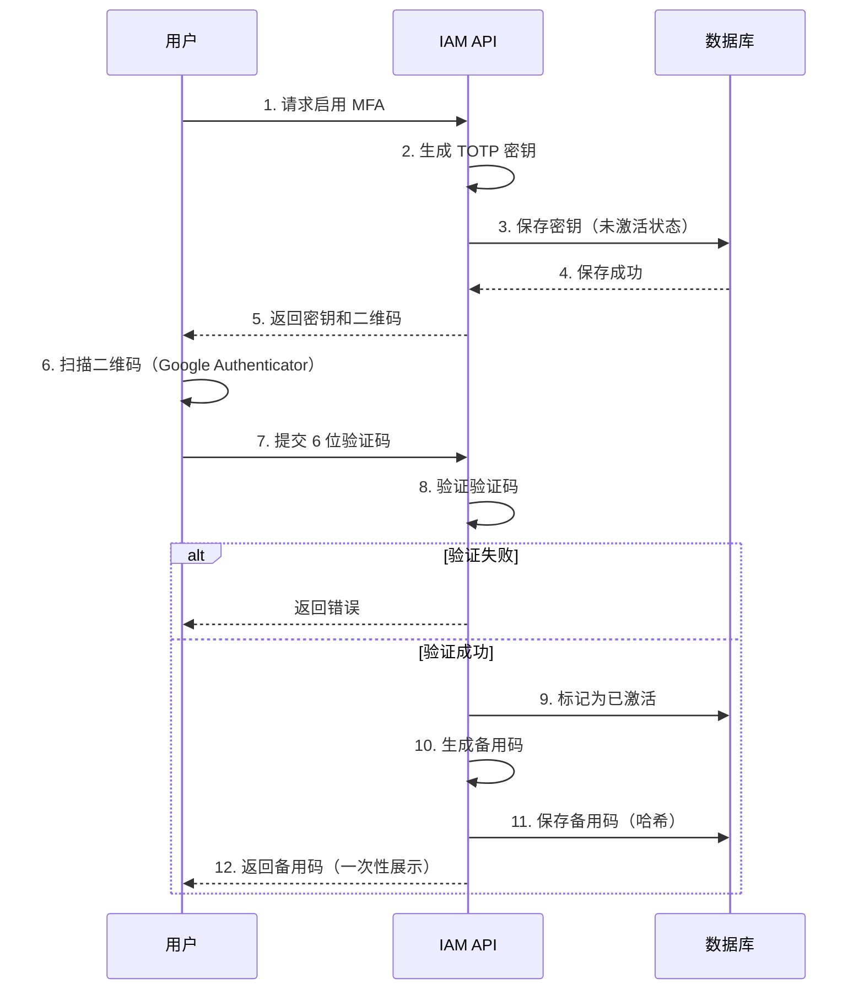
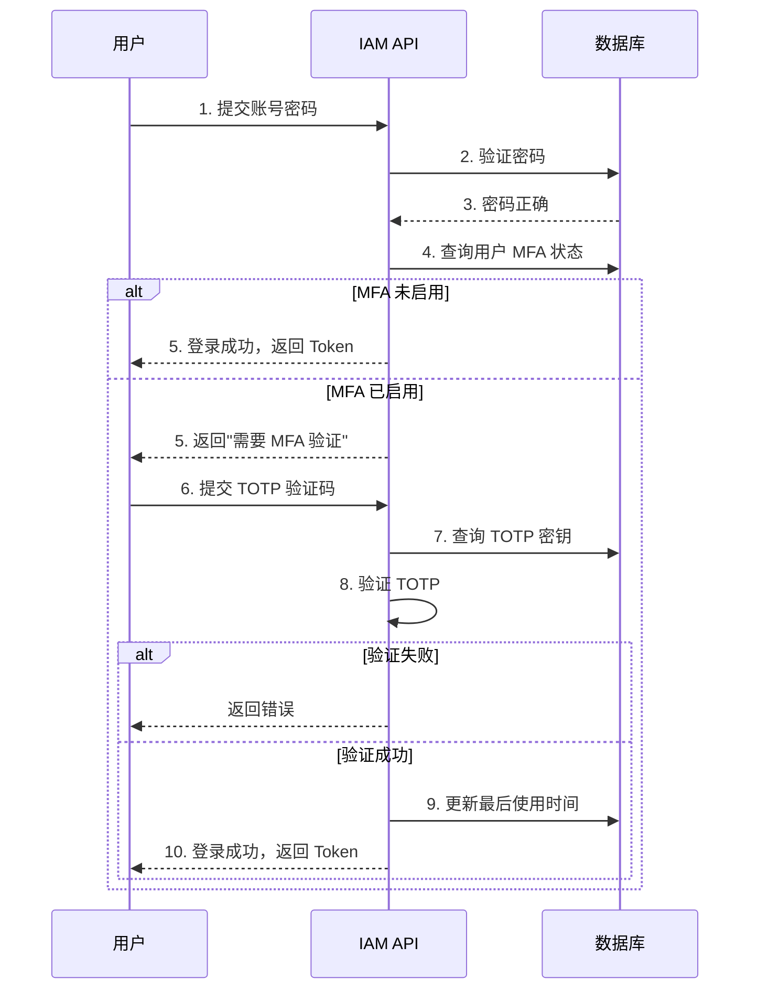

# MFA/TOTP 多因素认证

> 最后更新：2026-03-28
> 适用场景：高安全等级认证、管理员登录、敏感操作二次验证

---

## 1. 概述

**多因素认证（Multi-Factor Authentication, MFA）** 是要求用户提供两种或两种以上认证因素的验证方法。

**认证因素分类：**

| 因素类型 | 说明 | 示例 |
|----------|------|------|
| **你知道什么（Knowledge）** | 只有你知道的信息 | 密码、PIN 码、安全问题 |
| **你拥有什么（Possession）** | 你拥有的物理设备 | 手机、硬件 Token、智能卡 |
| **你是什么（Inherence）** | 你的生物特征 | 指纹、人脸、虹膜 |

**MFA 组合：**

| 组合 | 安全等级 | 用户体验 | 适用场景 |
|------|----------|----------|----------|
| 密码 + 短信验证码 | 中 | 好 | 一般业务 |
| 密码 + TOTP | 高 | 中 | 管理员、高安全系统（推荐） |
| 密码 + 硬件 Key | 极高 | 差 | 金融、核心系统 |
| 密码 + TOTP + 生物识别 | 极高 | 中 | 超高安全要求 |

---

## 2. TOTP 算法原理

### 2.1 什么是 TOTP？

**TOTP（Time-based One-Time Password）** 是基于时间的一次性密码算法，是 HOTP（基于计数器的一次性密码）的改进版本。

```
TOTP = HMAC-SHA1(共享密钥，当前时间戳) 的前 6 位数字
```

**核心特性：**

| 特性 | 说明 |
|------|------|
| **时效性** | 每 30 秒自动更换一次验证码 |
| **离线生成** | 无需网络，客户端和服务端时间同步即可 |
| **一次一密** | 每个验证码只能使用一次 |
| **标准化** | RFC 6238 标准，广泛支持 |

### 2.2 算法流程



### 2.3 数学公式

```
TOTP(T) = HOTP(K, T)

其中：
- K: 共享密钥（Base32 编码）
- T: 时间计数器 = floor((当前 Unix 时间戳 - 起始时间) / 时间步长)
- 起始时间：通常取 0（Unix 纪元）
- 时间步长：30 秒

HOTP(K, T) = MSB(Hash(K, T)) 的前 6 位数字
```

---

## 3. 实现详解

### 3.1 Go 代码示例

**生成 TOTP 密钥：**

```go
package mfa

import (
    "crypto/rand"
    "encoding/base32"
    "fmt"
)

// GenerateSecret 生成 20 字节的随机密钥
func GenerateSecret() (string, error) {
    secret := make([]byte, 20)

    _, err := rand.Read(secret)
    if err != nil {
        return "", err
    }

    // Base32 编码（便于用户输入）
    return base32.StdEncoding.EncodeToString(secret), nil
}
```

**生成 TOTP 验证码：**

```go
import (
    "crypto/hmac"
    "crypto/sha1"
    "encoding/binary"
    "time"
)

// GenerateTOTP 生成 6 位 TOTP 验证码
func GenerateTOTP(secret string, t time.Time) (string, error) {
    // 解码 Base32 密钥
    key, err := base32.StdEncoding.DecodeString(secret)
    if err != nil {
        return "", err
    }

    // 计算时间计数器 T = floor(t / 30)
    T := t.Unix() / 30

    // 将 T 转换为 8 字节大端序
    msg := make([]byte, 8)
    binary.BigEndian.PutUint64(msg, uint64(T))

    // HMAC-SHA1
    h := hmac.New(sha1.New, key)
    h.Write(msg)
    digest := h.Sum(nil)

    // 动态截断（RFC 4226）
    offset := digest[len(digest)-1] & 0x0F
    code := binary.BigEndian.Uint32(digest[offset:]) & 0x7FFFFFFF

    // 取后 6 位
    code = code % 1000000

    return fmt.Sprintf("%06d", code), nil
}
```

**验证 TOTP（允许 ±1 时间窗口误差）：**

```go
// ValidateTOTP 验证 TOTP 验证码
func ValidateTOTP(secret, code string, t time.Time) bool {
    // 验证当前时间窗口
    if check, _ := GenerateTOTP(secret, t); check == code {
        return true
    }

    // 验证前一个时间窗口（-30 秒）
    if check, _ := GenerateTOTP(secret, t.Add(-30*time.Second)); check == code {
        return true
    }

    // 验证后一个时间窗口（+30 秒）
    if check, _ := GenerateTOTP(secret, t.Add(30*time.Second)); check == code {
        return true
    }

    return false
}
```

---

## 4. 数据库设计

### 4.1 用户 MFA 表

| 字段 | 类型 | 必填 | 说明 | 示例 |
|------|------|------|------|------|
| id | BIGINT | 是 | 主键 | 1001 |
| user_id | BIGINT | 是 | 用户 ID | 12345 |
| tenant_id | BIGINT | 是 | 租户 ID | 67890 |
| secret | VARCHAR(32) | 是 | TOTP 密钥（Base32） | JBSWY3DPEHPK3PXP |
| enabled | BOOLEAN | 是 | 是否启用 | true |
| verified | BOOLEAN | 是 | 是否已验证激活 | true |
| backup_codes | JSON | 否 | 备用码（哈希存储） | ["hash1", ...] |
| created_at | DATETIME | 是 | 创建时间 | 2026-03-28 10:00:00 |
| last_used | DATETIME | 否 | 最后使用时间 | 2026-03-28 12:00:00 |

**索引设计：**

| 索引名 | 字段 | 类型 | 说明 |
|--------|------|------|------|
| uk_user_id | user_id | 唯一索引 | 一个用户只有一个 MFA 记录 |
| idx_tenant_user | tenant_id, user_id | 联合索引 | 租户查询 |

### 4.2 MFA 日志表

| 字段 | 类型 | 必填 | 说明 | 示例 |
|------|------|------|------|------|
| id | BIGINT | 是 | 主键 | 10001 |
| user_id | BIGINT | 是 | 用户 ID | 12345 |
| tenant_id | BIGINT | 是 | 租户 ID | 67890 |
| event_type | VARCHAR(20) | 是 | 事件类型 | enable/disable/verify/login |
| ip_address | VARCHAR(45) | 否 | IP 地址 | 192.168.1.1 |
| user_agent | VARCHAR(500) | 否 | 用户代理 | Mozilla/5.0... |
| result | BOOLEAN | 是 | 是否成功 | true |
| created_at | DATETIME | 是 | 创建时间 | 2026-03-28 10:00:00 |

---

## 5. 用户流程

### 5.1 启用 MFA



### 5.2 登录时 MFA 验证



---

## 6. 二维码格式

### 6.1 otpauth:// URL 格式

```
otpauth://totp/{issuer}:{label}?secret={secret}&issuer={issuer}&algorithm=SHA1&digits=6&period=30
```

**参数说明：**

| 参数 | 说明 | 示例 |
|------|------|------|
| `type` | 固定为 totp | totp |
| `issuer` | 发行者名称 | MyCompany |
| `label` | 用户标识（邮箱） | user@example.com |
| `secret` | Base32 编码的密钥 | JBSWY3DPEHPK3PXP |
| `algorithm` | 哈希算法 | SHA1（默认） |
| `digits` | 验证码位数 | 6（默认） |
| `period` | 有效期（秒） | 30（默认） |

---

## 7. 备用码设计

### 7.1 备用码特性

| 特性 | 说明 |
|------|------|
| **一次性使用** | 每个备用码只能使用一次 |
| **哈希存储** | 数据库中不存储明文备用码 |
| **数量固定** | 通常生成 10 个备用码 |
| **格式简单** | 8 位数字，便于输入 |

### 7.2 用户提示

```
请妥善保存以下备用码：

12345678  23456789  34567890  45678901  56789012
67890123  78901234  89012345  90123456  01234567

⚠️ 重要提示：
- 备用码只能查看一次，请截图或打印保存
- 每个备用码只能使用一次
- 备用码用完后，可在 MFA 设置页重新生成
- 如手机丢失且备用码用完，请联系管理员
```

---

## 8. 安全考虑

### 8.1 速率限制

| 接口 | 限制 | 说明 |
|------|------|------|
| TOTP 验证 | 5 次/分钟 | 防止暴力破解 |
| 备用码验证 | 3 次/分钟 | 防止暴力破解 |
| 生成密钥 | 10 次/小时 | 防止滥用 |

### 8.2 密钥安全

| 措施 | 说明 |
|------|------|
| **加密存储** | 密钥在数据库中加密存储 |
| **HTTPS 传输** | 密钥和验证码全程 HTTPS |
| **不记录日志** | 密钥和验证码不写入日志 |

### 8.3 时间同步

| 问题 | 解决方案 |
|------|----------|
| 客户端时间不准 | 验证 ±1 时间窗口（±30 秒） |
| 服务端时间漂移 | 使用 NTP 同步服务器时间 |
| 时区差异 | 使用 Unix 时间戳（UTC） |

---

## 9. 强制策略

### 9.1 必须启用 MFA 的场景

| 用户类型 | 场景 | 说明 |
|----------|------|------|
| 租户管理员 | 登录 | 强制启用 |
| 普通用户 | 访问敏感功能 | 如修改密码、查看审计日志 |
| 所有用户 | 异地登录 | 首次在新地点登录 |

### 9.2 MFA 豁免

| 场景 | 说明 |
|------|------|
| 受信任设备 | 30 天内登录过的设备可豁免 |
| 内网访问 | 公司内网 IP 可豁免（可选） |
| API 访问 | Service Account 不使用 MFA |

---

## 10. 常见问题

### Q1: TOTP 和短信验证码哪个更好？

| 维度 | TOTP | 短信验证码 |
|------|------|------------|
| **安全性** | 高（离线生成，不依赖运营商） | 中（SIM 卡劫持风险） |
| **可用性** | 需安装 APP | 需手机信号 |
| **成本** | 无 | 每条短信成本 |
| **用户体验** | 需打开 APP | 自动填充 |
| **推荐度** | ★★★★★ | ★★★☆☆ |

### Q2: 用户手机丢失怎么办？

1. 使用备用码登录
2. 登录后立即禁用旧 MFA，重新启用
3. 如无备用码，联系管理员重置

### Q3: 为什么允许 ±1 时间窗口误差？

TOTP 基于时间，客户端和服务端时间可能不同步。允许 ±1 窗口（共 90 秒有效时间）可容忍最多 ±30 秒的时间误差。

### Q4: 支持哪些认证 APP？

| APP | 平台 | 说明 |
|-----|------|------|
| Google Authenticator | iOS/Android | 最广泛使用 |
| Microsoft Authenticator | iOS/Android | 企业常用 |
| Authy | iOS/Android/桌面 | 支持云备份 |
| 1Password | 全平台 | 密码管理器内置 |

---

## 11. 参考链接

- RFC 6238 (TOTP): https://tools.ietf.org/html/rfc6238
- RFC 4226 (HOTP): https://tools.ietf.org/html/rfc4226
- Google Authenticator: https://github.com/google/google-authenticator
