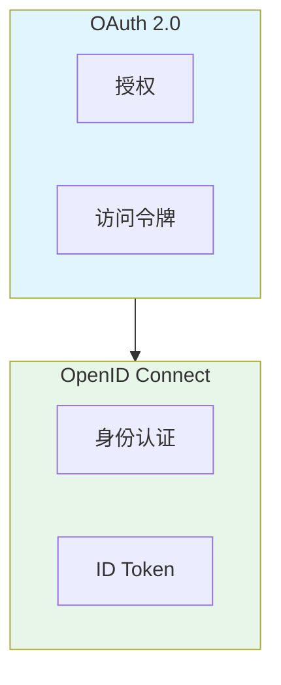
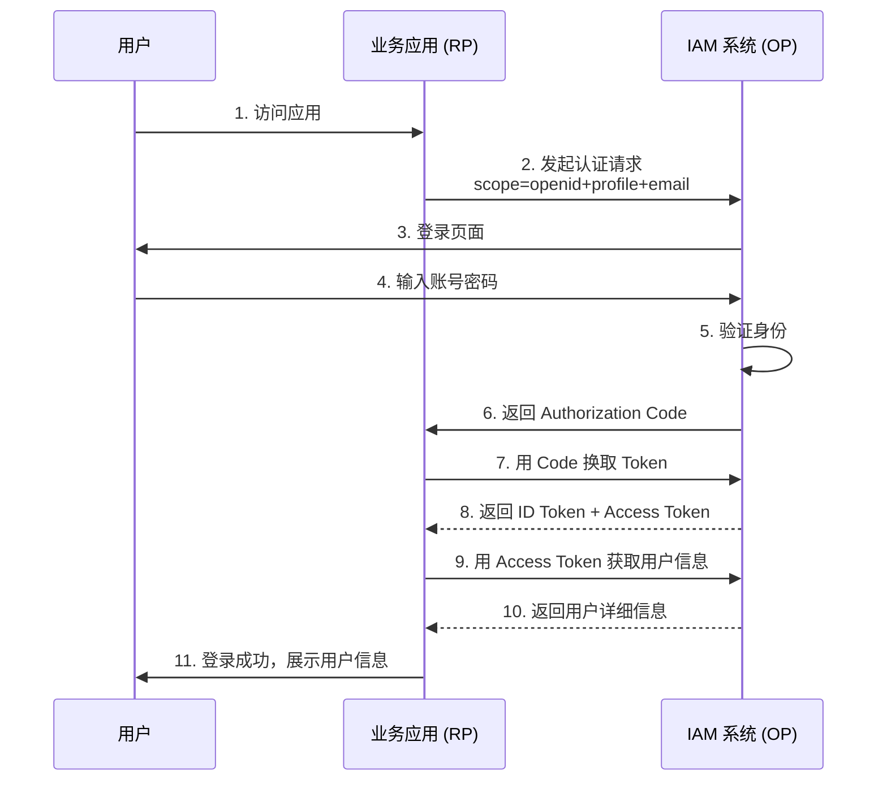

# OpenID Connect (OIDC) 基础

> 最后更新：2026-03-28
> 适用场景：第三方登录、单点登录 (SSO)、用户身份认证

---

## 1. 概述

**OpenID Connect (OIDC)** 是建立在 OAuth 2.0 协议之上的简单身份层协议。

| 协议 | 用途 | 类比 |
|------|------|------|
| **OAuth 2.0** | 授权协议 - "允许应用访问你的资源" | 酒店房卡 - 可以进入房间，但不知道你是谁 |
| **OpenID Connect** | 身份协议 - "证明你是你" | 身份证 - 证明你的身份信息 |

OIDC 于 2014 年由 OpenID 基金会发布，基于 OAuth 2.0，使用 JWT 传递用户身份信息。

---

## 2. OIDC 与 OAuth 2.0 的关系



**关键区别：**

| 维度 | OAuth 2.0 | OpenID Connect |
|------|-----------|----------------|
| **目的** | 授权（访问资源） | 身份认证（验证用户身份） |
| **输出** | Access Token | ID Token + Access Token |
| **Token 格式** | 可以是 JWT 或 Opaque | 必须是 JWT |
| **用户信息** | 需要调用 UserInfo API | ID Token 中直接包含 |

---

## 3. 核心概念

### 3.1 角色

| 角色 | 说明 | IAM 中的对应 |
|------|------|-------------|
| **End-User (资源所有者)** | 被认证的用户 | 登录用户 |
| **Relying Party (RP)** | 需要用户身份的应用 | 业务系统（OA/CRM/ERP） |
| **OpenID Provider (OP)** | 提供身份认证的服务 | IAM 系统 |

### 3.2 Token

| Token | 说明 | 包含内容 |
|-------|------|----------|
| **ID Token** | 证明用户身份 | 用户基本信息（sub、name、email 等） |
| **Access Token** | 访问用户资源 | 权限范围（scope） |
| **Refresh Token** | 刷新 Access Token | 长期有效，用于获取新 Token |

### 3.3 Claim（声明）

ID Token 中的标准 Claim：

| Claim | 说明 | 示例 |
|-------|------|------|
| `iss` | 签发者 | `https://iam.example.com` |
| `sub` | 用户唯一标识 | `user-12345` |
| `aud` | 受众（客户端 ID） | `client-abc` |
| `exp` | 过期时间 | `1711351800` |
| `iat` | 签发时间 | `1711350000` |
| `auth_time` | 认证时间 | `1711349900` |
| `nonce` | 随机值（防重放攻击） | `random-string` |
| `email` | 用户邮箱 | `user@example.com` |
| `email_verified` | 邮箱是否验证 | `true` |
| `name` | 用户姓名 | `张三` |
| `picture` | 头像 URL | `https://.../avatar.jpg` |

---

## 4. OIDC 授权流程

### 4.1 标准流程（Authorization Code Flow）



### 4.2 详细步骤说明

**步骤 2：认证请求**

```
GET /authorize?
  response_type=code
  &client_id=client-abc
  &redirect_uri=https://app.example.com/callback
  &scope=openid+profile+email
  &state=random-state
  &nonce=random-nonce
```

| 参数 | 说明 |
|------|------|
| `response_type=code` | 授权码模式 |
| `client_id` | 应用唯一标识 |
| `redirect_uri` | 回调地址 |
| `scope=openid` | 必须包含 openid 才是 OIDC 请求 |
| `state` | 防 CSRF 攻击 |
| `nonce` | 防重放攻击 |

**步骤 7：Token 请求**

```
POST /oauth/token
Content-Type: application/x-www-form-urlencoded

grant_type=authorization_code
&code=AUTH_CODE_HERE
&redirect_uri=https://app.example.com/callback
&client_id=client-abc
&client_secret=CLIENT_SECRET
```

**步骤 8：Token 响应**

```json
{
  "access_token": "ACCESS_TOKEN_HERE",
  "token_type": "Bearer",
  "expires_in": 3600,
  "refresh_token": "REFRESH_TOKEN_HERE",
  "id_token": "eyJhbGciOiJSUzI1NiIsInR5cCI6IkpXVCJ9..."
}
```

**步骤 9：UserInfo 请求**

```
GET /userinfo
Authorization: Bearer ACCESS_TOKEN_HERE
```

**UserInfo 响应**

```json
{
  "sub": "user-12345",
  "name": "张三",
  "email": "user@example.com",
  "email_verified": true,
  "picture": "https://.../avatar.jpg"
}
```

---

## 5. IAM 中的 OIDC 应用

### 5.1 作为 OIDC Provider（身份提供方）

IAM 系统作为 OP，为业务系统提供身份认证服务。

**支持场景：**

| 场景 | 说明 |
|------|------|
| 单点登录 (SSO) | 用户登录一次，可访问所有授权应用 |
| 第三方登录 | 业务系统接入 IAM 登录 |
| 应用身份统一 | 多个应用共享同一套用户体系 |

**IAM 需要实现的端点：**

| 端点 | 说明 |
|------|------|
| `/.well-known/openid-configuration` | OIDC 配置发现端点 |
| `/authorize` | 授权请求端点 |
| `/oauth/token` | Token 颁发端点 |
| `/userinfo` | 用户信息端点 |
| `/jwks.json` | JWKS 公钥端点（用于验证 ID Token 签名） |
| `/logout` | 登出端点 |

### 5.2 作为 Relying Party（依赖方）

IAM 系统对接第三方身份提供商（如 GitHub、Google、企业微信）。

**支持场景：**

| 场景 | 说明 |
|------|------|
| GitHub 登录 | 开发者使用 GitHub 账号登录 |
| 企业微信/钉钉 | 企业内部统一身份 |
| Google/Microsoft | 国际业务常用 |

---

## 6. 安全考虑

### 6.1 必须做的安全措施

| 措施 | 说明 |
|------|------|
| **HTTPS** | 所有端点必须使用 HTTPS |
| **state 参数** | 防止 CSRF 攻击 |
| **nonce 参数** | 防止重放攻击 |
| **PKCE** | 移动端/SPA 必须使用 PKCE |
| **redirect_uri 校验** | 防止回调地址劫持 |

### 6.2 ID Token 验证

业务系统收到 ID Token 后必须验证：

1. **验证签名** - 使用 OP 的公钥验证
2. **验证签发者** - `iss` 是否匹配预期的 OP
3. **验证受众** - `aud` 是否包含本应用的 client_id
4. **验证过期时间** - `exp` 是否已过期
5. **验证 nonce** - 与请求时的 nonce 是否一致

---

## 7. OIDC vs SAML

| 维度 | OIDC | SAML 2.0 |
|------|------|----------|
| **协议格式** | JSON + JWT | XML |
| **复杂度** | 简单 | 复杂 |
| **适用场景** | 移动端、现代 Web 应用 | 传统企业系统 |
| **性能** | 轻量级 | 较重 |
| **浏览器兼容性** | 好 | 一般 |
| **移动端支持** | 好 | 差 |

**选型建议：**

- 新项目优先选择 **OIDC**
- 传统企业已有 SAML 投资，可继续支持

---

## 8. 在 IAM 中的实现建议

### 8.1 ID Token 结构

```json
{
  "iss": "https://iam.example.com",
  "sub": "user-12345",
  "aud": ["client-abc"],
  "exp": 1711351800,
  "iat": 1711350000,
  "auth_time": 1711349900,
  "nonce": "random-nonce",
  "acr": "urn:mace:incommon:iap:silver",
  "amr": ["pwd", "mfa"],
  "azp": "client-abc",
  "email": "user@example.com",
  "email_verified": true,
  "name": "张三",
  "preferred_username": "zhangsan",
  "picture": "https://.../avatar.jpg",
  "tenant_id": "tenant-678"
}
```

### 8.2 Scope 定义

| Scope | 说明 | 返回 Claim |
|-------|------|------------|
| `openid` | 必需，表示 OIDC 请求 | `sub` |
| `profile` | 用户基本信息 | `name`, `picture`, `preferred_username` |
| `email` | 用户邮箱 | `email`, `email_verified` |
| `phone` | 用户电话 | `phone_number`, `phone_number_verified` |
| `offline_access` | 请求 Refresh Token | 返回 `refresh_token` |

---

## 9. 常见问题

### Q1: OAuth 2.0 和 OIDC 有什么区别？

OAuth 2.0 是**授权**协议，解决"允许应用访问你的资源"；OIDC 是**身份**协议，解决"证明你是你"。OIDC 基于 OAuth 2.0 构建。

### Q2: 为什么需要 ID Token？

Access Token 用于访问资源，但不包含用户身份信息。ID Token 专门用于传递身份信息，且必须是 JWT 格式，可被业务系统直接验证。

### Q3: PKCE 是什么？

**PKCE** (Proof Key for Code Exchange) 是一种安全扩展，防止授权码被截获。移动端和 SPA 应用**必须**使用 PKCE。

### Q4: 如何处理用户登出？

OIDC 支持 **RP-Initiated Logout**，业务系统可重定向到 IAM 的登出端点：

```
GET /logout?
  id_token_hint=ID_TOKEN_HERE
  &post_logout_redirect_uri=https://app.example.com/logged-out
```

---

## 10. 参考链接

- OpenID Connect 官网：https://openid.net/connect/
- OIDC 核心规范：https://openid.net/specs/openid-connect-core-1_0.html
- OIDC 中文教程：https://www.zhengwenfeng.com/posts/oidc-tutorial/
- OAuth 2.0 Playground: https://www.oauth.com/playground/
