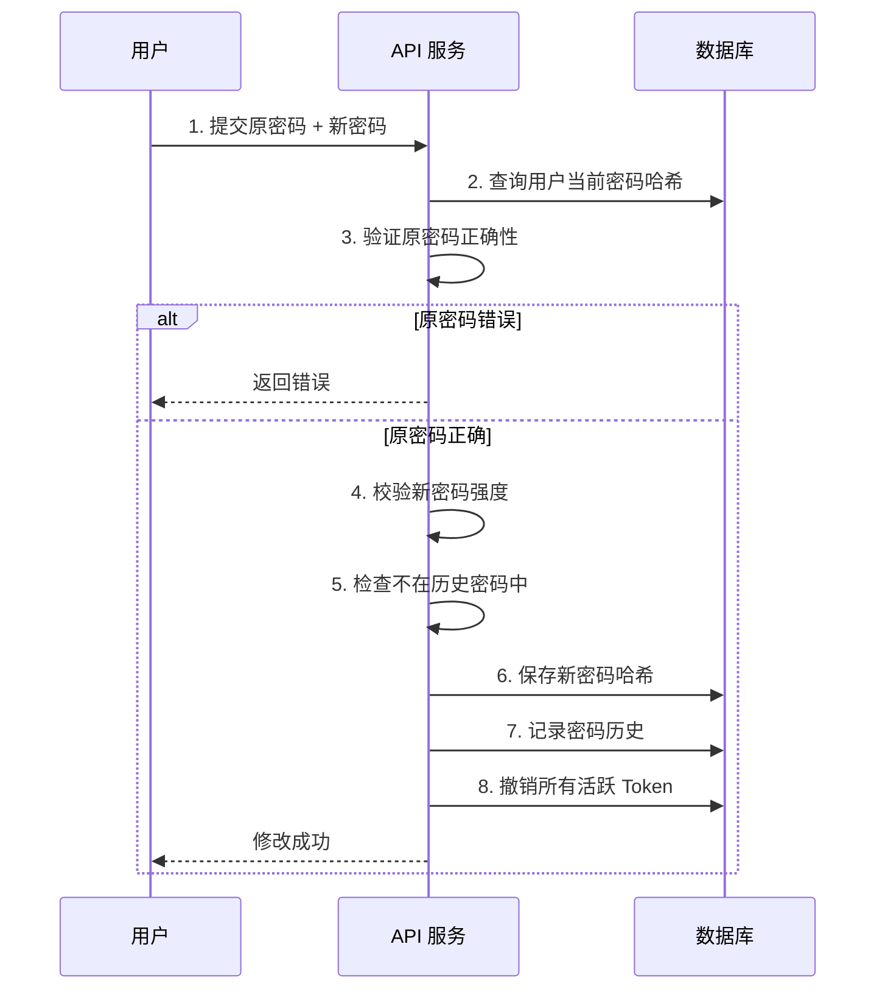
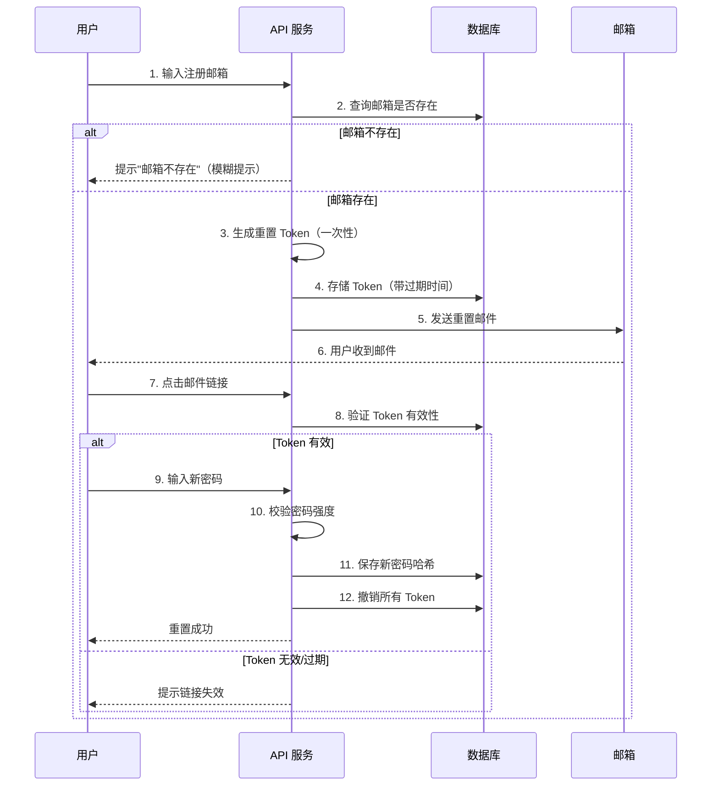

# 密码安全

> 最后更新：2026-03-28
> 适用场景：用户密码存储、验证、策略管理

---

## 1. 概述

密码是用户认证的第一道防线。密码安全的核心是**加密存储**和**防护策略**。

**核心原则：**

1. **永远不要存储明文密码**
2. **永远不要在日志中输出密码**
3. **永远不要通过邮件/短信发送明文密码**
4. **使用专业的密码哈希算法**

---

## 2. 密码哈希算法

### 2.1 推荐算法

| 算法 | 推荐度 | 说明 |
|------|--------|------|
| **Argon2** | ★★★★★ | 最新标准，抗 GPU/ASIC 攻击 |
| **bcrypt** | ★★★★☆ | 成熟稳定，广泛使用 |
| **scrypt** | ★★★★☆ | 抗硬件攻击，内存密集 |
| **PBKDF2** | ★★★☆☆ | NIST 推荐，但抗 GPU 能力弱 |
| **SHA-256/512** | ★☆☆☆☆ | 不安全，已被淘汰 |

### 2.2 算法对比

| 算法 | 发明时间 | 内存占用 | 抗 GPU 攻击 | 适用场景 |
|------|----------|----------|-------------|----------|
| Argon2 | 2015 | 高 | 强 | 新项目首选 |
| bcrypt | 1999 | 中 | 中 | 传统项目 |
| scrypt | 2009 | 高 | 强 | 加密货币常用 |
| PBKDF2 | 2000 | 低 | 弱 | 合规要求场景 |

### 2.3 IAM 选型建议

**推荐：bcrypt**

理由：
1. **成熟稳定** - 20 多年历史，经过充分验证
2. **Go 标准库支持** - `golang.org/x/crypto/bcrypt`
3. **自动加盐** - 无需自己处理盐值
4. **可调节成本** - 通过 cost factor 调整计算强度

---

## 3. bcrypt 详解

### 3.1 工作原理

```
密码 + 随机盐 → bcrypt 哈希 → 存储到数据库

         ┌─────────────────────────────────────┐
         │  $2a$12$abc123...xyz789            │
         │   │  │  │                           │
         │   │  │  └─ 哈希结果 (22 字符)          │
         │   │  └──── 盐 (22 字符)               │
         │   └─────── 成本因子 (2^12 次迭代)     │
         └─────────────────────────────────────┘
```

### 3.2 Go 代码示例

**密码哈希（注册/修改密码）**

```go
package password

import (
    "golang.org/x/crypto/bcrypt"
)

// HashPassword 对密码进行哈希
func HashPassword(password string) (string, error) {
    // 使用默认成本因子 (10)
    // 生产环境建议 12-14
    cost := 12

    hash, err := bcrypt.GenerateFromPassword(
        []byte(password),
        cost,
    )
    if err != nil {
        return "", err
    }

    return string(hash), nil
}
```

**密码验证（登录）**

```go
// ComparePassword 验证密码
func ComparePassword(hash, password string) bool {
    err := bcrypt.CompareHashAndPassword(
        []byte(hash),
        []byte(password),
    )
    return err == nil
}
```

### 3.3 成本因子选择

| 成本因子 | 计算次数 | 耗时 (参考) | 适用场景 |
|----------|----------|-------------|----------|
| 10 | 2^10 = 1024 | ~50ms | 开发测试 |
| 12 | 2^12 = 4096 | ~200ms | 生产环境 (推荐) |
| 14 | 2^14 = 16384 | ~800ms | 高安全要求 |
| 16 | 2^16 = 65536 | ~3s | 不推荐（太慢） |

**建议：**
- 登录接口耗时 = 哈希时间 + 网络 + 数据库
- 成本因子应使哈希时间在 100-300ms 之间
- 每隔 2-3 年提升一次成本因子

---

## 4. 盐值（Salt）

### 4.1 为什么需要盐值？

**无盐哈希的问题：**

```
两个用户使用相同密码 → 哈希值相同 → 容易被彩虹表攻击

用户 A: password123 → hash_abc123
用户 B: password123 → hash_abc123  ← 相同！
```

**加盐哈希：**

```
每个用户独立随机盐 → 相同密码哈希也不同

用户 A: password123 + salt_A → hash_XYZ789
用户 B: password123 + salt_B → hash_ABC123  ← 不同！
```

### 4.2 bcrypt 的盐值处理

bcrypt **自动处理盐值**，无需手动生成：

```go
// bcrypt.GenerateFromPassword 内部自动：
// 1. 生成 16 字节随机盐
// 2. 将盐嵌入哈希结果
// 3. 返回完整哈希字符串

// 验证时自动提取盐值进行比对
bcrypt.CompareHashAndPassword(hash, password)
```

### 4.3 盐值存储

bcrypt 的哈希字符串包含盐值，**直接存储在同一字段**：

```
数据库字段：password_hash VARCHAR(60)

存储内容：$2a$12$abc123...xyz789
         └──────┬─────┘
                │
          包含版本、成本、盐、哈希
```

---

## 5. 彩虹表防护

### 5.1 什么是彩虹表？

彩虹表是预先计算的**明文 - 哈希对照表**，用于反向查询密码。

```
彩虹表示例（简化）：

明文       → SHA-256 哈希
password1  → 0b123abc...
password2  → 1c234bcd...
123456     → 2d345cde...

攻击者拿到哈希后，直接查表找到明文密码
```

### 5.2 防护措施

| 措施 | 说明 | 有效性 |
|------|------|--------|
| **加盐** | 每用户独立盐值 | ★★★★★ |
| **使用 bcrypt** | 慢哈希算法，计算成本高 | ★★★★★ |
| **密码策略** | 禁止弱密码 | ★★★★☆ |
| **密码黑名单** | 禁止常见弱密码 | ★★★★☆ |

---

## 6. 密码策略

### 6.1 强度要求

| 规则 | 推荐值 | 说明 |
|------|--------|------|
| 最小长度 | ≥ 8 字符 | 防止短密码 |
| 大写字母 | ≥ 1 个 | 增加复杂度 |
| 小写字母 | ≥ 1 个 | 增加复杂度 |
| 数字 | ≥ 1 个 | 增加复杂度 |
| 特殊字符 | ≥ 1 个 | 增加复杂度 |

**强度等级：**

| 等级 | 要求 | 适用场景 |
|------|------|----------|
| 低 | 最小长度 ≥ 6 | 内部测试系统 |
| 中 | 长度≥8 + 大小写 + 数字 | 一般业务系统（推荐） |
| 高 | 长度≥12 + 四类字符 | 金融、医疗系统 |

### 6.2 密码黑名单

禁止以下密码：

```go
var weakPasswords = []string{
    "password", "password123", "123456", "12345678",
    "qwerty", "abc123", "admin", "admin123",
    "welcome", "letmein", "iloveyou", "sunshine",
    // 可扩展更多
}
```

**第三方密码字典：**

- [SecLists/Passwords](https://github.com/danielmiessler/SecLists)
- 包含 1000 万 + 常见弱密码

### 6.3 密码历史

防止用户重复使用旧密码：

```
保留最近 N 次密码哈希
修改密码时，检查是否与历史密码重复

用户密码历史：
- 当前密码：hash_5
- 历史密码：hash_4, hash_3, hash_2, hash_1

新密码哈希与以上所有对比，重复则拒绝
```

**建议：** 保留最近 5 次密码

---

## 7. 密码过期策略

### 7.1 过期时间设置

| 场景 | 推荐周期 | 说明 |
|------|----------|------|
| 一般业务 | 90 天 | 平衡安全与体验 |
| 高安全系统 | 30-60 天 | 金融、医疗 |
| 内部系统 | 180 天 | 降低用户负担 |
| 服务账号 | 永不过期 | 避免服务中断 |

### 7.2 过期提醒

```
密码有效期：90 天

- 到期前 7 天：登录时提示"密码将在 7 天后过期"
- 到期前 3 天：登录时强提醒，引导修改
- 已过期：强制跳转密码修改页
```

---

## 8. 密码修改/重置流程

### 8.1 修改密码（已知原密码）



### 8.2 重置密码（忘记密码）



### 8.3 密码重置 Token 设计

```go
type PasswordResetToken struct {
    ID        int64     // 主键
    UserID    int64     // 用户 ID
    TokenHash string    // Token 哈希（不存明文）
    ExpiresAt time.Time // 过期时间
    Used      bool      // 是否已使用
    CreatedAt time.Time // 创建时间
}

// Token 特性：
// - 有效期：15-30 分钟
// - 一次性使用
// - 哈希存储（防泄露）
// - 绑定用户 ID
```

---

## 9. 安全传输

### 9.1 HTTPS 强制

```
所有涉及密码的接口必须使用 HTTPS：

❌ http://api.example.com/login  (明文传输，可被窃听)
✅ https://api.example.com/login (加密传输)
```

### 9.2 前端加密（可选增强）

```javascript
// 可选：前端使用 RSA 加密密码
// 后端用私钥解密后再 bcrypt

const publicKey = 'RSA 公钥';
const encrypted = crypto.publicEncrypt(
    { key: publicKey, padding: crypto.constants.RSA_PKCS1_OAEP_PADDING },
    Buffer.from(password)
);

// 传输加密后的密码
fetch('/login', {
    method: 'POST',
    body: encrypted.toString('hex')
});
```

**注意：** 前端加密**不能替代 HTTPS**，仅作为额外防护层。

---

## 10. 密码错误锁定

### 10.1 锁定策略

| 错误次数 | 锁定时间 | 说明 |
|----------|----------|------|
| 5 次 | 15 分钟 | 首次锁定 |
| 10 次 | 1 小时 | 二次锁定 |
| 20 次 | 24 小时 | 严重锁定 |

### 10.2 Go 代码示例

```go
type LoginAttempt struct {
    UserID     int64
    AttemptAt  time.Time
    Success    bool
    IPAddress  string
}

// 检查是否锁定
func isLocked(userID int64) (bool, time.Duration) {
    // 查询最近 1 小时内的失败次数
    failures := getRecentFailures(userID, time.Hour)

    switch {
    case failures >= 20:
        return true, 24 * time.Hour
    case failures >= 10:
        return true, 1 * time.Hour
    case failures >= 5:
        return true, 15 * time.Minute
    default:
        return false, 0
    }
}
```

---

## 11. 审计与日志

### 11.1 需要记录的事件

| 事件 | 记录内容 | 保留期 |
|------|----------|--------|
| 密码修改成功 | 用户 ID、时间、IP | 180 天 |
| 密码修改失败 | 用户 ID、时间、IP、错误原因 | 180 天 |
| 密码重置请求 | 用户 ID、时间、IP | 180 天 |
| 密码重置完成 | 用户 ID、时间、IP | 180 天 |
| 账号锁定 | 用户 ID、时间、IP、失败次数 | 180 天 |

### 11.2 日志脱敏

```go
// ❌ 错误：记录明文密码
log.Printf("用户 %d 登录失败，密码：%s", userID, password)

// ✅ 正确：不记录密码
log.Printf("用户 %d 登录失败，IP: %s", userID, ipAddress)
```

---

## 12. 常见问题

### Q1: 为什么不能用 MD5/SHA-256 存储密码？

MD5 和 SHA-256 设计目标是**快速计算**，这恰恰是密码存储不需要的。攻击者可以在 GPU 上每秒计算数十亿次哈希，便于暴力破解。bcrypt/Argon2 是**故意设计得很慢**，增加破解成本。

### Q2: 盐值需要单独存储吗？

bcrypt 的盐值**嵌入在哈希字符串中**，无需单独存储。哈希字符串格式：`$算法$成本$盐 + 哈希`。

### Q3: 密码复杂度要求越高越好吗？

不是。过高的复杂度要求会导致用户写下密码或使用模式化密码（如 `Password1!`、`Password2!`）。建议**最小长度 8 字符 + 中等复杂度**。

### Q4: 如何平滑升级哈希算法？

```go
// 登录时检查并重新哈希
func verifyAndUpdatePassword(hash, password string) (bool, string) {
    // 验证密码
    err := bcrypt.CompareHashAndPassword([]byte(hash), []byte(password))
    if err != nil {
        return false, ""
    }

    // 检查是否需要升级（成本因子过低）
    if needsUpgrade(hash) {
        // 重新生成更高成本的哈希
        newHash, _ := HashPassword(password)
        return true, newHash
    }

    return true, ""
}
```

---

## 13. 参考链接

- OWASP 密码存储指南：https://cheatsheetseries.owasp.org/cheatsheets/Password_Storage_Cheat_Sheet.html
- Argon2 RFC: https://datatracker.ietf.org/doc/html/rfc9106
- bcrypt 论文：https://www.usenix.org/legacy/event/usenix99/full_papers/provos/provos.pdf
- SecLists 密码字典：https://github.com/danielmiessler/SecLists
