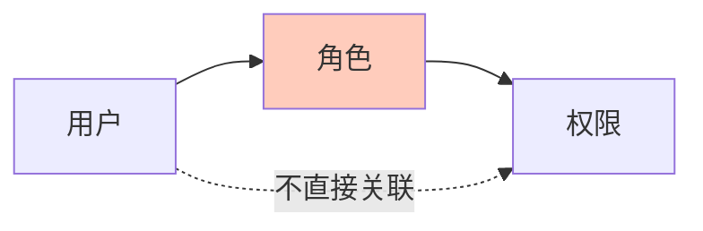
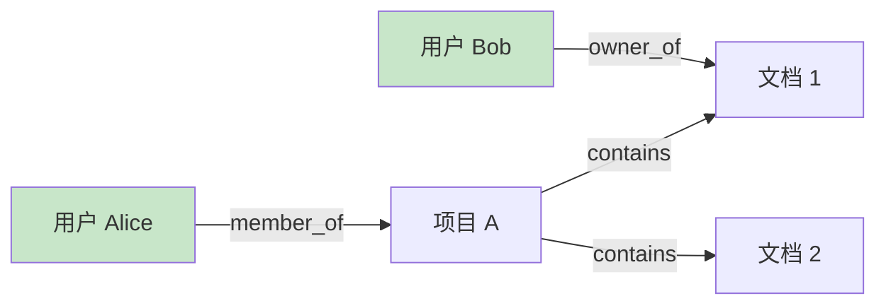
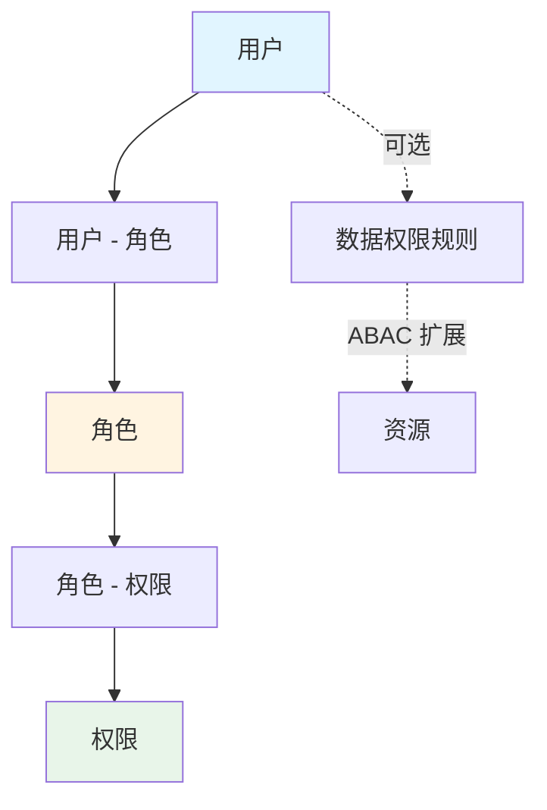

# 权限模型对比与选型

> 最后更新：2026-03-28
> 适用场景：权限系统设计、访问控制策略选型

---

## 1. 概述

权限模型是用于决定"谁可以对什么资源执行什么操作"的系统化方法。

```
用户发起请求
    ↓
权限模型判断：用户是否有权限？
    ↓
允许 / 拒绝
```

**核心概念：**

| 概念 | 说明 | 示例 |
|------|------|------|
| **主体（Subject）** | 发起请求的实体 | 用户、角色、服务账号 |
| **资源（Resource）** | 被访问的对象 | 文件、API、数据库记录 |
| **操作（Action）** | 对资源的动作 | 读、写、删除、执行 |
| **策略（Policy）** | 权限规则的定义 | "管理员可以删除用户" |

---

## 2. 主流权限模型

### 2.1 模型对比总览

| 模型 | 全称 | 核心思想 | 复杂度 | 灵活性 |
|------|------|----------|--------|--------|
| **DAC** | 自主访问控制 | 资源所有者决定谁可访问 | 低 | 中 |
| **MAC** | 强制访问控制 | 系统强制规则，用户无法更改 | 高 | 低 |
| **RBAC** | 基于角色的访问控制 | 通过角色分配权限 | 中 | 中 |
| **ABAC** | 基于属性的访问控制 | 基于属性动态计算权限 | 高 | 高 |
| **ReBAC** | 基于关系的访问控制 | 基于实体间关系授权 | 高 | 极高 |

---

## 3. DAC - 自主访问控制

### 3.1 原理

资源所有者自主决定谁可以访问该资源。

```
文件 A 的所有者：用户 Alice

Alice 可以：
- 允许 Bob 读取文件 A
- 允许 Carol 编辑文件 A
- 拒绝 Dave 访问文件 A
```

### 3.2 示例

| 操作系统 | 实现方式 |
|----------|----------|
| Unix/Linux | rwx 权限（读/写/执行） |
| Windows | ACL（访问控制列表） |
| Google Docs | 分享按钮，设置协作者权限 |

### 3.3 优缺点

| 优点 | 缺点 |
|------|------|
| 灵活，资源所有者可自主授权 | 权限分散，难以统一管理 |
| 实现简单 | 容易出现权限泄露（被授权者可继续授权） |
| 用户体验好 | 不适合企业级集中管控 |

### 3.4 适用场景

- 个人文件管理
- 小型协作工具
- 非敏感数据场景

---

## 4. MAC - 强制访问控制

### 4.1 原理

系统根据预设的安全级别强制控制访问，用户无法更改。

```
安全级别：公开 < 内部 < 机密 < 绝密

规则：
- 用户只能访问 ≤ 自己安全级别的资源
- 绝密级用户也不能访问未授权的资源
```

### 4.2 示例

| 场景 | 实现方式 |
|------|----------|
| 军事系统 | 密级标签（公开/秘密/机密/绝密） |
| SELinux | 安全上下文 + 强制策略 |
| 政府系统 | 人员审查级别 + 数据分级 |

### 4.3 优缺点

| 优点 | 缺点 |
|------|------|
| 安全性极高 | 配置复杂，管理成本高 |
| 集中管控，权限不泄露 | 灵活性差 |
| 符合严格合规要求 | 用户体验差 |

### 4.4 适用场景

- 军事、政府系统
- 金融核心系统
- 高合规要求场景

---

## 5. RBAC - 基于角色的访问控制

### 5.1 原理

通过角色作为中介，将用户与权限解耦。



**核心关系：**

```
用户 --拥有--> 角色 --包含--> 权限

权限 = 资源 + 操作
```

### 5.2 角色层级

```
CEO
├── 部门经理
│   ├── 团队领导
│   │   └── 普通员工
│   └── 团队领导
│       └── 普通员工
└── 财务总监
    └── 会计
```

**继承规则：**
- 上级角色自动拥有下级角色的所有权限
- 角色层级简化权限管理

### 5.3 Go 代码示例

```go
// 角色定义
type Role struct {
    ID          int64   `json:"id"`
    Name        string  `json:"name"`
    Description string  `json:"description"`
    ParentID    *int64  `json:"parent_id"` // 父角色 ID（支持层级）
}

// 权限定义
type Permission struct {
    ID       int64  `json:"id"`
    Resource string `json:"resource"` // 如 "user", "order"
    Action   string `json:"action"`   // 如 "read", "write", "delete"
}

// 用户 - 角色关联
type UserRole struct {
    UserID int64 `json:"user_id"`
    RoleID int64 `json:"role_id"`
}

// 角色 - 权限关联
type RolePermission struct {
    RoleID       int64 `json:"role_id"`
    PermissionID int64 `json:"permission_id"`
}

// 权限检查
func hasPermission(userID int64, resource, action string) bool {
    // 查询用户所有角色
    roles := getUserRoles(userID)

    // 查询所有角色的权限
    permissions := make(map[string]bool)
    for _, role := range roles {
        for _, perm := range getRolePermissions(role.ID) {
            key := fmt.Sprintf("%s:%s", perm.Resource, perm.Action)
            permissions[key] = true
        }
    }

    // 检查是否有权限
    return permissions[fmt.Sprintf("%s:%s", resource, action)]
}
```

### 5.4 优缺点

| 优点 | 缺点 |
|------|------|
| 管理简单，批量授权 | 角色爆炸问题（可能需要上百个角色） |
| 职责分离清晰 | 不支持动态条件（如"只能访问自己的数据"） |
| 易于审计 | 角色层级复杂时难以理解 |
| 业界标准，广泛使用 | 细粒度权限控制困难 |

### 5.5 适用场景

- 企业信息系统（OA/ERP/CRM）
- SaaS 多租户系统
- **IAM 系统的核心权限模型（推荐）**

---

## 6. ABAC - 基于属性的访问控制

### 6.1 原理

基于主体、资源、环境等属性的组合条件动态计算权限。

```
策略示例：
"允许部门经理访问本部门的项目文档，但仅限工作时间的公司内网"

主体属性：角色=部门经理，部门=技术部
资源属性：类型=文档，部门=技术部
环境属性：时间=工作时间，IP=公司内网
```

### 6.2 策略语言示例（Rego）

```rego
package authz

# 允许部门经理访问本部门文档
allow {
    input.user.role == "manager"
    input.user.department == input.resource.department
    input.resource.type == "document"
    is_work_hours(input.time)
    is_internal_network(input.ip)
}

is_work_hours(t) {
    t.hour >= 9
    t.hour < 18
    t.weekday < 5
}

is_internal_network(ip) {
    startswith(ip, "192.168.")
}
```

### 6.3 属性分类

| 属性类型 | 说明 | 示例 |
|----------|------|------|
| **主体属性** | 用户的特征 | 角色、部门、职级、入职时间 |
| **资源属性** | 资源的特征 | 类型、所有者、密级、部门归属 |
| **环境属性** | 访问时的上下文 | 时间、地点、IP、设备类型 |

### 6.4 优缺点

| 优点 | 缺点 |
|------|------|
| 细粒度控制 | 策略复杂，难以调试 |
| 动态授权，无需预定义角色 | 性能开销大（每次请求都要计算） |
| 支持复杂业务场景 | 学习曲线陡峭 |
| 策略可复用 | 需要专门的策略引擎 |

### 6.5 适用场景

- 云平台权限管理（AWS IAM 策略）
- 跨组织协作场景
- 需要动态条件控制的场景

---

## 7. ReBAC - 基于关系的访问控制

### 7.1 原理

基于实体之间的关系进行授权。

```
关系示例：
- 用户 A 是 项目 X 的 成员
- 用户 B 是 文档 Y 的 所有者
- 项目 X 包含 文档 Y

推导：
- 项目成员可以访问项目下的文档
- 文档所有者可以删除文档
```

### 7.2 关系图示例



**推导规则：**

```
规则 1: member_of + contains → access
规则 2: owner_of → full_control
```

### 7.3 Google Zanzibar

Google 内部的统一授权系统，核心是 ReBAC 模型。

```
元组（Tuple）：
  <user:alice, member, project:abc>
  <project:abc, contains, document:123>

查询（Check）：
  问：alice 是否可以访问 document:123？
  答：是，因为 alice 是 project:abc 的成员，而 document:123 属于该项目
```

### 7.4 优缺点

| 优点 | 缺点 |
|------|------|
| 表达能力极强 | 实现复杂度高 |
| 适合社交网络、协作场景 | 需要图数据库或专门的授权引擎 |
| 自然建模现实世界关系 | 调试和审计困难 |

### 7.5 适用场景

- 社交网络（好友关系、关注关系）
- 协作工具（项目成员、文档协作者）
- 内容平台（订阅、粉丝）

---

## 8. 模型对比总结

### 8.1 综合能力对比

| 维度 | DAC | MAC | RBAC | ABAC | ReBAC |
|------|-----|-----|------|------|-------|
| **管理复杂度** | 低 | 高 | 中 | 高 | 高 |
| **灵活性** | 中 | 低 | 中 | 高 | 极高 |
| **安全性** | 低 | 高 | 中 | 高 | 高 |
| **可扩展性** | 低 | 中 | 高 | 中 | 高 |
| **实现成本** | 低 | 高 | 中 | 高 | 高 |
| **用户友好性** | 高 | 低 | 高 | 中 | 中 |

### 8.2 场景匹配

| 场景 | 推荐模型 | 理由 |
|------|----------|------|
| 企业内部系统 | RBAC | 管理简单，符合组织架构 |
| 云平台 | ABAC | 支持细粒度、动态条件 |
| 社交网络 | ReBAC | 关系表达能力强 |
| 个人工具 | DAC | 简单灵活 |
| 军事/政府 | MAC | 安全性优先 |

---

## 9. IAM 系统选型建议

### 9.1 推荐方案：RBAC 为主，ABAC 为辅

```
核心权限模型：RBAC
- 用户 - 角色 - 权限三层结构
- 角色层级支持
- 批量授权、批量回收

扩展能力：ABAC
- 数据权限（行级/列级过滤）
- 动态条件（时间、IP、设备）
- 特殊场景补充
```

### 9.2 选型理由

| 理由 | 说明 |
|------|------|
| **符合企业组织架构** | 角色对应岗位，便于理解和管理 |
| **实现简单** | 数据模型清晰，查询高效 |
| **易于审计** | 权限链路：用户→角色→权限，可追溯 |
| **业界标准** | 广泛使用，有成熟实践 |
| **支持扩展** | RBAC 基础上可扩展 ABAC 能力 |

### 9.3 数据模型设计



---

## 10. 常见问题

### Q1: RBAC 和 ABAC 应该选哪个？

- 如果权限规则主要是"某角色可以访问某资源"，选 **RBAC**
- 如果需要复杂的动态条件（如"只能访问本部门数据"），选 **ABAC**
- 推荐 **RBAC 为主 + ABAC 为辅** 的混合模式

### Q2: 如何解决 RBAC 的角色爆炸问题？

角色爆炸：需要创建上百个角色才能覆盖所有场景。

**解决方案：**
1. 引入角色层级，减少重复定义
2. 将共性权限提取为通用角色
3. 对于特殊场景，使用 ABAC 补充

### Q3: 什么是权限的"最小特权原则"？

用户只应拥有完成工作所必需的最小权限集合。

**实现方式：**
- 默认无任何权限
- 显式授权
- 定期审计和回收闲置权限

---

## 11. 参考链接

- NIST RBAC 标准：https://csrc.nist.gov/projects/role-based-access-control
- Google Zanzibar 论文：https://research.google/pubs/pub48190/
- Open Policy Agent (Rego): https://www.openpolicyagent.org/
- casbin 权限库：https://github.com/casbin/casbin
