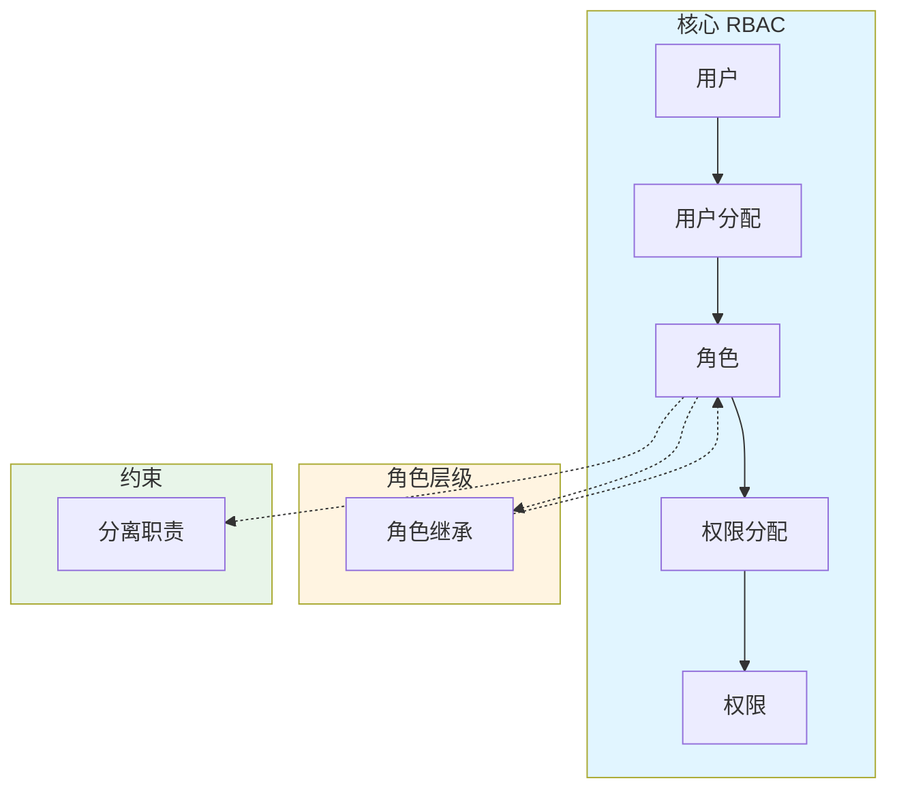

# RBAC 详细设计与实现

> 最后更新：2026-03-28
> 适用场景：IAM 系统权限模块设计、角色管理、权限分配

---

## 1. 概述

RBAC（Role-Based Access Control）是基于角色的访问控制模型，核心思想是**通过角色将用户与权限解耦**。

```
传统模式：用户 → 权限（每个用户单独授权，管理复杂）

RBAC 模式：用户 → 角色 → 权限（批量授权，管理简单）
```

**核心优势：**

| 优势 | 说明 |
|------|------|
| **批量授权** | 给用户分配角色即可获得角色所有权限 |
| **职责分离** | 角色对应岗位职责，便于理解 |
| **易于审计** | 权限链路清晰：用户→角色→权限 |
| **降低错误** | 避免直接给用户授权的人为错误 |

---

## 2. RBAC 参考模型

### 2.1 NIST RBAC 标准模型



**四个组成部分：**

| 部分 | 说明 |
|------|------|
| **核心 RBAC** | 用户、角色、权限、会话四要素 |
| **角色层级** | 支持角色继承（上级包含下级所有权限） |
| **静态分离职责** | 一个用户不能同时拥有两个冲突角色 |
| **动态分离职责** | 同一会话中不能同时激活两个冲突角色 |

### 2.2 核心元素定义

| 元素 | 符号 | 说明 |
|------|------|------|
| 用户集合 | U | 系统中的所有用户 |
| 角色集合 | R | 系统中的所有角色 |
| 权限集合 | P | 所有可能的权限（资源 × 操作） |
| 会话集合 | S | 用户与角色的临时映射 |

**形式化定义：**

```
用户分配 UA ⊆ U × R
权限分配 PA ⊆ P × R

用户 u 的权限 = { p | ∃r ∈ R, (u,r) ∈ UA ∧ (p,r) ∈ PA }
```

---

## 3. 数据模型设计

### 3.1 核心表结构

**roles 表 - 角色定义**

| 字段 | 类型 | 必填 | 说明 | 示例 |
|------|------|------|------|------|
| id | BIGINT | 是 | 主键 | 1001 |
| tenant_id | BIGINT | 是 | 租户 ID（多租户隔离） | 67890 |
| name | VARCHAR(100) | 是 | 角色名称 | "部门经理" |
| code | VARCHAR(50) | 是 | 角色代码（唯一标识） | "dept_manager" |
| description | TEXT | 否 | 角色描述 | "负责部门日常管理" |
| parent_id | BIGINT | 否 | 父角色 ID（支持层级） | 1000 |
| status | TINYINT | 是 | 状态：1-启用，0-禁用 | 1 |
| created_at | DATETIME | 是 | 创建时间 | 2026-03-28 10:00:00 |
| updated_at | DATETIME | 是 | 更新时间 | 2026-03-28 12:00:00 |

**索引设计：**

| 索引名 | 字段 | 类型 | 说明 |
|--------|------|------|------|
| uk_tenant_code | tenant_id, code | 唯一索引 | 租户内角色代码唯一 |
| idx_parent_id | parent_id | 普通索引 | 查询子角色 |
| idx_status | status | 普通索引 | 查询启用角色 |

**permissions 表 - 权限定义**

| 字段 | 类型 | 必填 | 说明 | 示例 |
|------|------|------|------|------|
| id | BIGINT | 是 | 主键 | 2001 |
| tenant_id | BIGINT | 是 | 租户 ID | 67890 |
| resource_type | VARCHAR(50) | 是 | 资源类型 | "user", "order", "menu" |
| resource_id | VARCHAR(100) | 是 | 资源标识 | "user:123", "menu:settings" |
| action | VARCHAR(50) | 是 | 操作类型 | "read", "write", "delete" |
| name | VARCHAR(100) | 是 | 权限名称 | "查看用户" |
| description | TEXT | 否 | 权限描述 | "可以查看用户基本信息" |

**索引设计：**

| 索引名 | 字段 | 类型 | 说明 |
|--------|------|------|------|
| uk_tenant_resource | tenant_id, resource_type, resource_id, action | 唯一索引 | 权限唯一性 |

**role_permissions 表 - 角色权限关联**

| 字段 | 类型 | 必填 | 说明 | 示例 |
|------|------|------|------|------|
| id | BIGINT | 是 | 主键 | 3001 |
| tenant_id | BIGINT | 是 | 租户 ID | 67890 |
| role_id | BIGINT | 是 | 角色 ID | 1001 |
| permission_id | BIGINT | 是 | 权限 ID | 2001 |
| granted_at | DATETIME | 是 | 授权时间 | 2026-03-28 10:00:00 |
| granted_by | BIGINT | 是 | 授权人 ID | 1 |

**索引设计：**

| 索引名 | 字段 | 类型 | 说明 |
|--------|------|------|------|
| uk_role_permission | role_id, permission_id | 唯一索引 | 避免重复授权 |
| idx_permission_id | permission_id | 普通索引 | 反向查询角色 |

**user_roles 表 - 用户角色关联**

| 字段 | 类型 | 必填 | 说明 | 示例 |
|------|------|------|------|------|
| id | BIGINT | 是 | 主键 | 4001 |
| tenant_id | BIGINT | 是 | 租户 ID | 67890 |
| user_id | BIGINT | 是 | 用户 ID | 12345 |
| role_id | BIGINT | 是 | 角色 ID | 1001 |
| granted_at | DATETIME | 是 | 授权时间 | 2026-03-28 10:00:00 |
| granted_by | BIGINT | 是 | 授权人 ID | 1 |
| expires_at | DATETIME | 否 | 过期时间（可选） | 2026-12-31 23:59:59 |

**索引设计：**

| 索引名 | 字段 | 类型 | 说明 |
|--------|------|------|------|
| uk_user_role | user_id, role_id | 唯一索引 | 避免重复分配 |
| idx_role_id | role_id | 普通索引 | 查询角色下用户 |
| idx_expires_at | expires_at | 普通索引 | 定时清理过期角色 |

---

## 4. 角色层级设计

### 4.1 层级继承规则

```
CEO (最高层)
├── 部门经理
│   ├── 团队领导
│   │   └── 普通员工
│   └── 团队领导
└── 财务总监
    └── 会计
```

**继承规则：**
- 上级角色自动拥有下级角色的所有权限
- 给用户分配"团队领导"角色，自动拥有"普通员工"权限
- 角色权限变更时，所有继承该角色的用户自动生效

### 4.2 查询用户权限（包含继承）

```go
// 获取用户所有权限（包含角色层级继承）
func GetUserPermissions(userID, tenantID int64) ([]Permission, error) {
    // 1. 查询用户直接拥有的角色
    roles := GetUserRoles(userID, tenantID)

    // 2. 递归查询所有祖先角色
    allRoles := make(map[int64]*Role)
    for _, role := range roles {
        collectAncestorRoles(role, allRoles)
    }

    // 3. 查询所有角色的权限（去重）
    permissionMap := make(map[int64]*Permission)
    for _, role := range allRoles {
        perms := GetRolePermissions(role.ID, tenantID)
        for _, perm := range perms {
            permissionMap[perm.ID] = perm
        }
    }

    // 4. 转为列表返回
    var permissions []Permission
    for _, perm := range permissionMap {
        permissions = append(permissions, *perm)
    }

    return permissions, nil
}

// 递归收集祖先角色
func collectAncestorRoles(role *Role, allRoles map[int64]*Role) {
    if role == nil {
        return
    }
    if _, exists := allRoles[role.ID]; exists {
        return // 已处理过，避免循环
    }

    allRoles[role.ID] = role

    // 递归处理父角色
    if role.ParentID != nil {
        parent := GetRoleByID(*role.ParentID)
        collectAncestorRoles(parent, allRoles)
    }
}
```

### 4.3 层级深度限制

```go
const MaxRoleDepth = 10 // 最大层级深度

func validateRoleHierarchy(roleID, parentID int64, depth int) error {
    if depth > MaxRoleDepth {
        return errors.New("角色层级深度不能超过 10 层")
    }

    // 检查是否形成循环
    if roleID == parentID {
        return errors.New("不能将角色设置为自己的子角色")
    }

    // 检查 parentID 是否已经是当前角色的后代（避免循环）
    if isDescendant(roleID, parentID) {
        return errors.New("不能创建循环继承")
    }

    return nil
}
```

---

## 5. 权限检查实现

### 5.1 权限检查中间件

```go
// 权限检查中间件
func PermissionMiddleware(requiredResource, requiredAction string) gin.HandlerFunc {
    return func(c *gin.Context) {
        // 从 Token 中提取用户 ID 和租户 ID
        userID := GetUserIDFromToken(c)
        tenantID := GetTenantIDFromToken(c)

        // 检查权限
        hasPerm, err := CheckPermission(userID, tenantID, requiredResource, requiredAction)
        if err != nil {
            c.AbortWithStatusJSON(500, gin.H{"error": "权限检查失败"})
            return
        }

        if !hasPerm {
            c.AbortWithStatusJSON(403, gin.H{"error": "权限不足"})
            return
        }

        c.Next()
    }
}

// 检查权限
func CheckPermission(userID, tenantID int64, resource, action string) (bool, error) {
    // 1. 检查是否是超级管理员（超级管理员拥有所有权限）
    isAdmin, err := IsSuperAdmin(userID, tenantID)
    if err != nil {
        return false, err
    }
    if isAdmin {
        return true, nil
    }

    // 2. 获取用户所有权限（包含角色层级）
    permissions, err := GetUserPermissions(userID, tenantID)
    if err != nil {
        return false, err
    }

    // 3. 检查是否有匹配的权限
    for _, perm := range permissions {
        if perm.ResourceType == resource && perm.Action == action {
            return true, nil
        }
        // 支持通配符
        if perm.ResourceType == "*" || perm.Action == "*" {
            return true, nil
        }
    }

    return false, nil
}
```

### 5.2 使用示例

```go
// API 路由定义
r := gin.Default()

// 需要 "user:read" 权限
r.GET("/users", PermissionMiddleware("user", "read"), listUsers)

// 需要 "user:write" 权限
r.POST("/users", PermissionMiddleware("user", "write"), createUser)

// 需要 "user:delete" 权限
r.DELETE("/users/:id", PermissionMiddleware("user", "delete"), deleteUser)
```

---

## 6. 约束 RBAC (Constrained RBAC)

### 6.1 静态职责分离 (SSD)

一个用户不能同时拥有两个互斥的角色。

```
互斥角色对：
- "采购员" 和 "审批员"
- "会计" 和 "出纳"
- "申请人" 和 "审批人"
```

**数据库设计：**

| 字段 | 类型 | 必填 | 说明 | 示例 |
|------|------|------|------|------|
| id | BIGINT | 是 | 主键 | 1 |
| tenant_id | BIGINT | 是 | 租户 ID | 67890 |
| role_a | BIGINT | 是 | 角色 A | 101（采购员） |
| role_b | BIGINT | 是 | 角色 B | 102（审批员） |
| description | TEXT | 否 | 说明 | "采购与审批分离" |

**检查逻辑：**

```go
// 给用户分配角色前检查 SSD 约束
func AssignRoleToUser(userID, roleID, tenantID int64) error {
    // 查询与 roleID 互斥的所有角色
    conflictingRoles := GetConflictingRoles(roleID, tenantID)

    // 检查用户是否已拥有互斥角色
    for _, conflictRoleID := range conflictingRoles {
        if HasRole(userID, conflictRoleID, tenantID) {
            return fmt.Errorf("用户已拥有互斥角色 %d，无法分配角色 %d", conflictRoleID, roleID)
        }
    }

    // 分配角色
    return CreateUserRole(userID, roleID, tenantID)
}
```

### 6.2 动态职责分离 (DSD)

同一会话中不能同时激活两个互斥角色。

```
场景：
- 用户同时拥有"开发人员"和"发布管理员"角色
- 正常工作时使用"开发人员"角色
- 发布时使用"发布管理员"角色
- 同一会话中不能同时使用两个角色
```

**实现方式：**

```go
// 会话激活角色
func ActivateRoleInSession(sessionID, roleID, tenantID int64) error {
    // 获取会话中已激活的角色
    activeRoles := GetActiveRolesInSession(sessionID, tenantID)

    // 检查 DSD 约束
    for _, activeRole := range activeRoles {
        if IsMutuallyExclusive(activeRole, roleID, tenantID) {
            return fmt.Errorf("角色 %d 与已激活角色 %d 互斥", roleID, activeRole)
        }
    }

    // 激活角色
    return AddRoleToSession(sessionID, roleID)
}
```

---

## 7. 权限变更与传播

### 7.1 权限变更影响范围

```
修改角色权限
    ↓
影响所有拥有该角色的用户
    ↓
影响所有继承该角色的上级角色

权限回收
    ↓
立即生效，无需重新登录（因为每次请求都查权限）
```

### 7.2 缓存策略

```go
// 使用 Redis 缓存用户权限
func GetUserPermissionsWithCache(userID, tenantID int64) ([]Permission, error) {
    cacheKey := fmt.Sprintf("iam:permissions:%d:%d", tenantID, userID)

    // 1. 先查缓存
    cached, err := redis.Get(ctx, cacheKey)
    if err == nil {
        var perms []Permission
        json.Unmarshal([]byte(cached), &perms)
        return perms, nil
    }

    // 2. 查数据库
    perms, err := GetUserPermissions(userID, tenantID)
    if err != nil {
        return nil, err
    }

    // 3. 写入缓存（5 分钟过期）
    data, _ := json.Marshal(perms)
    redis.Set(ctx, cacheKey, data, 5*time.Minute)

    return perms, nil
}

// 权限变更时清除缓存
func InvalidatePermissionCache(userID, tenantID int64) {
    cacheKey := fmt.Sprintf("iam:permissions:%d:%d", tenantID, userID)
    redis.Del(ctx, cacheKey)
}
```

---

## 8. 最佳实践

### 8.1 角色设计原则

| 原则 | 说明 |
|------|------|
| **角色对应岗位** | 角色名称应反映实际工作岗位 |
| **角色粒度适中** | 不要太粗（如"用户"）也不要太细（如"可以查看 A 报表的人"） |
| **避免角色爆炸** | 通过角色层级和权限模板减少角色数量 |
| **定期审计** | 定期审查角色权限，回收不再需要的权限 |

### 8.2 权限命名规范

```
格式：资源类型：操作

示例：
- user:read       - 查看用户
- user:write      - 修改用户
- user:delete     - 删除用户
- order:read      - 查看订单
- order:approve   - 审批订单
- report:export   - 导出报表
```

### 8.3 默认角色

| 角色 | 说明 | 权限 |
|------|------|------|
| **所有用户默认角色** | 新用户自动拥有 | 基础权限（查看个人信息等） |
| **部门经理** | 中层管理者 | 部门管理 + 所有下级角色权限 |
| **管理员** | 系统管理员 | 所有权限（除敏感操作） |
| **超级管理员** | 最高权限 | 所有权限 |

---

## 9. 常见问题

### Q1: 角色太多怎么办？

1. 使用角色层级，减少重复定义
2. 抽象通用权限为"基础角色"
3. 对于特殊场景，使用 ABAC 补充

### Q2: 如何支持临时权限？

在 user_roles 表中设置 expires_at 字段：

```sql
INSERT INTO user_roles (user_id, role_id, expires_at)
VALUES (123, 456, '2026-12-31 23:59:59');

-- 定时任务清理过期角色
DELETE FROM user_roles WHERE expires_at < NOW();
```

### Q3: 如何审计权限变更？

```go
// 审计日志
type PermissionAudit struct {
    ID           int64     `json:"id"`
    TenantID     int64     `json:"tenant_id"`
    UserID       int64     `json:"user_id"`
    RoleID       int64     `json:"role_id"`
    Action       string    `json:"action"` // assign/revoke
    ChangedBy    int64     `json:"changed_by"`
    ChangedAt    time.Time `json:"changed_at"`
    ExpiresAt    *time.Time `json:"expires_at"`
}
```

### Q4: 如何批量授权？

```go
// 批量给用户分配角色
func BatchAssignUsersToRole(userIDs []int64, roleID, tenantID int64, operatorID int64) error {
    // 事务处理
    return db.Transaction(func(tx *gorm.DB) error {
        for _, userID := range userIDs {
            // 检查 SSD 约束
            if err := ValidateSSD(userID, roleID, tenantID); err != nil {
                continue // 跳过冲突用户
            }

            // 分配角色
            if err := CreateUserRoleTx(tx, userID, roleID, tenantID, operatorID); err != nil {
                return err
            }
        }
        return nil
    })
}
```

---

## 10. 参考链接

- NIST RBAC 标准：https://csrc.nist.gov/projects/role-based-access-control
- casbin 权限库：https://github.com/casbin/casbin
- Open Policy Agent: https://www.openpolicyagent.org/
