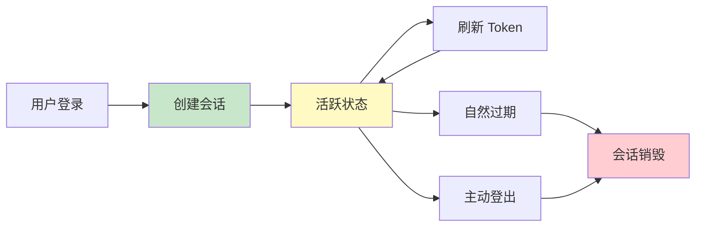
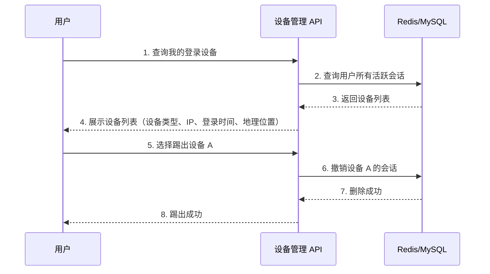
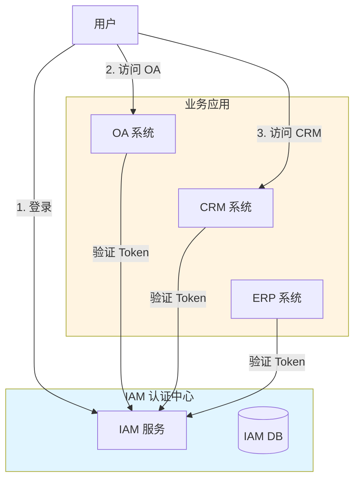
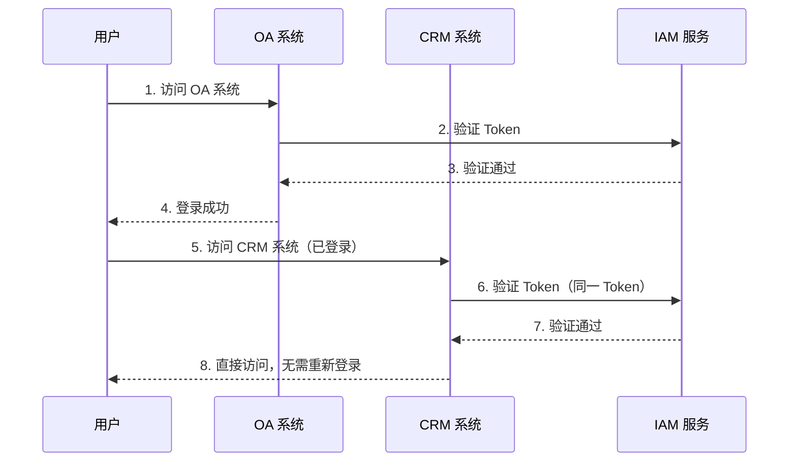

# 会话管理

> 最后更新：2026-03-28
> 适用场景：用户会话生命周期管理、并发控制、会话安全

---

## 1. 概述

**会话（Session）** 是用户认证成功后建立的上下文状态，用于在一段时间内保持用户的登录状态。

```
用户登录成功
    ↓
创建会话 → 会话 ID → 返回客户端（Cookie/Token）
    ↓
用户携带会话凭证访问 API
    ↓
服务端验证会话有效性
    ↓
会话过期/用户登出 → 销毁会话
```

**核心目标：**

1. **身份保持** - 用户无需每次请求都重新登录
2. **状态管理** - 追踪用户登录状态
3. **安全控制** - 防止会话劫持、会话固定攻击
4. **并发管理** - 控制同一用户的登录设备数

---

## 2. 会话 vs Token

| 维度 | Session 方案 | Token 方案（JWT） |
|------|-------------|-----------------|
| **存储位置** | 服务端（Redis/DB）+ 客户端 Session ID | 客户端存储 Token |
| **验证方式** | 查询服务端存储 | 本地验证签名 |
| **扩展性** | 需要共享存储 | 天然无状态 |
| **撤销能力** | 删除记录即可 | 需要黑名单机制 |
| **跨域支持** | 需要额外处理 | 天然支持 |

**IAM 选择：Token 方案（JWT）**

理由：
- 微服务架构下无状态设计更优
- 减少 Redis 依赖，降低延迟
- 通过 Refresh Token 实现撤销能力

---

## 3. 会话生命周期

### 3.1 完整生命周期



### 3.2 各阶段说明

| 阶段 | 说明 | 关键操作 |
|------|------|----------|
| **创建** | 用户认证成功 | 生成 Token、记录登录日志 |
| **活跃** | 用户正常访问 | 验证 Token、更新最后活跃时间 |
| **刷新** | Access Token 过期 | 用 Refresh Token 换取新 Access Token |
| **过期** | 超过有效期 | 自动失效，需重新登录 |
| **销毁** | 用户登出/强制下线 | 撤销 Token、清理会话记录 |

---

## 4. 会话存储设计

### 4.1 Redis 会话结构

```
# Refresh Token 存储
Key: iam:session:{user_id}:{session_id}
Value: {
    "session_id": "uuid",
    "user_id": "user-123",
    "tenant_id": "tenant-456",
    "device_info": {...},
    "ip_address": "192.168.1.1",
    "login_time": 1711350000,
    "last_active": 1711350500,
    "expires_at": 1711954800  // 7 天后
}
TTL: 7 天

# JWT 黑名单（撤销时使用）
Key: iam:token:blacklist:{jti}
Value: ""
TTL: Token 剩余有效期
```

### 4.2 会话表结构（可选）

用于审计和会话管理功能：

| 字段 | 类型 | 必填 | 说明 | 示例 |
|------|------|------|------|------|
| id | BIGINT | 是 | 主键 | 1001 |
| user_id | BIGINT | 是 | 用户 ID | 12345 |
| tenant_id | BIGINT | 是 | 租户 ID | 67890 |
| session_id | VARCHAR(64) | 是 | 会话 ID（UUID） | uuid-abc-123 |
| refresh_token_hash | VARCHAR(128) | 是 | Refresh Token 哈希 | sha256(...) |
| device_type | VARCHAR(20) | 否 | 设备类型 | web/ios/android |
| device_info | JSON | 否 | 设备详细信息 | {"ua": "..."} |
| ip_address | VARCHAR(45) | 否 | IP 地址 | 192.168.1.1 |
| location | VARCHAR(100) | 否 | 地理位置 | 北京市海淀区 |
| login_time | DATETIME | 是 | 登录时间 | 2026-03-28 10:00:00 |
| last_active | DATETIME | 否 | 最后活跃时间 | 2026-03-28 12:00:00 |
| expires_at | DATETIME | 是 | 过期时间 | 2026-04-04 10:00:00 |
| status | TINYINT | 是 | 状态：1-活跃，0-登出，-1-过期 | 1 |

**索引设计：**

| 索引名 | 字段 | 类型 | 说明 |
|--------|------|------|------|
| uk_session_id | session_id | 唯一索引 | 快速查询会话 |
| idx_user_tenant | user_id, tenant_id | 联合索引 | 查询用户会话列表 |
| idx_expires_at | expires_at | 普通索引 | 定时清理过期会话 |

---

## 5. 并发控制

### 5.1 登录设备数限制

| 用户类型 | 最大设备数 | 说明 |
|----------|------------|------|
| 普通用户 | 3 台 | Web + iOS + Android |
| VIP 用户 | 5 台 | 可多设备同时登录 |
| 管理员 | 3 台 | 安全优先 |

### 5.2 超出设备数处理策略

| 策略 | 说明 | 适用场景 |
|------|------|----------|
| **禁止新登录** | 提示"已达到设备上限" | 高安全要求系统 |
| **踢出最早设备** | 自动登出最早登录的设备 | 用户体验优先 |
| **用户选择** | 展示设备列表，用户选择踢出哪个 | 平衡安全与体验（推荐） |

### 5.3 设备管理功能



---

## 6. 会话固定攻击防护

### 6.1 什么是会话固定攻击？

```
攻击者生成一个会话 ID
    ↓
诱导受害者使用该会话 ID 登录
    ↓
攻击者利用已知会话 ID 劫持受害者会话
```

### 6.2 防护措施

| 措施 | 说明 | 实现难度 |
|------|------|----------|
| **登录时重新生成会话 ID** | 认证成功后生成新的会话 ID | 简单（推荐） |
| **会话 ID 绑定 IP** | 验证会话时检查 IP 是否匹配 | 中等（可能误杀） |
| **会话 ID 绑定设备指纹** | 验证设备指纹是否一致 | 中等 |
| **限制会话 ID 生命周期** | 会话 ID 定期轮换 | 简单 |

### 6.3 IAM 实现建议

```go
// 登录成功后
func createSession(user *User, request *http.Request) (*Session, error) {
    session := &Session{
        SessionID:  uuid.New().String(),  // 生成全新会话 ID
        UserID:     user.ID,
        TenantID:   user.TenantID,
        LoginTime:  time.Now(),
        IPAddress:  getClientIP(request),
        DeviceInfo: extractDeviceInfo(request),
    }

    // 存储到 Redis
    err := redis.Set(ctx, sessionKey, session, 7*24*time.Hour)
    if err != nil {
        return nil, err
    }

    return session, nil
}
```

---

## 7. 会话超时策略

### 7.1 超时类型

| 类型 | 说明 | 推荐值 |
|------|------|--------|
| **绝对超时** | 从登录开始计算，超时后强制重新登录 | 7 天 |
| **空闲超时** | 从最后一次请求开始计算，超时后自动登出 | 30 分钟 |
| **强制超时** | 改密码/权限变更后，所有会话立即失效 | 立即 |

### 7.2 滑动会话（Sliding Session）

```
用户活跃时自动延长会话有效期

登录时间：T0
初始过期时间：T0 + 7 天

用户在第 3 天活跃
    ↓
会话过期时间更新为：T3 + 7 天

用户连续 7 天未活跃
    ↓
会话过期，需重新登录
```

**实现方式：**

```go
// 每次请求时更新 last_active
func updateSessionActivity(sessionID string) {
    key := fmt.Sprintf("iam:session:%s", sessionID)

    // 更新最后活跃时间
    redis.HSet(ctx, key, "last_active", time.Now().Unix())

    // 重置 TTL（滑动过期）
    redis.Expire(ctx, key, 7*24*time.Hour)
}
```

---

## 8. 强制会话失效

### 8.1 触发场景

| 场景 | 处理方式 |
|------|----------|
| **用户主动登出** | 删除 Redis 会话 + JWT 加入黑名单 |
| **修改密码** | 删除用户所有会话（踢出所有设备） |
| **权限变更** | 删除用户所有会话，强制重新获取 Token |
| **账号禁用** | 删除用户所有会话，禁止新登录 |
| **安全风险** | 管理员强制下线可疑会话 |

### 8.2 实现代码

```go
// 撤销用户所有会话
func revokeAllSessions(userID int64) error {
    // 查询用户所有活跃会话
    sessions := getUserSessions(userID)

    for _, session := range sessions {
        // 删除 Redis 会话
        redis.Del(ctx, fmt.Sprintf("iam:session:%s", session.SessionID))

        // JWT Access Token 加入黑名单（可选）
        // 由于 Access Token 有效期短（30 分钟），可不处理
    }

    return nil
}

// 撤销指定会话
func revokeSession(userID int64, sessionID string) error {
    key := fmt.Sprintf("iam:session:%s", sessionID)

    // 验证会话属于该用户
    session := redis.HGetAll(ctx, key)
    if session.UserID != userID {
        return errors.New("unauthorized")
    }

    // 删除会话
    return redis.Del(ctx, key)
}
```

---

## 9. 单点登录（SSO）

### 9.1 SSO 架构



### 9.2 SSO 流程



### 9.3 SSO 关键点

| 要点 | 说明 |
|------|------|
| **统一认证中心** | IAM 作为唯一的身份认证源 |
| **Token 共享** | 所有业务系统使用同一套 Token 验证逻辑 |
| **JWT 公钥分发** | 业务系统需要 IAM 的公钥验证签名 |
| **登出同步** | 一处登出，所有应用会话同步失效 |

---

## 10. 审计与监控

### 10.1 需要记录的会话事件

| 事件 | 记录内容 | 保留期 |
|------|----------|--------|
| 登录成功 | 用户 ID、时间、IP、设备、地理位置 | 180 天 |
| 登录失败 | 用户 ID、时间、IP、错误原因 | 180 天 |
| Token 刷新 | 用户 ID、时间、IP、新旧 Token ID | 30 天 |
| 主动登出 | 用户 ID、时间、IP、会话 ID | 180 天 |
| 强制下线 | 用户 ID、操作人、时间、原因 | 180 天 |
| 会话过期 | 用户 ID、过期时间、最后活跃时间 | 30 天 |

### 10.2 异常监控指标

| 指标 | 阈值 | 告警级别 |
|------|------|----------|
| 单用户登录失败次数 | > 5 次/15 分钟 | 中 |
| 单 IP 登录失败次数 | > 20 次/1 小时 | 高 |
| 异地登录 | 同一用户 1 小时内 IP 距离 > 1000km | 高 |
| 异常设备登录 | 未知设备类型 | 中 |
| 会话创建速率 | > 100 次/分钟 | 高 |

---

## 11. 常见问题

### Q1: JWT 方案如何实现会话管理？

JWT 本身是无状态的，但可以通过以下方式实现会话管理：
1. **Refresh Token 存储** - 将 Refresh Token 存储在 Redis，实现服务端控制
2. **JWT 黑名单** - 需要撤销时，将 JWT 的 jti 加入黑名单
3. **会话记录** - 单独存储会话记录用于审计和设备管理

### Q2: 如何处理 Token 被盗用的风险？

1. **短有效期** - Access Token 设置较短有效期（30 分钟）
2. **HTTPS** - 强制 HTTPS 传输
3. **HttpOnly Cookie** - Refresh Token 存储在 HttpOnly Cookie，防止 XSS
4. **设备绑定** - 验证设备指纹是否一致
5. **异常检测** - 异地登录、异常设备登录时告警

### Q3: 如何实现"记住我"功能？

```
记住我 = 延长 Refresh Token 有效期

普通模式：
- Access Token: 30 分钟
- Refresh Token: 7 天

记住我模式：
- Access Token: 30 分钟
- Refresh Token: 30 天
```

实现：登录时根据用户选择设置不同的 Refresh Token 过期时间。

### Q4: 会话管理和 RBAC 权限有什么关系？

| 维度 | 会话管理 | RBAC 权限 |
|------|----------|----------|
| **职责** | 管理用户登录状态 | 管理用户访问权限 |
| **验证时机** | 每次请求验证 Token | 权限校验中间件验证 |
| **数据来源** | Token 中的用户身份 | Token 中的角色信息 + 数据库 |
| **关系** | 会话是权限校验的前提 | 权限校验是会话的延伸 |

---

## 12. 参考链接

- OWASP 会话管理指南：https://cheatsheetseries.owasp.org/cheatsheets/Session_Management_Cheat_Sheet.html
- 会话固定攻击：https://owasp.org/www-community/attacks/Session_fixation
- RFC 6265 (Cookies): https://tools.ietf.org/html/rfc6265
