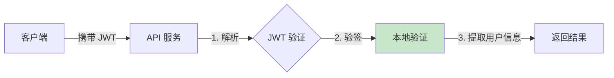
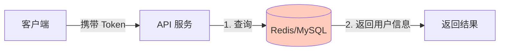

# Token 方案选型：JWT vs Opaque Token

> 最后更新：2026-03-28
> 适用场景：IAM Access Token 技术选型

---

## 1. 概述

Token 是用于身份认证的凭证，JWT 和 Opaque Token 是两种主流的 Token 实现方案。

| 方案 | 格式 | 验证方式 |
|------|------|----------|
| **JWT (JSON Web Token)** | 结构化：`Header.Payload.Signature` | 本地验证签名 |
| **Opaque Token** | 随机字符串（如 `abc123xyz`） | 查数据库/Redis 验证 |

---

## 2. 方案对比

### 2.1 技术特性对比

| 对比维度 | JWT | Opaque Token |
|----------|-----|--------------|
| **格式** | 自包含 JSON 信息 | 无意义随机字符串 |
| **内容可见性** | Payload 可解码查看 | 完全 opaque，无信息泄露 |
| **验证方式** | 本地验证签名 | 必须查询服务端存储 |
| **性能** | 高（无需查库） | 低（每次请求查库） |
| **撤销支持** | 需要黑名单机制 | 天然支持（删除记录） |
| **Token 大小** | 较大（包含用户信息） | 较小（仅随机字符串） |
| **跨域支持** | 天然支持 | 需要共享存储 |

### 2.2 工作流程对比

**JWT 验证流程：**



**Opaque Token 验证流程：**



### 2.3 性能对比

假设场景：1000 QPS 的 API 请求，每次请求都需要验证 Token。

| 指标 | JWT | Opaque Token |
|------|-----|--------------|
| 单次验证耗时 | ~1ms（本地计算） | ~5-10ms（网络 + 查库） |
| P95 延迟 | ~2ms | ~20ms |
| Redis QPS | 0 | 1000+ |
| 数据库连接数 | 0 | 需连接池支持 |

**结论**：JWT 在高并发场景下性能优势明显，且不依赖外部存储。

---

## 3. 安全对比

| 安全维度 | JWT | Opaque Token |
|----------|-----|--------------|
| **信息泄露** | Payload 可被解码，不应存储敏感信息 | 无信息泄露风险 |
| **伪造风险** | 需保护签名密钥，支持 RS256/HS256 | 需保护 Token 本身 |
| **撤销能力** | 需黑名单机制（Redis） | 删除记录即可 |
| **盗用风险** | 泄露后可使用至过期 | 可主动撤销 |

---

## 4. 架构影响

### 4.1 JWT 的架构影响

**优势：**
- 服务无状态，便于水平扩展
- 微服务可独立验证，无需共享存储
- 降低数据库/Redis 压力

**劣势：**
- 撤销需要额外实现黑名单机制
- Payload 过大可能影响网络传输
- 密钥轮换需要平滑过渡方案

### 4.2 Opaque Token 的架构影响

**优势：**
- 撤销简单，服务端完全控制
- Token 体积小，传输开销低
- 无需处理密钥轮换

**劣势：**
- 每次验证都需要查库，增加延迟
- 需要高可用的 Redis/数据库集群
- 微服务需要共享 Token 存储

---

## 5. IAM 方案选型

### 5.1 推荐方案：双 Token 方案

IAM 系统采用 **JWT Access Token + Opaque Refresh Token** 组合：

| Token 类型 | 格式 | 选择原因 |
|-----------|------|----------|
| **Access Token** | JWT | 高频使用，性能优先 |
| **Refresh Token** | Opaque | 低频使用，安全优先，易撤销 |

### 5.2 选型理由

**Access Token 选择 JWT：**

1. **高性能**：API 每次请求都需要验证，JWT 本地验证无需查库
2. **无状态**：服务不需要维护会话状态，便于水平扩展
3. **微服务友好**：多个服务可独立验证，无需共享存储
4. **自包含**：Payload 包含用户 ID、租户 ID、角色等信息，减少数据库查询

**Refresh Token 选择 Opaque：**

1. **易撤销**：用户登出/改密码时，删除 Redis 记录即可
2. **服务端控制**：可精确控制每个 Refresh Token 的生命周期
3. **安全性**：随机字符串无含义，泄露后无法推断用户信息
4. **低频使用**：仅在刷新 Access Token 时使用，性能影响小

### 5.3 方案架构图

```mermaid
flowchart TB
    subgraph 客户端
        AT[Access Token (JWT)]
        RT[Refresh Token (Opaque)]
    end

    subgraph 服务端
        API[API 服务]
        Auth[认证服务]
        Redis[(Redis)]
    end

    AT -->|API 请求| API
    API -->|验证签名 | AT
    API -->|通过 | Business[业务逻辑]

    RT -->|刷新请求 | Auth
    Auth -->|查询 | Redis
    Redis -->|验证通过 | Auth
    Auth -->|新 Token| 客户端
```

---

## 6. JWT 在 IAM 中的应用

### 6.1 Access Token Payload 结构

```json
{
  "sub": "user-12345",        // 用户 ID
  "tenant_id": "tenant-678",  // 租户 ID
  "roles": ["admin", "user"], // 角色列表
  "apps": ["oa", "crm"],      // 可访问的应用列表
  "iat": 1711350000,          // 签发时间
  "exp": 1711351800,          // 过期时间（30 分钟后）
  "iss": "iam-system",        // 签发者
  "aud": "api-gateway"        // 目标服务
}
```

### 6.2 黑名单机制（撤销方案）

为弥补 JWT 撤销困难的缺点，IAM 系统实现黑名单机制：

```
用户登出/改密码
    ↓
将 JWT 的 jti 加入 Redis 黑名单
    ↓
API 验证时检查黑名单
    ↓
黑名单中的 Token 被拒绝
    ↓
黑名单 TTL = Token 剩余有效期（自动过期）
```

---

## 7. 性能测试数据（参考）

| 场景 | JWT | Opaque Token |
|------|-----|--------------|
| 1000 并发验证 | 1.2s | 8.5s |
| Redis 压力 | 0 QPS | 1000+ QPS |
| 平均响应时间 | 1.5ms | 12ms |
| 数据库连接 | 0 | 需连接池 |

---

## 8. 结论

| 评估维度 | JWT | Opaque Token | IAM 选择 |
|----------|-----|--------------|----------|
| 性能 | ★★★★★ | ★★☆☆☆ | JWT (Access Token) |
| 撤销便利性 | ★★☆☆☆ | ★★★★★ | Opaque (Refresh Token) |
| 架构简洁性 | ★★★★☆ | ★★☆☆☆ | JWT |
| 安全性 | ★★★☆☆ | ★★★★☆ | Opaque (Refresh Token) |

**IAM 最终选型：JWT Access Token + Opaque Refresh Token 双 Token 方案**

该方案兼顾了 JWT 的高性能和 Opaque Token 的易撤销特性，是业界成熟的最佳实践。

---

## 9. 参考链接

- RFC 7519 (JWT): https://tools.ietf.org/html/rfc7519
- OAuth 2.0 Token 格式：https://oauth.net/2/jwt/
- Auth0 JWT vs Opaque Token: https://auth0.com/docs/secure/tokens/access-tokens/reference/jwt-vs-opaque
