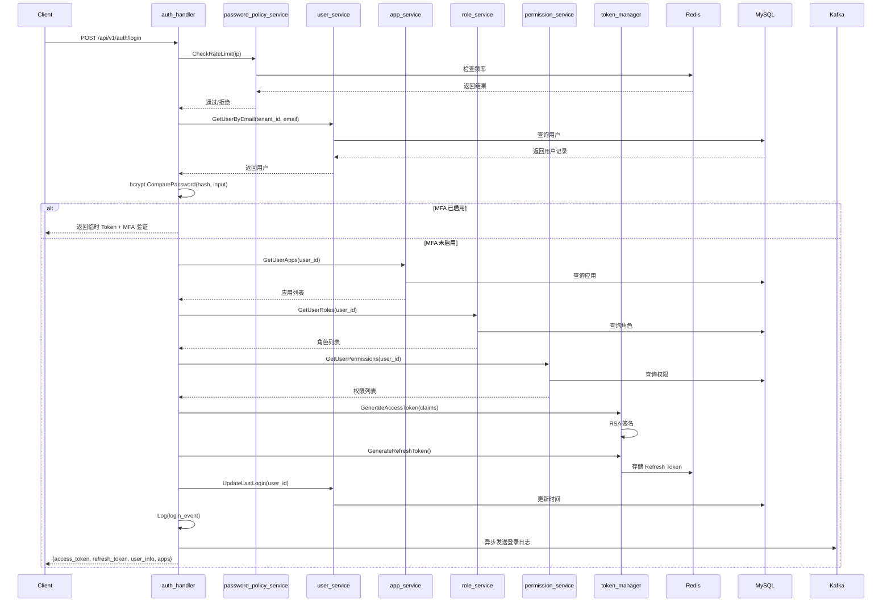

# IAM 系统技术设计文档

> 日期：2026-04-10
> 作者：IAM Team
> 状态：待评审

---

## 1. 架构总览

### 1.1 部署模式

模块化单体（Modular Monolith），单一进程部署，内部按领域边界清晰划分。

### 1.2 技术栈

| 层级 | 技术选型 |
|------|----------|
| 后端框架 | Golang + go-zero |
| 数据库 | MySQL 8.0 |
| 缓存 | Redis 7.0 |
| 消息队列 | Kafka 3.0 |
| 前端 | Vue 3 + Vite + TypeScript + Element Plus |
| 容器化 | Docker + Docker Compose |

### 1.3 目录结构

```
iam/
├── app/main.go                          # 应用入口
├── etc/dev.yaml                         # 配置文件
├── web/                                 # 前端源码目录
│   ├── public/                          # 静态资源
│   ├── index.html                       # HTML 入口
│   └── src/                             # Vue 3 + TypeScript 源码
├── infra/                               # 基础设施层
│   ├── cache/                           # Redis 缓存封装
│   ├── database/                        # MySQL 连接封装
│   ├── executor/                        # 批量执行器
│   └── queue/                           # Kafka 消息队列
├── internal/                            # 内部核心业务
│   ├── config/                          # 配置结构体
│   ├── constant/                        # 常量、错误码定义
│   ├── middleware/                      # 全局中间件
│   │   ├── auth.go                      # JWT 认证中间件
│   │   ├── tenant_isolation.go          # 租户隔离中间件
│   │   ├── permission.go                # 权限校验中间件
│   │   └── audit.go                     # 审计日志中间件
│   ├── dto/                             # 数据传输对象
│   │   ├── auth/                        # 认证模块 DTO
│   │   ├── user/                        # 用户模块 DTO
│   │   ├── tenant/                      # 租户模块 DTO
│   │   ├── role/                        # 角色模块 DTO
│   │   ├── permission/                  # 权限模块 DTO
│   │   ├── app/                         # 应用模块 DTO
│   │   ├── client/                      # 客户端模块 DTO
│   │   └── audit/                       # 审计模块 DTO
│   ├── entity/                          # 实体模型（DB 映射结构体）
│   ├── handler/                         # HTTP 处理器
│   │   ├── auth/
│   │   ├── user/
│   │   ├── tenant/
│   │   ├── role/
│   │   ├── permission/
│   │   ├── app/
│   │   ├── client/
│   │   └── audit/
│   ├── repository/                      # 数据访问层
│   │   ├── user_repo.go
│   │   ├── role_repo.go
│   │   └── ...
│   ├── routes/                          # 路由注册
│   │   ├── routes.go                    # 统一路由入口
│   │   ├── auth/
│   │   ├── user/
│   │   └── ...
│   ├── service/                         # 业务逻辑层
│   │   ├── auth/
│   │   ├── user/
│   │   └── ...
│   └── svc/
│       └── servicecontext.go            # 服务上下文
├── sql/                                 # SQL 迁移脚本
├── internal/tests/                      # 测试代码
│   ├── unit/                            # 单元测试
│   ├── integration/                     # 集成测试
│   ├── api/                             # API 端到端测试
│   └── fixtures/                        # 测试数据
├── debug/                               # Python 调试脚本
├── package.json                         # 前端构建配置
├── vite.config.ts                       # Vite 配置
├── tsconfig.json                        # TypeScript 配置
└── docker-compose.yml                   # 容器编排
```

### 1.4 设计决策记录

| 决策项 | 结论 | 备选方案 |
|--------|------|----------|
| 部署模式 | 模块化单体 | 微服务拆分 |
| 目录组织 | 按层分（handler/service/dto 按领域划分子目录） | 按领域分目录 |
| 多租户隔离 | 逻辑隔离（tenant_id 强制过滤） | 独立数据库 |
| Token 机制 | RS256 JWT + Redis Refresh Token + 黑名单 | 纯 Session |
| 审计日志写入 | Kafka 异步落盘 | 同步写入 |
| 前端方案 | Vue 3 + Vite，构建文件放根目录 | 独立前端仓库 / web/ 下独立构建 |

---

## 2. 数据库 Schema 设计

共 **14 张表**，按领域分为 7 组。

### 2.1 租户管理

**tenants — 租户表**

| 字段 | 类型 | 约束 | 说明 |
|------|------|------|------|
| id | BIGINT | PK, AUTO_INCREMENT | 主键 |
| name | VARCHAR(100) | UNIQUE, NOT NULL | 租户名称 |
| status | TINYINT | NOT NULL, DEFAULT 1 | 1=启用 2=禁用 3=过期 |
| max_users | INT | NOT NULL, DEFAULT 100 | 最大用户配额 |
| max_apps | INT | NOT NULL, DEFAULT 10 | 最大应用配额 |
| expire_at | DATETIME | NULL | 租户过期时间 |
| created_at | DATETIME | NOT NULL, DEFAULT CURRENT_TIMESTAMP | 创建时间 |
| updated_at | DATETIME | NOT NULL, DEFAULT CURRENT_TIMESTAMP ON UPDATE | 更新时间 |

### 2.2 用户管理

**users — 用户表**

| 字段 | 类型 | 约束 | 说明 |
|------|------|------|------|
| id | BIGINT | PK, AUTO_INCREMENT | 主键 |
| tenant_id | BIGINT | NOT NULL, INDEX | 租户 ID |
| email | VARCHAR(100) | NOT NULL, INDEX | 邮箱（登录账号） |
| phone | VARCHAR(20) | NULL | 手机号 |
| password_hash | VARCHAR(255) | NOT NULL | bcrypt 哈希 |
| status | TINYINT | NOT NULL, DEFAULT 1 | 1=启用 2=禁用 3=锁定 |
| mfa_enabled | TINYINT | NOT NULL, DEFAULT 0 | 是否开启 MFA |
| mfa_secret | VARCHAR(100) | NULL | TOTP 密钥 |
| last_login_at | DATETIME | NULL | 最后登录时间 |
| password_changed_at | DATETIME | NULL | 密码最后修改时间 |
| created_at | DATETIME | NOT NULL, DEFAULT CURRENT_TIMESTAMP | 创建时间 |
| updated_at | DATETIME | NOT NULL, DEFAULT CURRENT_TIMESTAMP ON UPDATE | 更新时间 |

索引：
- `UNIQUE KEY uk_tenant_email (tenant_id, email)`
- `INDEX idx_tenant_status (tenant_id, status)`

**user_groups — 用户组表**

| 字段 | 类型 | 约束 | 说明 |
|------|------|------|------|
| id | BIGINT | PK, AUTO_INCREMENT | 主键 |
| tenant_id | BIGINT | NOT NULL, INDEX | 租户 ID |
| name | VARCHAR(100) | NOT NULL | 用户组名称 |
| description | TEXT | NULL | 描述 |
| created_at | DATETIME | NOT NULL, DEFAULT CURRENT_TIMESTAMP | 创建时间 |
| updated_at | DATETIME | NOT NULL, DEFAULT CURRENT_TIMESTAMP ON UPDATE | 更新时间 |

**user_group_members — 用户组成员表**

| 字段 | 类型 | 约束 | 说明 |
|------|------|------|------|
| id | BIGINT | PK, AUTO_INCREMENT | 主键 |
| group_id | BIGINT | NOT NULL, INDEX | 用户组 ID |
| user_id | BIGINT | NOT NULL, INDEX | 用户 ID |
| created_at | DATETIME | NOT NULL, DEFAULT CURRENT_TIMESTAMP | 加入时间 |

索引：
- `UNIQUE KEY uk_group_user (group_id, user_id)`

### 2.3 权限管理（RBAC）

**permissions — 权限定义表**

| 字段 | 类型 | 约束 | 说明 |
|------|------|------|------|
| id | BIGINT | PK, AUTO_INCREMENT | 主键 |
| code | VARCHAR(100) | UNIQUE, NOT NULL | 权限编码，如 `user:read` |
| name | VARCHAR(100) | NOT NULL | 权限名称 |
| resource | VARCHAR(100) | NOT NULL | 资源类型 |
| action | VARCHAR(50) | NOT NULL | 操作：read/write/delete |
| app_code | VARCHAR(50) | INDEX, NULL | 归属应用（NULL=平台级） |
| description | TEXT | NULL | 描述 |
| created_at | DATETIME | NOT NULL, DEFAULT CURRENT_TIMESTAMP | 创建时间 |
| updated_at | DATETIME | NOT NULL, DEFAULT CURRENT_TIMESTAMP ON UPDATE | 更新时间 |

**roles — 角色表**

| 字段 | 类型 | 约束 | 说明 |
|------|------|------|------|
| id | BIGINT | PK, AUTO_INCREMENT | 主键 |
| tenant_id | BIGINT | NOT NULL, INDEX | 租户 ID |
| name | VARCHAR(100) | NOT NULL | 角色名称 |
| code | VARCHAR(100) | NOT NULL | 角色编码 |
| type | TINYINT | NOT NULL, DEFAULT 2 | 1=系统内置 2=自定义 |
| status | TINYINT | NOT NULL, DEFAULT 1 | 1=启用 2=禁用 |
| description | TEXT | NULL | 描述 |
| created_at | DATETIME | NOT NULL, DEFAULT CURRENT_TIMESTAMP | 创建时间 |
| updated_at | DATETIME | NOT NULL, DEFAULT CURRENT_TIMESTAMP ON UPDATE | 更新时间 |

索引：
- `UNIQUE KEY uk_tenant_code (tenant_id, code)`

**role_permissions — 角色权限关联表**

| 字段 | 类型 | 约束 | 说明 |
|------|------|------|------|
| id | BIGINT | PK, AUTO_INCREMENT | 主键 |
| role_id | BIGINT | NOT NULL, INDEX | 角色 ID |
| permission_id | BIGINT | NOT NULL, INDEX | 权限 ID |
| data_scope | VARCHAR(50) | NOT NULL, DEFAULT 'all' | all/dept/dept_and_sub/personal/custom |
| created_at | DATETIME | NOT NULL, DEFAULT CURRENT_TIMESTAMP | 创建时间 |

索引：
- `UNIQUE KEY uk_role_perm (role_id, permission_id)`

**user_roles — 用户角色关联表**

| 字段 | 类型 | 约束 | 说明 |
|------|------|------|------|
| id | BIGINT | PK, AUTO_INCREMENT | 主键 |
| tenant_id | BIGINT | NOT NULL, INDEX | 租户 ID |
| user_id | BIGINT | NOT NULL, INDEX | 用户 ID |
| role_id | BIGINT | NOT NULL, INDEX | 角色 ID |
| app_code | VARCHAR(50) | NULL | 应用编码（角色生效范围） |
| created_at | DATETIME | NOT NULL, DEFAULT CURRENT_TIMESTAMP | 创建时间 |

索引：
- `UNIQUE KEY uk_tenant_user_role_app (tenant_id, user_id, role_id, app_code)`

**role_constraints — 角色约束表（SoD 约束）**

| 字段 | 类型 | 约束 | 说明 |
|------|------|------|------|
| id | BIGINT | PK, AUTO_INCREMENT | 主键 |
| tenant_id | BIGINT | NOT NULL, INDEX | 租户 ID |
| type | TINYINT | NOT NULL | 1=静态SoD 2=动态SoD |
| role_a | BIGINT | NOT NULL | 冲突角色 A |
| role_b | BIGINT | NOT NULL | 冲突角色 B |
| created_at | DATETIME | NOT NULL, DEFAULT CURRENT_TIMESTAMP | 创建时间 |

### 2.4 应用管理

**applications — 应用表**

| 字段 | 类型 | 约束 | 说明 |
|------|------|------|------|
| id | BIGINT | PK, AUTO_INCREMENT | 主键 |
| tenant_id | BIGINT | NOT NULL, INDEX | 租户 ID |
| code | VARCHAR(50) | NOT NULL | 应用编码（租户内唯一） |
| name | VARCHAR(100) | NOT NULL | 应用名称 |
| description | TEXT | NULL | 描述 |
| status | TINYINT | NOT NULL, DEFAULT 1 | 1=启用 2=禁用 |
| created_at | DATETIME | NOT NULL, DEFAULT CURRENT_TIMESTAMP | 创建时间 |
| updated_at | DATETIME | NOT NULL, DEFAULT CURRENT_TIMESTAMP ON UPDATE | 更新时间 |

索引：
- `UNIQUE KEY uk_tenant_code (tenant_id, code)`

**user_app_authorizations — 用户应用授权表**

| 字段 | 类型 | 约束 | 说明 |
|------|------|------|------|
| id | BIGINT | PK, AUTO_INCREMENT | 主键 |
| tenant_id | BIGINT | NOT NULL, INDEX | 租户 ID |
| user_id | BIGINT | NOT NULL, INDEX | 用户 ID |
| app_id | BIGINT | NOT NULL, INDEX | 应用 ID |
| created_at | DATETIME | NOT NULL, DEFAULT CURRENT_TIMESTAMP | 授权时间 |

索引：
- `UNIQUE KEY uk_tenant_user_app (tenant_id, user_id, app_id)`

### 2.5 客户端管理

**clients — 内部客户端表**

| 字段 | 类型 | 约束 | 说明 |
|------|------|------|------|
| id | BIGINT | PK, AUTO_INCREMENT | 主键 |
| client_id | VARCHAR(64) | UNIQUE, NOT NULL | 客户端标识 |
| access_key | VARCHAR(64) | NOT NULL | AK |
| secret_key_hash | VARCHAR(255) | NOT NULL | SK 哈希 |
| name | VARCHAR(100) | NOT NULL | 客户端名称 |
| allowed_scopes | JSON | NOT NULL | 允许的 scopes |
| status | TINYINT | NOT NULL, DEFAULT 1 | 1=启用 2=禁用 |
| created_at | DATETIME | NOT NULL, DEFAULT CURRENT_TIMESTAMP | 创建时间 |
| updated_at | DATETIME | NOT NULL, DEFAULT CURRENT_TIMESTAMP ON UPDATE | 更新时间 |

### 2.6 审计日志

**audit_logs — 操作审计日志表**

| 字段 | 类型 | 约束 | 说明 |
|------|------|------|------|
| id | BIGINT | PK, AUTO_INCREMENT | 主键 |
| tenant_id | BIGINT | NOT NULL, INDEX | 租户 ID |
| user_id | BIGINT | NOT NULL, INDEX | 操作人 |
| action | VARCHAR(100) | NOT NULL | 操作类型 |
| resource_type | VARCHAR(50) | NOT NULL | 资源类型 |
| resource_id | BIGINT | NULL | 资源 ID |
| detail | JSON | NULL | 操作详情 |
| ip | VARCHAR(45) | NULL | 操作 IP |
| created_at | DATETIME | NOT NULL, INDEX | 操作时间 |

> Kafka 异步落盘，按 `created_at` 分区。

**login_logs — 登录日志表**

| 字段 | 类型 | 约束 | 说明 |
|------|------|------|------|
| id | BIGINT | PK, AUTO_INCREMENT | 主键 |
| tenant_id | BIGINT | NOT NULL, INDEX | 租户 ID |
| user_id | BIGINT | NULL | NULL=登录失败 |
| email | VARCHAR(100) | NOT NULL | 登录账号 |
| status | TINYINT | NOT NULL | 1=成功 2=失败 3=MFA待验证 |
| fail_reason | VARCHAR(200) | NULL | 失败原因 |
| login_type | VARCHAR(30) | NOT NULL | password/code/oauth/mfa |
| ip | VARCHAR(45) | NULL | 登录 IP |
| user_agent | VARCHAR(500) | NULL | 用户代理 |
| created_at | DATETIME | NOT NULL, INDEX | 登录时间 |

### 2.7 密码策略

**password_policies — 密码策略表**

| 字段 | 类型 | 约束 | 说明 |
|------|------|------|------|
| id | BIGINT | PK, AUTO_INCREMENT | 主键 |
| tenant_id | BIGINT | UNIQUE, NOT NULL | 每租户一条 |
| min_length | INT | NOT NULL, DEFAULT 8 | 最小密码长度 |
| require_uppercase | TINYINT | NOT NULL, DEFAULT 1 | 需要大写字母 |
| require_lowercase | TINYINT | NOT NULL, DEFAULT 1 | 需要小写字母 |
| require_digit | TINYINT | NOT NULL, DEFAULT 1 | 需要数字 |
| require_special | TINYINT | NOT NULL, DEFAULT 1 | 需要特殊字符 |
| history_count | INT | NOT NULL, DEFAULT 3 | 历史密码检查次数 |
| expire_days | INT | NOT NULL, DEFAULT 0 | 密码过期天数（0=永不过期） |
| max_login_attempts | INT | NOT NULL, DEFAULT 5 | 最大登录失败次数 |
| lockout_minutes | INT | NOT NULL, DEFAULT 30 | 锁定时长（分钟） |
| updated_at | DATETIME | NOT NULL, DEFAULT CURRENT_TIMESTAMP ON UPDATE | 更新时间 |

**password_history — 密码历史表**

| 字段 | 类型 | 约束 | 说明 |
|------|------|------|------|
| id | BIGINT | PK, AUTO_INCREMENT | 主键 |
| user_id | BIGINT | NOT NULL, INDEX | 用户 ID |
| password_hash | VARCHAR(255) | NOT NULL | 历史密码哈希 |
| created_at | DATETIME | NOT NULL, DEFAULT CURRENT_TIMESTAMP | 创建时间 |

索引：
- `INDEX idx_user_created (user_id, created_at)`

---

## 3. API 端点设计

基础路径：`/api/v1`。统一使用 `Bearer Token` 认证，认证路由除外。

### 3.1 认证模块（`/auth`）

| 方法 | 路径 | 说明 | 认证 |
|------|------|------|------|
| POST | `/auth/login` | 用户登录（密码/验证码） | 免认证 |
| POST | `/auth/register` | 用户注册 | 免认证 |
| POST | `/auth/password/reset` | 密码重置（邮件验证码） | 免认证 |
| POST | `/auth/refresh` | 刷新 Access Token | Refresh Token |
| POST | `/auth/logout` | 登出（加入黑名单） | Bearer Token |
| POST | `/auth/mfa/verify` | MFA 二次验证 | 临时 Token |
| POST | `/auth/mfa/enable` | 启用 MFA | Bearer Token |
| POST | `/auth/mfa/disable` | 禁用 MFA | Bearer Token |
| POST | `/auth/code/send` | 发送验证码 | 免认证 |
| POST | `/auth/code/login` | 验证码登录 | 免认证 |

### 3.2 用户管理模块（`/users`）

| 方法 | 路径 | 说明 |
|------|------|------|
| GET | `/users` | 用户列表（分页、搜索、状态过滤） |
| POST | `/users` | 创建用户 |
| GET | `/users/:id` | 用户详情 |
| PUT | `/users/:id` | 更新用户 |
| DELETE | `/users/:id` | 删除用户 |
| POST | `/users/:id/roles` | 为用户分配角色 |
| DELETE | `/users/:id/roles/:role_id` | 移除用户角色 |
| GET | `/users/:id/permissions` | 查询用户权限（并集） |
| PUT | `/users/:id/status` | 启用/禁用/锁定用户 |
| PUT | `/users/:id/password` | 修改密码（管理员重置） |
| POST | `/users/batch-import` | 批量导入用户（CSV） |
| GET | `/users/batch-import/template` | 下载导入模板 |

### 3.3 用户组管理模块（`/groups`）

| 方法 | 路径 | 说明 |
|------|------|------|
| GET | `/groups` | 用户组列表 |
| POST | `/groups` | 创建用户组 |
| GET | `/groups/:id` | 用户组详情 |
| PUT | `/groups/:id` | 更新用户组 |
| DELETE | `/groups/:id` | 删除用户组 |
| POST | `/groups/:id/members` | 添加组成员 |
| DELETE | `/groups/:id/members/:user_id` | 移除组成员 |
| GET | `/groups/:id/members` | 组成员列表 |

### 3.4 角色管理模块（`/roles`）

| 方法 | 路径 | 说明 |
|------|------|------|
| GET | `/roles` | 角色列表 |
| POST | `/roles` | 创建角色 |
| GET | `/roles/:id` | 角色详情（含权限列表） |
| PUT | `/roles/:id` | 更新角色 |
| DELETE | `/roles/:id` | 删除角色 |
| PUT | `/roles/:id/permissions` | 更新角色权限 |
| GET | `/roles/:id/users` | 拥有该角色的用户列表 |

### 3.5 权限管理模块（`/permissions`）

| 方法 | 路径 | 说明 |
|------|------|------|
| GET | `/permissions` | 权限列表 |
| POST | `/permissions` | 创建权限（仅平台管理员） |
| PUT | `/permissions/:id` | 更新权限 |
| GET | `/permissions/:id/roles` | 拥有该权限的角色（反向查询） |

### 3.6 租户管理模块（`/tenants`）

| 方法 | 路径 | 说明 | 认证 |
|------|------|------|------|
| GET | `/tenants` | 租户列表 | 平台管理员 |
| POST | `/tenants` | 创建租户 | 平台管理员 |
| GET | `/tenants/:id` | 租户详情 | 平台管理员 |
| PUT | `/tenants/:id` | 更新租户 | 平台管理员 |
| PUT | `/tenants/:id/status` | 启用/禁用租户 | 平台管理员 |
| GET | `/tenants/:id/quota` | 租户配额查询/使用量 | 平台管理员 |

### 3.7 应用管理模块（`/apps`）

| 方法 | 路径 | 说明 |
|------|------|------|
| GET | `/apps` | 应用列表 |
| POST | `/apps` | 创建应用 |
| GET | `/apps/:id` | 应用详情 |
| PUT | `/apps/:id` | 更新应用 |
| DELETE | `/apps/:id` | 删除应用 |
| POST | `/apps/:id/authorize` | 授权用户访问应用 |
| DELETE | `/apps/:id/authorize/:user_id` | 移除用户应用授权 |
| GET | `/apps/:id/users` | 有授权的用户列表 |

### 3.8 客户端管理模块（`/clients`）

| 方法 | 路径 | 说明 | 认证 |
|------|------|------|------|
| POST | `/clients/token` | AK/SK 换 JWT Token | AK/SK 签名 |
| GET | `/clients` | 客户端列表 | 平台管理员 |
| POST | `/clients` | 创建客户端 | 平台管理员 |
| GET | `/clients/:id` | 客户端详情 | 平台管理员 |
| PUT | `/clients/:id` | 更新客户端 | 平台管理员 |
| PUT | `/clients/:id/rotate-key` | 轮换密钥 | 平台管理员 |
| DELETE | `/clients/:id` | 删除客户端 | 平台管理员 |

### 3.9 审计日志模块（`/logs`）与用户自助

| 方法 | 路径 | 说明 |
|------|------|------|
| GET | `/logs/audit` | 审计日志列表（分页、过滤） |
| GET | `/logs/audit/:id` | 单条审计日志详情 |
| GET | `/logs/login` | 登录日志列表 |
| GET | `/logs/login/stats` | 登录统计（失败率、IP 排行） |
| GET | `/users/me` | 当前用户信息 |
| PUT | `/users/me/password` | 修改当前用户密码 |

### 3.10 密码策略模块

| 方法 | 路径 | 说明 |
|------|------|------|
| GET | `/password-policy` | 获取当前租户密码策略 |
| PUT | `/password-policy` | 更新密码策略 |

---

## 4. 领域间依赖与数据流

### 4.1 模块依赖关系

```
auth_handler  →  user_service, auth_service, audit_service, login_log_service, redis_service
user_handler  →  user_service, role_service, app_service, password_policy_service
group_handler →  group_service, user_service
role_handler  →  role_service, permission_service, audit_service
perm_handler  →  permission_service
app_handler   →  app_service, user_service
client_handler → client_service
audit_handler →  audit_log_service, login_log_service
```

**中间件依赖：**

| 中间件 | 依赖 |
|--------|------|
| auth_middleware | redis_service（验证 Token/黑名单） |
| tenant_middleware | 无（从 JWT 提取 tenant_id） |
| perm_middleware | permission_service（检查权限） |
| audit_middleware | audit_log_service（异步写入） |

### 4.2 ServiceContext 结构

```go
type ServiceContext struct {
    Config config.Config
    DB     *sql.DB
    Redis  *redis.Redis
    KafkaProducer *kafka.Producer

    UserService       *user.UserService
    RoleService       *role.RoleService
    PermissionService *permission.PermissionService
    TenantService     *tenant.TenantService
    AppService        *app.AppService
    ClientService     *client.ClientService
    AuditLogService   *audit.AuditLogService
    LoginLogService   *audit.LoginLogService
    PasswordPolicySvc *auth.PasswordPolicyService
    GroupService      *user.GroupService
    AuthService       *auth.AuthService

    JWTKey       *rsa.PrivateKey
    JWTPubKey    *rsa.PublicKey
    TokenManager *auth.TokenManager
}
```

### 4.3 调用约定

| 规则 | 说明 |
|------|------|
| 禁止跨领域 handler 调用 | handler 只能调用自己领域的 service |
| service 间单向依赖 | auth_service 可调用 user_service，不反向 |
| 审计日志异步化 | 所有写审计日志操作通过 Kafka 异步发送 |
| 统一通过 ServiceContext 注入 | 所有 service 实例在 ServiceContext 中管理 |
| 数据隔离由中间件保证 | tenant_middleware 从 JWT 提取 tenant_id 注入 context |

### 4.4 登录请求数据流



---

## 5. 错误处理与响应规范

### 5.1 统一响应结构

```json
// 成功响应
{
  "code": 0,
  "message": "success",
  "data": { ... }
}

// 错误响应
{
  "code": 1001,
  "message": "用户不存在",
  "data": null,
  "details": {
    "field": "user_id",
    "reason": "record not found"
  }
}
```

### 5.2 HTTP 状态码映射

| HTTP | 场景 | 示例 |
|------|------|------|
| 200 | 所有成功请求 | `{"code":0,...}` |
| 400 | 参数/校验失败 | 邮箱格式错误、密码不满足策略 |
| 401 | 未认证/Token 无效 | Token 过期、签名错误 |
| 403 | 权限不足 | 用户无此权限、角色冲突 |
| 404 | 资源不存在 | 用户/角色/租户不存在 |
| 409 | 资源冲突 | 邮箱已存在、角色编码重复 |
| 429 | 频率超限 | 密码重试次数过多 |
| 500 | 系统内部错误 | DB 连接失败 |

### 5.3 业务错误码

错误码 = 模块码(2位) + 子模块码(2位) + 错误序号(2位)，与 `05-api-design.md` 保持一致。

| 范围 | 模块 | 示例 |
|------|------|------|
| 010101~010199 | 认证 | 010101=密码错误, 010102=账号锁定, 010103=MFA失败, 010104=验证码错误, 010105=验证码已过期 |
| 010201~010299 | Token | 010201=Token过期, 010202=Token无效, 010203=Token已撤销, 010204=Refresh Token无效 |
| 020101~020199 | 用户 | 020101=用户不存在, 020102=邮箱已存在, 020103=用户已禁用, 020104=密码不满足策略 |
| 030101~030199 | 租户 | 030101=租户不存在, 030102=租户已过期, 030103=租户已禁用, 030104=超出配额 |
| 040101~040199 | 角色 | 040101=角色不存在, 040102=角色编码重复, 040103=权限冲突(SoD), 040104=权限不足 |
| 050101~050199 | 权限 | 050101=权限不存在, 050102=权限编码重复 |
| 060101~060199 | MFA | 060101=MFA未启用, 060102=MFA验证失败 |
| 070101~070199 | 审计日志 | 070101=日志写入失败 |
| 990101~990199 | 系统 | 990101=内部错误, 990102=数据库错误, 990103=Redis错误, 990104=Kafka错误 |

---

## 6. 测试策略

### 6.1 测试分层

| 层级 | 范围 | 框架 | 覆盖率目标 |
|------|------|------|------------|
| 单元测试 | service 内部逻辑：密码校验、JWT 生成、权限校验、数据转换 | go test + testify | > 80% |
| 集成测试 | handler → service → DB 全链路：CRUD、认证流程、授权校验 | go test + testcontainers | 核心流程 100% |
| API 测试 | 端到端 HTTP 调用：完整登录、注册、权限变更流程 | apitest / 自研脚本 | 覆盖所有 API |

### 6.2 Mock 策略

| 依赖 | Mock 方式 | 场景 |
|------|-----------|------|
| MySQL | testcontainers 真实实例 | 集成测试 |
| Redis | testcontainers 真实实例 | 集成测试 |
| Kafka | interface mock | 单元测试（审计异步） |
| JWT 密钥 | 固定测试密钥对 | token 生成/验证测试 |
| 领域间 Service | interface mock | 单领域单元测试 |

### 6.3 CI 流水线

**触发方式：**

| 事件 | 分支 | 说明 |
|------|------|------|
| `push` | `main`, `dev` | 主干/开发分支推送 |
| `push` | `feature/*` | 特性分支推送 |
| `pull_request` | `main` | 向 main 创建 PR 时 |

**流水线步骤：**

```
push/PR
  ├─ 1. lint:      golangci-lint + eslint
  ├─ 2. build:     go build ./... && npm run build
  ├─ 3. unit:      go test ./... -race -cover + npm run test:unit
  ├─ 4. integration: docker compose up deps → go test -tags=integration
  ├─ 5. api:       启动服务 → 跑用例
  └─ 6. e2e:       启动前后端 → Playwright 跑 E2E 测试
```

> 注意：agent-browser 仅用于开发期交互式验证，不进入 CI 流水线。

**本地触发验证：**

CI 的每一步都可以在本地执行，方便在推送前验证：

| 步骤 | 本地命令 | 依赖 |
|------|----------|------|
| lint | `golangci-lint run ./...` + `npx eslint web/src/` | 安装 golangci-lint, npm |
| build | `go build ./...` + `npm run build` | npm |
| unit | `go test ./... -race -cover` + `npm run test:unit` | npm |
| integration | `docker compose up -d mysql redis && go test -tags=integration ./...` | Docker, docker compose |
| api | `go run app/main.go -f etc/test.yaml & python -m pytest tests/api/` | 完整依赖环境 |
| e2e | `npm run test:e2e` | Playwright（`npx playwright install`） |

**本地一键验证脚本（待实现）：**

```bash
# scripts/ci-local.sh
#!/bin/bash
set -e
echo "=== go lint ==="
golangci-lint run ./...
echo "=== eslint ==="
npx eslint web/src/
echo "=== go build ==="
go build ./...
echo "=== npm build ==="
npm run build
echo "=== go unit test ==="
go test ./... -race -cover
echo "=== npm unit test ==="
npm run test:unit
echo "=== all passed ==="
```

本地开发推荐：提交前至少运行 lint + unit，集成测试通过 Docker Compose 启动依赖服务后运行。

### 6.4 测试目录

```
internal/tests/
├── unit/
│   ├── auth_service_test.go
│   ├── token_manager_test.go
│   └── permission_test.go
├── integration/
│   ├── auth_test.go
│   ├── user_test.go
│   └── permission_test.go
├── api/
│   ├── auth_api_test.go
│   └── user_api_test.go
└── fixtures/
    ├── init.sql
    └── seed_data.go

web/                          # 前端测试 + 开发验证
├── src/                      # 前端单元测试 + 组件测试
│   ├── api/__tests__/
│   │   └── request.test.ts
│   ├── stores/__tests__/
│   │   └── auth.test.ts
│   ├── utils/__tests__/
│   │   └── format.test.ts
│   └── views/auth/__tests__/
│       └── Login.test.ts
├── tests/e2e/                # Playwright E2E 测试
│   ├── login.spec.ts
│   ├── tenant.spec.ts
│   └── user.spec.ts
└── dev-verify/               # agent-browser 开发验证截图（不提交到 git）
    ├── login-rendered.png
    └── dashboard-rendered.png
```

---

## 7. 与 PRD 需求对照

| REQ | 需求 | 涉及表 | 涉及 API 模块 | 状态 |
|-----|------|--------|---------------|------|
| REQ-001 | 用户登录 | users, login_logs | auth | 已设计 |
| REQ-002 | 用户注册 | users | auth | 已设计 |
| REQ-003 | 密码重置 | users, password_history | auth | 已设计 |
| REQ-004 | 用户管理 | users | user | 已设计 |
| REQ-005 | 角色管理 | roles, role_permissions | role | 已设计 |
| REQ-006 | 权限分配 | user_roles, permissions | role, permission | 已设计 |
| REQ-007 | 租户管理 | tenants | tenant | 已设计 |
| REQ-008 | MFA | users (mfa_*) | auth | 已设计 |
| REQ-009 | 操作审计日志 | audit_logs | audit | 已设计 |
| REQ-010 | 登录日志 | login_logs | audit | 已设计 |
| REQ-011 | OAuth2 第三方登录 | users, login_logs | auth | 已预留 |
| REQ-012 | Token 管理 | Redis (tokens) | auth | 已设计 |
| REQ-013 | 密码策略 | password_policies, password_history | password-policy | 已设计 |
| REQ-014 | 用户组管理 | user_groups, user_group_members | group | 已设计 |
| REQ-015 | 验证码登录 | users, login_logs | auth | 已设计 |
| REQ-016 | API 限流 | Redis | 中间件 | 已设计 |
| REQ-017 | 应用级数据隔离 | applications, user_app_authorizations | app | 已设计 |
| REQ-018 | 内部服务认证 | clients | client | 已设计 |

---

## 8. 修订历史

| 版本 | 日期 | 变更说明 |
|------|------|----------|
| v0.1 | 2026-04-10 | 初始版本，完整架构设计 |
