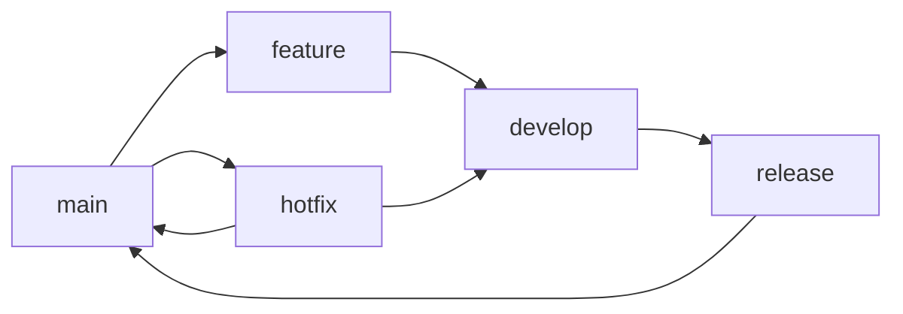

# Git 工作流规范

> 最后更新：2026-03-29
> 适用范围：IAM 项目所有代码提交

---

## 1. 分支策略

### 1.1 分支模型

```
main (主分支，受保护)
  ├── develop (开发分支，可选)
  ├── feature/xxx (功能分支)
  ├── bugfix/xxx (修复分支)
  ├── hotfix/xxx (紧急修复分支)
  └── release/v1.x (发布分支)
```

### 1.2 分支说明

| 分支 | 说明 | 命名规范 |
|------|------|----------|
| **main** | 主分支，生产环境代码，受保护 | `main` |
| **develop** | 开发主分支，集成最新功能 | `develop` |
| **feature** | 功能开发分支 | `feature/REQ-001-user-login` |
| **bugfix** | Bug 修复分支 | `bugfix/fix-login-error` |
| **hotfix** | 生产紧急修复分支 | `hotfix/fix-production-issue` |
| **release** | 发布分支 | `release/v1.0.0` |

### 1.3 分支生命周期



---

## 2. Commit 规范

### 2.1 Commit Message 格式

```
<type>(<scope>): <subject>

<body>

<footer>
```

### 2.2 Type 类型

| 类型 | 说明 |
|------|------|
| `feat` | 新功能 |
| `fix` | Bug 修复 |
| `docs` | 文档更新 |
| `style` | 代码格式（不影响功能） |
| `refactor` | 重构（既不是新功能也不是 Bug 修复） |
| `perf` | 性能优化 |
| `test` | 测试相关 |
| `chore` | 构建/工具/依赖等 |

### 2.3 Scope 范围

| 范围 | 说明 |
|------|------|
| `auth` | 认证模块 |
| `user` | 用户模块 |
| `rbac` | 权限模块 |
| `tenant` | 租户模块 |
| `api` | API 接口 |
| `db` | 数据库 |
| `deps` | 依赖管理 |
| `ci` | CI/CD |

### 2.4 Subject 要求

- 简短描述，不超过 50 字符
- 小写开头
- 不用句号结尾
- 使用祈使语气

```
✅ 正确：feat(auth): add JWT token refresh endpoint
❌ 错误：feat(auth): Added the JWT token refresh endpoint.
```

### 2.5 完整示例

```
feat(auth): add JWT token refresh endpoint

Add new POST /api/v1/auth/refresh endpoint to allow clients
to refresh their access tokens using refresh tokens.

- Add RefreshToken handler
- Add token validation middleware
- Add unit tests

Closes #123
```

### 2.6 特殊标记

| 标记 | 说明 |
|------|------|
| `📝 docs:` | 文档更新 |
| `🐛 fix:` | Bug 修复 |
| `✨ feat:` | 新功能 |
| `♻️ refactor:` | 重构 |
| `🔧 chore:` | 工具/配置 |
| `🗑️ remove:` | 删除文件/代码 |
| `🎨 style:` | 代码格式 |

---

## 3. Code Review 规范

### 3.1 PR 流程

```
1. 创建 feature 分支
2. 开发并提交代码
3. 推送到远程仓库
4. 创建 Pull Request
5. 等待 Code Review
6. 修改并重新提交
7. 审核通过后合并
8. 删除 feature 分支
```

### 3.2 PR 模板

```markdown
## 变更说明
<!-- 简要描述本次 PR 的变更内容 -->

## 关联 Issue
<!-- 关联的 Issue 编号，如 Closes #123 -->

## 测试计划
<!-- 如何测试这些变更 -->

- [ ] 单元测试
- [ ] 集成测试
- [ ] 手动测试

## 截图/录屏
<!-- 如有 UI 变更，提供截图 -->
```

### 3.3 Code Review 检查清单

**代码质量：**
- [ ] 代码是否遵循编码规范
- [ ] 是否有重复代码
- [ ] 是否有合适的注释
- [ ] 变量/函数命名是否清晰

**功能正确：**
- [ ] 是否实现需求
- [ ] 边界条件是否处理
- [ ] 错误处理是否完善

**安全性：**
- [ ] 是否有 SQL 注入风险
- [ ] 是否有 XSS/CSRF 风险
- [ ] 敏感数据是否加密

**性能：**
- [ ] 是否有性能问题
- [ ] 是否有内存泄漏
- [ ] 数据库查询是否优化

**测试：**
- [ ] 是否有单元测试
- [ ] 测试覆盖率是否足够

---

## 4. 开发流程

### 4.1 本地开发

```bash
# 1. 切换到 develop 分支并更新
git checkout develop
git pull origin develop

# 2. 创建 feature 分支
git checkout -b feature/REQ-001-user-login

# 3. 开发并提交
git add .
git commit -m "feat(auth): implement user login endpoint"

# 4. 推送到远程
git push origin feature/REQ-001-user-login
```

### 4.2 解决冲突

```bash
# 1. 更新 develop 分支
git checkout develop
git pull origin develop

# 2. 切换回 feature 分支
git checkout feature/REQ-001-user-login

# 3. 合并 develop 到 feature
git merge develop

# 4. 解决冲突并提交
git add .
git commit -m "Merge develop into feature/REQ-001-user-login"
```

### 4.3 合并到主分支

```bash
# 1. 创建 PR（GitHub/GitLab）
# 2. 等待 Code Review
# 3. 审核通过后合并（Squash and Merge）
# 4. 删除 feature 分支
```

---

## 5. Git 配置

### 5.1 全局配置

```bash
# 配置用户信息
git config --global user.name "Your Name"
git config --global user.email "your.email@example.com"

# 配置默认分支
git config --global init.defaultBranch main

# 配置拉取策略
git config --global pull.rebase false
```

### 5.2 常用别名

```bash
git config --global alias.co checkout
git config --global alias.br branch
git config --global alias.ci commit
git config --global alias.st status
git config --global alias.lg "log --oneline --graph"
```

---

## 6. 参考链接

- Conventional Commits: https://www.conventionalcommits.org/
- Git Flow: https://nvie.com/posts/a-successful-git-branching-model/
- GitHub Flow: https://guides.github.com/introduction/flow/
