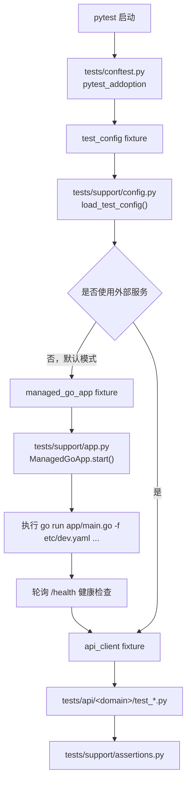

# Testing 文档目录

`docs/testing/` 目录用于维护 IAM 项目的测试体系文档，包括测试框架设计文档、测试用例编写指南、测试框架架构说明、测试指标说明、测试结果说明，以及这些内容的后续迭代记录。

## 目录定位

这里维护的是“整个项目的测试体系文档”，不是单一一份 `pytest` 框架说明。

这个目录后续应逐步覆盖：

- 测试框架设计文档（含迭代）
- 测试用例编写指南
- 测试框架架构说明
- 测试指标说明
- 测试结果说明

当前版本只完成了测试框架本身的搭建，因此目前已落地：

- 当前页里的测试框架架构概览
- `testing-framework-design-record.md` 里的设计、决策和迭代记录

其余文档先在目录索引中保留规划位，后续按需要补齐。

建议阅读顺序：

1. 先读当前页，了解测试文档目录、角色分工和索引方式。
2. 再读 [testing-framework-design-record.md](./testing-framework-design-record.md)，查看 `pytest` API 测试框架的设计背景、问题澄清、用户决策和当前落地方案。

## 测试框架架构概览

先看当前测试代码的目录树，再看后面的启动链路会更容易理解：

```bash
tests/
├── __init__.py
├── conftest.py # pytest 入口：注册 CLI 参数、组装全局 fixture、决定是否托管 Go 程序
├── api/
│   └── health/
│       └── test_health.py # 当前示例 smoke 用例，演示业务接口测试写法
└── support/
    ├── __init__.py
    ├── app.py          # ManagedGoApp：负责 go run、健康检查和进程清理
    ├── assertions.py   # 公共响应断言，减少各个测试文件重复写 JSON 校验
    ├── client.py       # APIClient、AuthSession、RequestContext 等请求侧封装
    └── config.py       # 合并 CLI 参数、环境变量和默认值，生成统一测试配置
```

按目录职责可以先这样理解：

- `tests/conftest.py` 是测试框架入口，`pytest` 一进来先看这里
- `tests/support/` 是框架支撑层，启动 Go 程序、组装客户端、公共断言都收敛在这里
- `tests/api/` 是业务测试层，只负责写接口用例，不应该自己散落启动服务或拼底层请求逻辑

当前版本的测试链路是：

1. `pytest` 从 `tests/conftest.py` 的 `pytest_addoption` 注册运行参数，例如 `--base-url`、`--app-config`、`--use-existing-service`
2. `test_config` fixture 调用 `tests/support/config.py` 中的 `load_test_config()`，合并 CLI 参数、环境变量和默认值
3. `managed_go_app` fixture 决定是否启动 Go 程序
   - 默认模式：创建 `ManagedGoApp`，并调用 `start(base_url=...)`
   - 外部服务模式：如果设置了 `--use-existing-service` 或 `IAM_USE_EXISTING_SERVICE=1`，则跳过启动
4. 真正启动 Go 程序的代码在 `tests/support/app.py` 的 `ManagedGoApp.start()`
   - 这里执行的是 `go run <entry> -f <config> ...`
   - 启动后会轮询 `<base_url>/health`，只有健康检查通过后才进入测试阶段
5. `api_client` fixture 依赖 `managed_go_app`，所以所有接口测试都会在服务 ready 之后才发请求
6. 业务测试文件放在 `tests/api/<domain>/` 下，通过 `api_client` 发请求，通过 `tests/support/assertions.py` 做公共 JSON 断言

可以先看下面这张图，再回来看上面的编号步骤：



这张图要表达的核心只有两点：

- `pytest` 不是只发 HTTP 请求，它还会在默认模式下先通过 `managed_go_app` 拉起 Go 程序
- 测试代码不会直接自己 `subprocess` 启动服务，而是统一经过 `ManagedGoApp.start()`，这样启动参数、健康检查和清理逻辑都集中在一处

如果新人问“Go 程序到底是从哪里启动的”，最直接的答案是：

- fixture 入口在 `tests/conftest.py` 的 `managed_go_app`
- 真正执行 `go run` 的位置在 `tests/support/app.py` 的 `ManagedGoApp.start()`

## 文档清单

| 文档 | 说明 | 状态 | 入口 |
|------|------|------|------|
| Testing Framework Design Record | `pytest` API 测试框架设计文档、决策记录、新增接口测试操作模板与迭代约定 | 已落地 | [testing-framework-design-record.md](./testing-framework-design-record.md) |
| Test Case Writing Guide | 测试用例编写规范、目录落位、断言策略和常用模板 | 待后续添加 | - |
| Testing Framework Architecture | 测试框架分层、fixture 关系、请求流和扩展点说明 | 当前页已概览，独立文档待后续添加 | 当前页 |
| Testing Metrics Guide | 测试指标定义、统计口径和观察方式 | 待后续添加 | - |
| Testing Results Guide | 测试结果记录方式、输出约定和结果解读说明 | 待后续添加 | - |

## 当前结构

```bash
docs/testing/
├── README.md
└── testing-framework-design-record.md
```

## 维护约定

- 测试框架的范围、运行模型、fixture 约定、目录结构和演进策略优先更新 `testing-framework-design-record.md`。
- 当前页负责目录定位、架构概览、文档清单、当前版本边界和后续规划，不重复维护主文档正文。
- 后续新增测试文档时，优先使用语义化文件名，而不是依赖编号排序。
- 当测试用例编写规范、测试架构、测试指标或测试结果说明稳定后，再补对应独立文档。
- 需要记录“为什么这么设计”时，优先把问题、选项、最终决策和理由写入对应文档，而不是只写结论。
